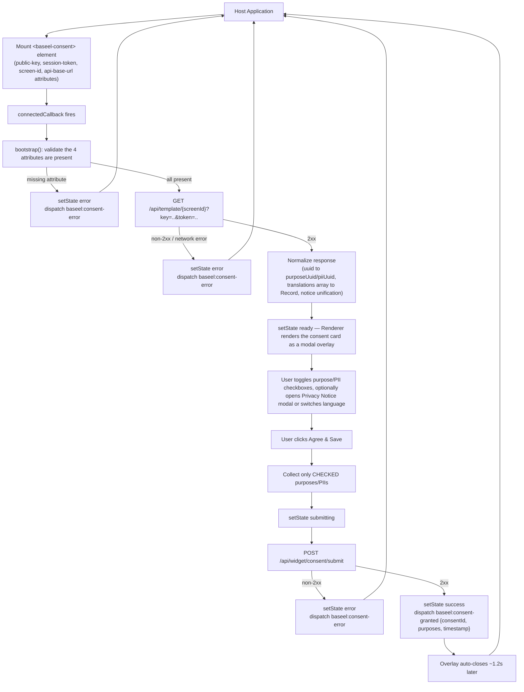
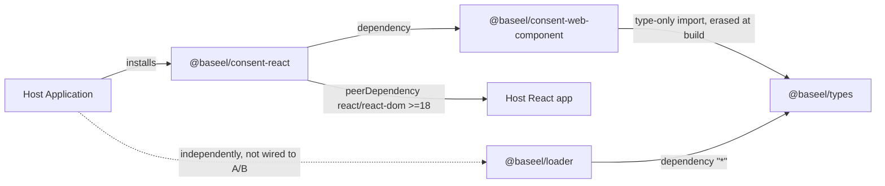
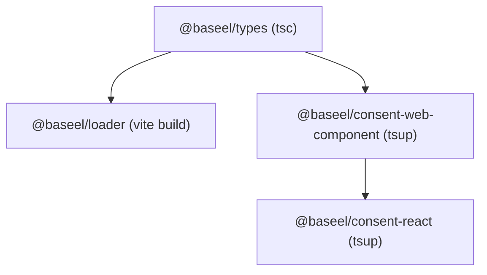
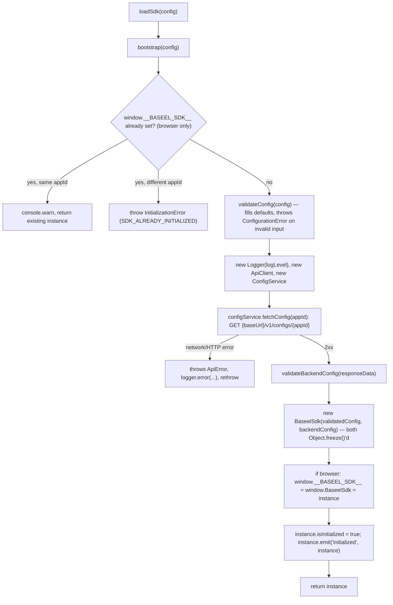
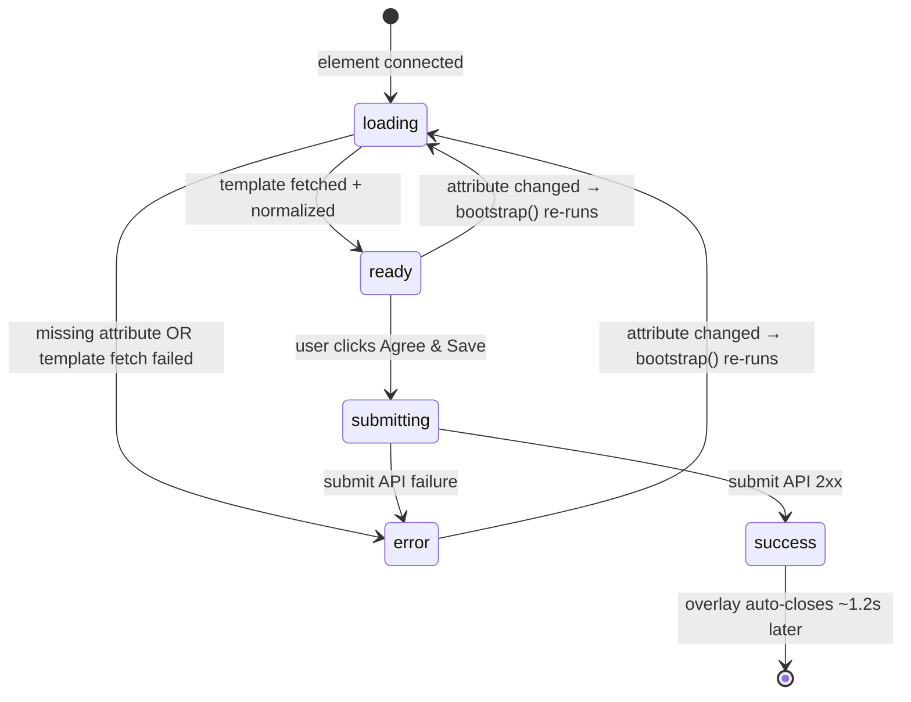
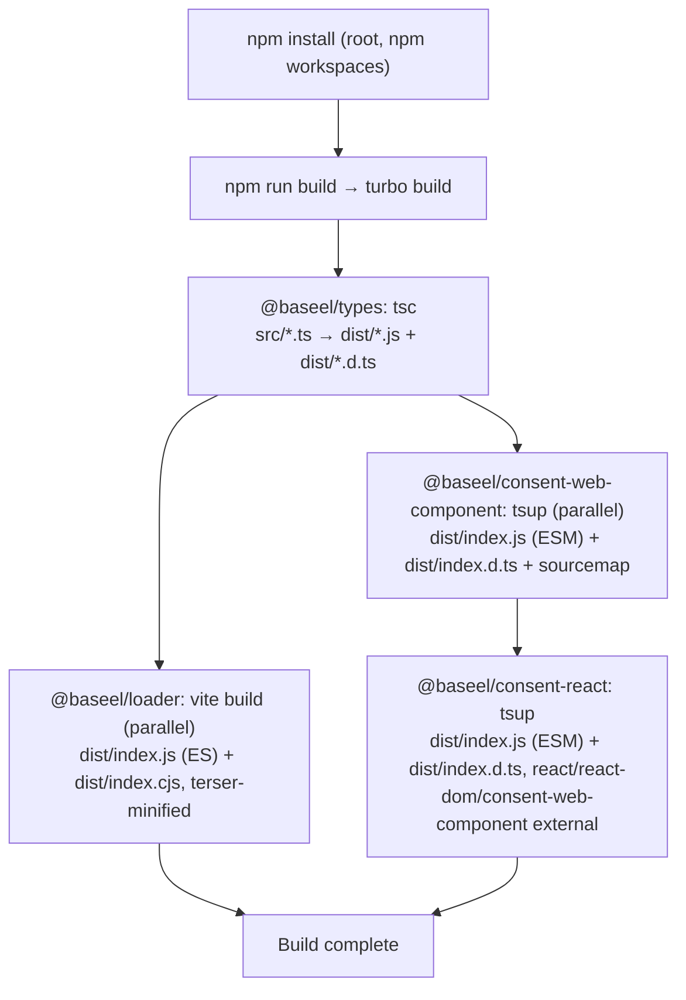

# Consent Manager SDK Documentation

> **Package family:** `@baseel/types`, `@baseel/loader`, `@baseel/consent-web-component`, `@baseel/consent-react`
> **Monorepo:** `baseel-sdk` (npm workspaces + Turbo v2)
> **Document scope:** Generated strictly from the current implementation on disk. Nothing in this document describes a feature, API, or behavior that is not actually present in source. Where a natural "expected" feature does not exist (persistence, retry logic, a dedicated preference center, CI/CD, etc.), this document says so explicitly instead of omitting or inventing it.

---

## Table of Contents

1. [Introduction](#1-introduction)
2. [High-Level Architecture](#2-high-level-architecture)
3. [Complete Folder Structure](#3-complete-folder-structure)
4. [Technology Stack](#4-technology-stack)
5. [Prerequisites](#5-prerequisites)
6. [Installation](#6-installation)
7. [SDK Build Process](#7-sdk-build-process)
8. [Environment Variables](#8-environment-variables)
9. [Configuration](#9-configuration)
10. [SDK Initialization](#10-sdk-initialization)
11. [Internal Working Flow](#11-internal-working-flow)
12. [Complete API Documentation](#12-complete-api-documentation)
13. [Component Documentation](#13-component-documentation)
14. [Hooks Documentation](#14-hooks-documentation)
15. [Utility Functions](#15-utility-functions)
16. [Services Layer](#16-services-layer)
17. [State Management](#17-state-management)
18. [Storage Layer](#18-storage-layer)
19. [Event Flow](#19-event-flow)
20. [Consent Lifecycle](#20-consent-lifecycle)
21. [Preference Center Flow](#21-preference-center-flow)
22. [Banner (Widget) Flow](#22-banner-widget-flow)
23. [API Flow](#23-api-flow)
24. [Error Handling](#24-error-handling)
25. [Logging](#25-logging)
26. [Security](#26-security)
27. [Performance Optimizations](#27-performance-optimizations)
28. [Browser Compatibility](#28-browser-compatibility)
29. [Framework Compatibility](#29-framework-compatibility)
30. [Example Projects](#30-example-projects)
31. [Complete Installation Examples](#31-complete-installation-examples)
32. [Troubleshooting](#32-troubleshooting)
33. [FAQ](#33-faq)
34. [Development Guide](#34-development-guide)
35. [Build Pipeline](#35-build-pipeline)
36. [Publishing Process](#36-publishing-process)
37. [Versioning Strategy](#37-versioning-strategy)
38. [Changelog Structure](#38-changelog-structure)
39. [Testing Strategy](#39-testing-strategy)
40. [Best Practices](#40-best-practices)
41. [Limitations](#41-limitations)
42. [Future Improvements](#42-future-improvements)
43. [Appendix](#43-appendix)

---

## 1. Introduction

### What the SDK is

The Baseel SDK is a **TypeScript monorepo** that ships four npm packages implementing a Digital Personal Data Protection (DPDP)-style **Consent Management Platform (CMP) client**:

| Package | What it is |
|---|---|
| `@baseel/types` | Shared TypeScript types/interfaces/enums. Zero runtime code. |
| `@baseel/loader` | A headless, standalone application-config bootstrapper: singleton init, config validation, backend config fetch, a typed event bus, a logger, and an error hierarchy. |
| `@baseel/consent-web-component` | A native Web Component (`<baseel-consent>`) that renders an interactive, translatable consent form in Shadow DOM, fetches a template from a backend, and submits the user's choices. **This is the actual consent banner/UI product.** |
| `@baseel/consent-react` | A thin React wrapper (`<BaseelConsent>`) around `@baseel/consent-web-component`, for JSX-based consumption in React/Next.js apps. |

**Important architectural fact, verified directly in source:** `@baseel/loader` and `@baseel/consent-web-component` are **two independent subsystems**. They share only `@baseel/types`. The loader's `BaseelSdk` class has no reference to the web component, and the web component has no reference to the loader. Nothing in the current codebase wires them together. Do not assume that initializing the loader also initializes or configures the consent widget, or vice versa — verified by reading every import statement in both packages' `src/` trees.

> **Publishing & Release Status.** As of this writing, all four packages are **published and publicly installable from the npm registry** under the `@baseel` scope:
>
> | Package | Published version |
> |---|---|
> | `@baseel/types` | `0.1.0` |
> | `@baseel/loader` | `0.0.1` |
> | `@baseel/consent-web-component` | `0.1.0` |
> | `@baseel/consent-react` | `0.1.0` |
>
> GitHub source: [`https://github.com/Baseel-IT-Services/consent-sdk`](https://github.com/Baseel-IT-Services/consent-sdk) (org `Baseel-IT-Services`, default branch `main`). See §6 (Installation) for the current, registry-first install instructions and §36 (Publishing Process) for the verified, repeatable publish procedure.

### Why it exists / business purpose

Businesses operating in jurisdictions with consent-law requirements (e.g. India's DPDP Act, GDPR-style regimes) must ask website/app visitors for permission to collect and use personal data. The conventional approach — embedding a third-party consent form inside an `<iframe>` — is slow, visually inconsistent with the host page, and hard to theme. The Baseel SDK replaces that iframe with a **native custom element** rendered directly in the host page's DOM (inside an isolated Shadow DOM), fetching its content from a Baseel-hosted backend and submitting the visitor's choices back to that backend.

### Technical purpose

- Provide a **framework-agnostic** consent UI (a real W3C Custom Element) so it can be dropped into React, Vue, Angular, Svelte, plain HTML, or any other environment without a framework-specific rewrite.
- Centralize **API response normalization** so callers never have to deal with inconsistent field names (`uuid` vs `purposeUuid`) or shapes (`translations` as array vs. Record) coming from the backend.
- Expose a small number of **typed public DOM events** (`baseel:consent-granted`, `baseel:consent-denied`, `baseel:consent-error`) so host applications can react to consent outcomes without polling.

### Problems solved (verified against actual code)

| Problem | How it's solved in this codebase |
|---|---|
| Iframe consent forms are slow/unstyled | `<baseel-consent>` is a real Custom Element rendered in the host page's DOM, not an iframe |
| Consent UI must visually resemble the CMP admin platform | `Renderer.ts` renders a header (logo/title/status badge/org name/version), a language row, content, purposes/PIIs, and a footer — mirroring the CMP platform's own layout |
| Backend field-name mismatches (`uuid` vs `purposeUuid`/`piiUuid`) | `getConsentScreen()` in `api/consent.ts` normalizes both on every fetch |
| `translations` returned as an array by some backend versions, but consumed as a keyed object | `getConsentScreen()` converts an array to `Record<languageCode, WidgetTranslation>` |
| SSR frameworks crash importing a browser-only Custom Element | `BaseelConsent.ts` falls back to a plain class when the global `HTMLElement` doesn't exist, so merely importing the package never throws in Node |
| Users could not actually customize consent (a real, now-fixed bug) | `Renderer.ts`'s form handler filters checkboxes by `.checked` before submission |

### Benefits

- One `<baseel-consent>` tag works identically across every JS framework.
- Shadow DOM isolation means the host page's global CSS cannot bleed into the widget, and the widget's internal DOM cannot be accidentally queried or styled by host page code.
- Small footprint: the compiled `@baseel/consent-web-component` ESM bundle is ~32 KB unminified, with zero runtime dependencies bundled in (its only import, `@baseel/types`, is type-only and erased at compile time).

---

## 2. High-Level Architecture

The user-requested reference flow (Application → SDK Init → Config Validation → Storage → Consent API → Banner Rendering → Preference Center → Consent Update → Storage Persistence → Callbacks → Application) does **not** map one-to-one onto this codebase. Two real, verified differences:

- There is **no persistent Storage Layer** for consent state anywhere in `@baseel/consent-web-component` (confirmed: zero references to `localStorage`, `sessionStorage`, or `document.cookie` in its `src/` tree). Consent state exists only in memory for the lifetime of the mounted element; persistence is entirely the backend's responsibility.
- There is **no separate "Preference Center"** screen/route. The one widget UI *is* the preference surface — purposes and PIIs are inline checkboxes inside the same card, plus a Privacy Notice modal.

The diagram below reflects what is **actually implemented**, using the requested top-to-bottom flow style:



**Not implemented (do not assume otherwise):** a client-side Storage Layer, a distinct Preference Center route/screen, retry logic on API failures, and any callback mechanism beyond the three DOM CustomEvents.

### Package relationship



### Monorepo build-order graph (from `turbo.json`'s `dependsOn: ["^build"]`)



---

## 3. Complete Folder Structure

```
baseel-sdk/
├── .claude/                              (Claude Code project settings — not part of the SDK runtime)
├── apps/
│   ├── browser-demo/.gitkeep             Reserved, empty — no demo app implemented yet
│   └── dev-sandbox/.gitkeep              Reserved, empty — no sandbox app implemented yet
├── packages/
│   ├── types/                            @baseel/types — shared TypeScript definitions, no runtime code
│   │   ├── src/
│   │   │   ├── index.ts                  Barrel: `export * from` all 5 modules below
│   │   │   ├── config.ts                 LogLevel, SdkConfig, ConsentConfig, BackendSdkConfig, BackendConsentConfig, BackendConsentCategory
│   │   │   ├── consent.ts                ConsentStatus, ConsentChangePayload
│   │   │   ├── error.ts                  ErrorCode enum, BaseelErrorPayload
│   │   │   ├── event.ts                  SdkEventMap (loader's typed event bus contract)
│   │   │   ├── sdk.ts                    BaseelSdkInstance interface
│   │   │   └── widget.ts                 WidgetTemplate, WidgetPurposeItem, WidgetPiiItem, WidgetTranslation, WidgetPrivacyNotice, ConsentSubmitPayload, etc.
│   │   ├── package.json                  publishConfig:{"access":"public"}, files:["dist"], build script: `tsc` — published as `@baseel/types` (see §6, §36)
│   │   └── tsconfig.json                 extends ../../tsconfig.base.json
│   │
│   ├── loader/                           @baseel/loader — standalone app-config bootstrapper (NOT wired to the widget)
│   │   ├── src/
│   │   │   ├── index.ts                  Public API: `loadSdk()`, re-exports the 5 error classes
│   │   │   ├── bootstrap.ts              `bootstrap()` — singleton guard, validation, fetch, instance creation
│   │   │   ├── sdkInstance.ts            `BaseelSdk` class implementing `BaseelSdkInstance`
│   │   │   ├── configValidator.ts        `validateConfig()` — client-side SdkConfig validation
│   │   │   ├── backendConfigValidator.ts `validateBackendConfig()` — validates the /v1/configs/{appId} response shape
│   │   │   ├── configService.ts          `ConfigService` — resolves environment base URL, calls ApiClient
│   │   │   ├── apiClient.ts              `ApiClient` — generic timeout/abort-controlled GET
│   │   │   ├── eventEmitter.ts           `EventEmitter` — typed pub/sub keyed by SdkEventMap
│   │   │   ├── logger.ts                 `Logger` — priority-filtered console wrapper
│   │   │   ├── errors.ts                 `BaseelError` base + 4 subclasses
│   │   │   └── index.test.ts             27 Vitest unit tests (the only test file in the entire monorepo)
│   │   ├── package.json                  publishConfig:{"access":"public"}, files:["dist"], dependencies: {"@baseel/types":"*"} — published as `@baseel/loader` (see §6, §36)
│   │   ├── tsconfig.json                 extends ../../tsconfig.base.json
│   │   └── vite.config.ts                Library build → dist/index.js (ES) + dist/index.cjs, terser-minified
│   │
│   ├── consent-web-component/            @baseel/consent-web-component — the actual consent banner Custom Element
│   │   ├── src/
│   │   │   ├── index.ts                  Public entry: imports register.ts (side effect), re-exports everything below
│   │   │   ├── register.ts               `customElements.define('baseel-consent', BaseelConsent)`, guarded
│   │   │   ├── constants.ts              ELEMENT_TAG, ATTR map, DEFAULT_API_BASE_URL
│   │   │   ├── component/
│   │   │   │   ├── index.ts              Barrel: BaseelConsent, ComponentConfig, StateManager, ComponentState, StateData
│   │   │   │   ├── BaseelConsent.ts      HTMLElement subclass — full custom-element lifecycle
│   │   │   │   ├── StateManager.ts       Tiny observable state holder (loading/ready/submitting/success/error)
│   │   │   │   └── Renderer.ts           Injects CSS once, converts StateData → Shadow DOM HTML, wires all handlers (~620 lines, the largest file in the SDK)
│   │   │   ├── api/
│   │   │   │   └── consent.ts            `getConsentScreen()` + `submitConsent()` — every HTTP call this package makes
│   │   │   ├── events/
│   │   │   │   ├── index.ts              Barrel: BASEEL_EVENTS + 3 dispatch helpers + 2 detail types
│   │   │   │   └── events.ts             BASEEL_EVENTS constants, dispatchConsentGranted/Denied/Error()
│   │   │   └── utils/
│   │   │       └── translate.ts          `stripHtml()` + `translateText()` — live Google Translate fallback for languages without a stored translation
│   │   ├── package.json                  files:["dist"], build: tsup, no "dependencies" field (only type-only import of @baseel/types, erased at build)
│   │   ├── tsconfig.json                 extends ../../tsconfig.base.json
│   │   └── tsup.config.ts                entry src/index.ts, format esm, dts:true, external:[]
│   │
│   └── consent-react/                    @baseel/consent-react — React wrapper
│       ├── src/
│       │   ├── index.ts                  `export * from './components/index.js'; export * from './hooks/index.js';`
│       │   ├── components/
│       │   │   ├── index.ts              Re-exports BaseelConsent + BaseelConsentProps
│       │   │   └── BaseelConsent.tsx     The React component + JSX.IntrinsicElements augmentation for `baseel-consent`
│       │   └── hooks/
│       │       └── index.ts              Literally one comment: `// hooks will be added in future milestones` — no hooks exist
│       ├── package.json                  dependency: @baseel/consent-web-component@0.0.1; peerDependencies react/react-dom >=18.0.0
│       ├── tsconfig.json                 extends ../../tsconfig.base.json, jsx: "react-jsx"
│       └── tsup.config.ts                external: ['react','react-dom','@baseel/consent-web-component']
│
├── compat-tests/                         Standalone, non-workspace demo apps created for cross-framework QA (see §30) — not part of the publishable SDK
├── .gitignore
├── IMPLEMENTATION_DETAILS.md             A separate, earlier hand/AI-generated architecture writeup (dated 2026-07-03) — informative but pre-dates several fixes in this document; this DOCUMENTATION.md is the current source of truth
├── README.md                             Generic, un-customized GitLab project template — not project-specific
├── package.json                          Root workspace manifest: workspaces ["packages/*","apps/*"], scripts (build/dev/lint/test/typecheck)
├── package-lock.json
├── tsconfig.json                         Root aggregate config: includes packages/*/src/**/*
├── tsconfig.base.json                    Shared compilerOptions extended by every package (ES2022, NodeNext, strict, jsx:"react-jsx")
└── turbo.json                            Turbo v2 task pipeline: build (dependsOn ^build), dev, lint, test
```

**Folders explicitly requested in the task template but not present in this codebase** (so as not to imply features that don't exist): `lib/`, `providers/`, `services/` (as a top-level folder — the closest equivalent is `packages/loader/src/*Service.ts`), `styles/`, `assets/`, `public/`, `build/` (build output is `dist/`), `scripts/` (no standalone scripts folder — build/publish steps are plain npm `package.json` scripts).

---

## 4. Technology Stack

Every entry below was confirmed present in a `package.json`, config file, or import statement — nothing is speculative.

| Category | Technology | Where used |
|---|---|---|
| Language | TypeScript ^5.4.5 (root), ^5.9.x resolved | All packages, `strict: true` |
| Module system | ESM (`NodeNext`) | All packages; `@baseel/loader` additionally emits CJS |
| UI framework | React ^18.0.0 (dev dep) / peer ≥18.0.0 | `@baseel/consent-react` only |
| React features used | `useCallback`, `useRef` | `BaseelConsent.tsx` — explicitly **no `useEffect`** |
| Browser platform API | Custom Elements (`customElements.define`) | `register.ts` |
| Browser platform API | Shadow DOM (`attachShadow({mode:'open'})`) | `BaseelConsent.ts` constructor |
| Browser platform API | `fetch`, `AbortController` | `apiClient.ts` (loader), `api/consent.ts` (web component) |
| Browser platform API | `CustomEvent` (bubbles + composed) | `events.ts`, internal accept/deny events in `Renderer.ts` |
| Bundler | tsup (esbuild-based) | `consent-web-component`, `consent-react` |
| Bundler | Vite (library mode) | `loader` (dual ES+CJS output) |
| Bundler | Rollup | Not used directly (tsup uses esbuild, not Rollup, for JS; a Rollup-based dts plugin is used internally by tsup for `.d.ts` generation) |
| Minifier | Terser | `loader`'s Vite build only |
| Monorepo orchestrator | Turbo v2 (`^2.0.0`) | Root `turbo.json`, drives `build`/`dev`/`lint`/`test` |
| Package manager | npm (pinned `npm@11.11.0` via `packageManager` field), npm workspaces | Root `package.json` |
| Type checker | `tsc --noEmit` | Root `npm run typecheck` |
| Test runner | Vitest ^1.6.0 | Declared in every package; **only `@baseel/loader` has actual test files** (`index.test.ts`, 27 tests) |
| Translation | Public Google Translate `gtx` endpoint (`translate.googleapis.com/translate_a/single`), no API key | `utils/translate.ts` |

**Explicitly NOT used anywhere in this codebase** (do not assume otherwise): Redux/Zustand/any state-management library, Context API, custom React hooks beyond the placeholder file, Axios, cookies, `sessionStorage`, `MutationObserver`, `IntersectionObserver`, CSS Modules, Tailwind, SCSS, Webpack, Parcel, plain ESBuild CLI (esbuild is used only transitively via tsup), Jest, Playwright/Cypress as installed test runners, ESLint, Prettier, pnpm, yarn.

---

## 5. Prerequisites

| Requirement | Value | Source |
|---|---|---|
| Node.js | Node version compatible with `@types/node@^20.12.12` and the toolchain (Vite 5, tsup 8, TypeScript 5.4+) — practically Node 18+ | inferred from devDependency versions; no `engines` field is declared anywhere in the repo |
| npm | Pinned to `11.11.0` | root `package.json` → `"packageManager": "npm@11.11.0"` |
| TypeScript | `^5.4.5` (root devDependency); resolves to 5.9.x in practice | root `package.json` |
| React (only if using `@baseel/consent-react`) | `>=18.0.0` (peerDependency), tested with 18 and confirmed working with 19 | `packages/consent-react/package.json` |
| Browser | Any browser supporting native Custom Elements v1 + Shadow DOM v1 (all evergreen browsers: Chrome, Edge, Firefox, Safari) | `customElements.define`, `attachShadow` usage |
| Operating system | None enforced by the SDK itself; all tooling (npm, tsc, tsup, vite) is cross-platform | — |
| Peer dependencies | `react` and `react-dom` (only for `@baseel/consent-react`) | see above |

No `.nvmrc`, `engines` field, or CI matrix exists in the repo specifying an exact minimum Node version — this is a genuine gap (see §41 Limitations).

---

## 6. Installation

**All four packages are published and publicly installable from the npm registry**, under the `@baseel` scope (owned by the npm organization `baseel`), each with `"publishConfig": {"access": "public"}` in its `package.json`. This is the current, real state — earlier drafts of this document (and the git history) describe a pre-publish, tarball-only workflow; that workflow still exists for contributors (see §6.5) but is **no longer the primary installation path**.

| Package | Published version | Install command |
|---|---|---|
| `@baseel/types` | `0.1.0` | `npm install @baseel/types` (rarely installed directly — it's a transitive dependency of the other three) |
| `@baseel/loader` | `0.0.1` | `npm install @baseel/loader` |
| `@baseel/consent-web-component` | `0.1.0` | `npm install @baseel/consent-web-component` |
| `@baseel/consent-react` | `0.1.0` | `npm install @baseel/consent-react` |

Source: [`https://github.com/Baseel-IT-Services/consent-sdk`](https://github.com/Baseel-IT-Services/consent-sdk).

### 6.1 Installing from the registry (the normal path for consumers)

```bash
# React or Next.js apps — transitively installs @baseel/consent-web-component and @baseel/types
npm install @baseel/consent-react

# Any other framework (Vue, Angular, Svelte, SolidJS, Astro, vanilla HTML) — install the web component directly
npm install @baseel/consent-web-component

# Only if you need the standalone app-config bootstrapper (independent subsystem, not wired to the consent widget — see §1/§2)
npm install @baseel/loader
```

No build step, no cloning this repo, and no tarball is required — these behave like any other published npm package.

**pnpm / yarn / bun** work identically, since this is now a standard registry package:

```bash
pnpm add @baseel/consent-react
yarn add @baseel/consent-react
bun add @baseel/consent-react
```

### 6.2 Verifying the install

```bash
npm view @baseel/consent-react version         # confirms what's currently published
npm ls @baseel/consent-react                    # confirms what your project actually resolved/installed
```

### 6.3 Local development / testing an unpublished change (contributors only)

This subsection is **not** for normal consumers — it only applies if you're actively developing this SDK itself and need to test a not-yet-released change in a separate consuming app before publishing a new version.

```bash
# from the monorepo root
npm install
npm run build

# then, from the specific package you want to test
cd packages/consent-web-component
npm pack
# → produces baseel-consent-web-component-0.1.0.tgz
```

Install that tarball in a scratch consuming project:

```bash
npm install @baseel/consent-web-component@file:../baseel-sdk/packages/consent-web-component/baseel-consent-web-component-0.1.0.tgz
```

> **Important, verified behavior:** re-running `npm install` with the *same* file path does not always pick up a rebuilt tarball, because npm may not detect the file content changed. Re-specify the exact dependency (`npm install @baseel/consent-web-component@file:...`) to force npm to re-read the tarball.

pnpm/yarn support the same `file:` tarball semantics if needed for local testing.

### 6.4 Workspace dependency (within this monorepo)

Inside this repo, `@baseel/consent-react`'s `package.json` declares its dependency on `@baseel/consent-web-component` as a plain version string, resolved via npm workspaces' hoisting/symlinking rather than a tarball or registry fetch — this is how the packages reference each other during development, and is unrelated to how an external consumer installs them (§6.1).

### 6.5 `npm link` / Git dependency

Neither is used or documented anywhere in this repo's own workflow. Standard `npm link` semantics would apply if a developer chose to use it for local testing, and no package references a git URL as a dependency.

---

## 7. SDK Build Process

All commands below are the actual root `package.json` scripts, delegated via Turbo:

| Command | What it does | Verified behavior |
|---|---|---|
| `npm install` | Installs and hoists dependencies for all 4 workspace packages | — |
| `npm run build` | `turbo build` — builds `@baseel/types` first (tsc), then `@baseel/loader` (vite) and `@baseel/consent-web-component` (tsup) in parallel, then `@baseel/consent-react` (tsup) last | Order enforced by `turbo.json`'s `"dependsOn": ["^build"]` |
| `npm run dev` | `turbo dev` — runs each package's watch-mode build (`cache: false, persistent: true` in `turbo.json`) | Only `consent-web-component` and `consent-react` define a `dev` script (`tsup --watch`); `types` and `loader` have no `dev` script |
| `npm run test` | `turbo test` — runs `vitest run --passWithNoTests` in each package (`dependsOn: ["^build"]`) | Only `@baseel/loader` has actual tests (27, all passing); the other 3 packages pass trivially with 0 tests |
| `npm run lint` | `turbo lint` | **A `lint` task is defined in `turbo.json`, but no ESLint/Prettier config exists anywhere in the repo** — this task currently has nothing to actually lint |
| `npm run typecheck` | `tsc --noEmit` (root-level, not delegated to Turbo) | Type-checks `packages/*/src/**/*` against `tsconfig.base.json` in one pass |
| `npm publish` | Manual, per-package, run from each package's own directory (`npm publish --access public`) — all four packages have `publishConfig.access: "public"` | No CI/CD automation exists yet — every release is published by hand by a maintainer; see §36 for the full verified process |

### Per-package build tool detail

| Package | Build tool | Output |
|---|---|---|
| `@baseel/types` | `tsc` (plain compiler, no bundler) | `dist/*.js` + `dist/*.d.ts`, one file per source module |
| `@baseel/loader` | Vite library mode + Terser | `dist/index.js` (ES) + `dist/index.cjs` (CJS), minified |
| `@baseel/consent-web-component` | tsup (esbuild) | `dist/index.js` (ESM only) + `dist/index.d.ts` + sourcemap |
| `@baseel/consent-react` | tsup (esbuild) | `dist/index.js` (ESM only) + `dist/index.d.ts` + sourcemap, with `react`/`react-dom`/`@baseel/consent-web-component` marked `external` |

---

## 8. Environment Variables

**There are no environment variables anywhere in this codebase.** No `.env`, `.env.example`, `process.env.*` reference, or `import.meta.env.*` reference exists in any of the four packages' source. All runtime configuration is passed explicitly:

- To `@baseel/consent-web-component` / `@baseel/consent-react`: via HTML attributes / React props (`public-key`, `session-token`, `screen-id`, `api-base-url`).
- To `@baseel/loader`: via the `SdkConfig` object argument to `loadSdk()`.

If your build tooling defines environment variables (e.g. a consuming Next.js app's `NEXT_PUBLIC_*` vars) to *supply* these values at build/runtime, that is the consuming application's own concern, not something the SDK itself reads.

---

## 9. Configuration

### 9.1 `@baseel/consent-web-component` / `@baseel/consent-react` configuration (HTML attributes / React props)

| Option | Type | Required | Default | Purpose |
|---|---|---|---|---|
| `public-key` / `publicKey` | `string` | **Yes** | — | Sent as the `X-Publishable-Key` header on submit and as a `?key=` query param on the template fetch. Identifies the merchant application. |
| `session-token` / `sessionToken` | `string` | **Yes** | — | Sent as `Authorization: Bearer {token}` on submit and as `?token=` on the template fetch. A leading `"Bearer "` prefix, if already present, is stripped before re-adding it. |
| `screen-id` / `screenId` | `string` | **Yes** | — | The consent template UUID/code to fetch: `GET {apiBaseUrl}/api/template/{screenId}`. |
| `api-base-url` / `apiBaseUrl` | `string` | No | `http://localhost:8080` (`DEFAULT_API_BASE_URL` constant) | Base URL prefixed to both API calls. |

If any of the three required attributes is missing, `getConfig()` in `BaseelConsent.ts` returns `null`, logs `console.error('[baseel-consent] Missing required attributes: ...')`, and the component enters the `error` state with the message `"Missing required attributes: public-key, session-token, screen-id."` — verified in source, not inferred.

### 9.2 `@baseel/consent-react` additional props

| Prop | Type | Required | Purpose |
|---|---|---|---|
| `onConsentGranted?` | `(detail: ConsentGrantedDetail) => void` | No | Fired on `baseel:consent-granted` |
| `onConsentDenied?` | `(detail: ConsentDeniedDetail) => void` | No | Fired on `baseel:consent-denied` |
| `onConsentError?` | `(message: string) => void` | No | Fired on `baseel:consent-error` (note: receives the extracted `.message` string, not the raw event detail object) |
| `className?` | `string` | No | Forwarded to the underlying element's `class` attribute |
| `style?` | `CSSProperties` | No | Forwarded to the underlying element's `style` |

### 9.3 `@baseel/loader`'s `SdkConfig` (independent of the widget — see §2)

| Option | Type | Required | Default (applied by `validateConfig()`) | Purpose |
|---|---|---|---|---|
| `appId` | `string` | **Yes** | — | Must be non-empty; throws `ConfigurationError` (`CONFIG_MISSING_APP_ID`) otherwise |
| `environment` | `'development' \| 'staging' \| 'production'` | No | `'production'` | Selects the backend base URL (see §16.3) |
| `logLevel` | `'none' \| 'error' \| 'warn' \| 'info' \| 'debug'` | No | `'error'` | Passed to `Logger` |
| `consent.enabled` | `boolean` | No | `true` | Stored on the frozen config; not otherwise enforced in loader logic |
| `consent.defaultStatus` | `'granted' \| 'denied'` | No | `'denied'` | Initial in-memory `consentStatus` on the `BaseelSdk` instance |
| `customEndpoint` | `string` | No | `''` (falls back to environment URL) | Overrides the environment-derived base URL; trailing slashes stripped |
| `autoInitialize` | `boolean` | No | `true` | Stored on config; not otherwise consumed by any logic in this codebase (no code branches on it) |

Invalid `environment` or `logLevel` values throw `ConfigurationError` with `CONFIG_INVALID_ENV` / `CONFIG_INVALID_LOG_LEVEL` respectively.

---

## 10. SDK Initialization

There are **two separate initialization flows** in this codebase — do not conflate them.

### 10.1 Web Component initialization (the actual consent widget)

Initialization is implicit and attribute-driven — there is no explicit "init" function call.

```mermaid
sequenceDiagram
    participant Host as Host App
    participant El as &lt;baseel-consent&gt; element
    participant API as Backend

    Host->>El: Element inserted into DOM (any means: HTML, innerHTML, React, etc.)
    El->>El: constructor(): attachShadow({mode:'open'})
    El->>El: connectedCallback(): new Renderer(shadowRoot), subscribe StateManager, render 'loading' state
    El->>El: bootstrap(): getConfig() — validate 3 required attributes
    alt attribute missing
        El->>El: setState('error', {...}); return
    else all present
        El->>API: GET /api/template/{screenId}?key=...&token=...
        API-->>El: WidgetTemplate JSON (or error)
        El->>El: normalize response, setState('ready'|'error')
    end
```

Re-initialization: `attributeChangedCallback` re-runs `bootstrap()` whenever any of the 4 observed attributes changes value (guarded by `oldValue !== newValue` and only if a renderer already exists). A `fetchGen` counter is incremented on every `bootstrap()` call; a response is discarded (`if (gen !== this.fetchGen) return;`) if a newer `bootstrap()` call has since started, preventing a stale, slow response from overwriting a newer one.

Cleanup: `disconnectedCallback` removes the two internal Shadow DOM listeners, unsubscribes the `StateManager` listener (`stateManager.offChange(...)`, added as a bug fix — see §41), and nulls the renderer reference.

### 10.2 Loader initialization (`loadSdk()`)



The singleton guard only applies **in a browser environment** (`typeof window !== 'undefined'`). In Node/SSR, `loadSdk()` always creates a fresh instance (no `window` to store a singleton on).

---

## 11. Internal Working Flow

This is the same flow as §2 and §10.1, restated as the requested step-by-step list, verified against `BaseelConsent.ts` + `Renderer.ts` + `api/consent.ts`:

1. **Element mounts** → `connectedCallback()`.
2. **`bootstrap()` validates attributes.** Missing attribute → error state, `console.error` logged, no network call made.
3. **Template fetch** — `GET /api/template/{screenId}?key=&token=`.
4. **Response normalization** — `uuid → purposeUuid`/`piiUuid`, translations array → Record, `notice ?? privacyNotice ?? privacy_notice`, `legalEntityName ?? legalEntity.name`, `logoUrl ?? branding.logoUrl`.
5. **`StateManager.set('ready', {template})`** → notifies the one subscribed listener (the Renderer's render callback).
6. **`Renderer.render()`** builds and injects the full consent card HTML *inside a fixed-position, centered overlay with a dark backdrop* (this is the current UI — a true modal/dialog, not an inline card).
7. **User interacts**: toggles purpose/PII checkboxes, optionally opens the language `<select>` (which either uses a stored `translations[lang]` entry or falls back to a live Google Translate call — see §15), optionally opens the Privacy Notice modal (its own independent language selector and translation cache).
8. **User clicks "Agree & Save."** The button is disabled until the "I agree the term and condition" checkbox is checked.
9. **Payload assembly** — `attachFormHandlers()` collects only the **checked** purpose checkboxes, and for each, only the **checked** PII checkboxes nested under it, into a `SubmitPurpose[]` array. Dispatches internal `baseel:internal:accept` with `{purposes}`.
10. **`handleAccept`** reads the current template's `uuid`/`version`/`languageCode` from `StateManager.getState().template`, calls `doSubmit()`.
11. **`setState('submitting')`** → spinner UI ("Submitting your preferences...").
12. **`POST /api/widget/consent/submit`** with `Authorization: Bearer {token}`, `X-Publishable-Key: {publicKey}`.
13. **On success** → `setState('success')` (green checkmark UI) → `dispatchConsentGranted(this, {consentId, purposes, timestamp})` → the whole overlay auto-removes itself ~1.2 seconds later.
14. **On failure (either fetch)** → `setState('error')` → `dispatchConsentError(this, message)`.
15. **Decline path** — if the internal `baseel:internal:deny` event were dispatched, `handleDeny()` would fire `dispatchConsentDenied(this, {timestamp})` immediately (no API call). **Verified: no visible button in the current rendered template actually triggers this path** — see §41.

---

## 12. Complete API Documentation

This section documents **every exported symbol** from all four packages' public entry points (`src/index.ts`), confirmed against each package's actual `export` statements and generated `.d.ts`.

### 12.1 `@baseel/types` — full export surface

| Export | Kind | Shape |
|---|---|---|
| `LogLevel` | type | `'none' \| 'error' \| 'warn' \| 'info' \| 'debug'` |
| `ConsentConfig` | interface | `{ enabled: boolean; defaultStatus?: 'granted' \| 'denied' }` |
| `SdkConfig` | interface | `{ appId: string; environment?: 'development'\|'production'\|'staging'; logLevel?: LogLevel; consent?: ConsentConfig; customEndpoint?: string; autoInitialize?: boolean }` |
| `BackendConsentCategory` | interface | `{ id: string; name: string; description?: string; required: boolean; defaultStatus: 'granted'\|'denied' }` |
| `BackendConsentConfig` | interface | `{ enabled: boolean; categories: BackendConsentCategory[] }` |
| `BackendSdkConfig` | interface | `{ appId: string; appName: string; consent: BackendConsentConfig; version: string; banner?: {...} }` |
| `ConsentStatus` | type | `'granted' \| 'denied'` |
| `ConsentChangePayload` | interface | `{ status: ConsentStatus; timestamp: number; source: 'user' \| 'system' }` |
| `ErrorCode` | enum | 10 members — see §24 |
| `BaseelErrorPayload` | interface | `{ code: ErrorCode; message: string; details?: any }` |
| `SdkEventMap` | interface | `{ initialized: BaseelSdkInstance; consent_changed: ConsentChangePayload; error: BaseelErrorPayload }` |
| `BaseelSdkInstance` | interface | Full loader SDK instance contract — see §16.1 |
| `WidgetPiiItem` | interface | `{ piiUuid: string; uuid?; piiCode?; name?; title?; description?; required: boolean; expiresAt?: string\|null }` |
| `WidgetCategory` | interface | `{ uuid?; categoryCode?; name?; title? }` |
| `WidgetPurposeItem` | interface | `{ purposeUuid: string; uuid?; purposeCode?; name?; title?; description?; required?; category?: WidgetCategory; piis: WidgetPiiItem[] }` |
| `WidgetBranding` | interface | `{ logoUrl?; brandTitle? }` |
| `WidgetLegalEntity` | interface | `{ type?; name?; email?; contact? }` |
| `WidgetCallbacks` | interface | `{ agreeCallbackUrl?; disagreeCallbackUrl? }` (fields defined but not read anywhere in current logic) |
| `WidgetUserAccount` | interface | `{ uuid: string; email: string; contactNo?; roles: string[] }` |
| `WidgetUser` | interface | `{ uuid: string; title?; firstName?; lastName?; name?; email? }` |
| `WidgetApplication` | interface | `{ uuid: string; name: string }` |
| `WidgetTranslation` | interface | `{ uuid?; languageCode: string; header: string; body: string; footer: string }` |
| `WidgetPrivacyNotice` | interface | `{ uuid: string; noticeCode?; version?: number; title: string; content: string; effectiveFrom?; effectiveTo?; active? }` |
| `WidgetTemplate` | interface | The full consent template shape — see §15/§23 |
| `ConsentPiiPayload` | interface | `{ piiUuid: string; required: boolean }` |
| `ConsentPurposePayload` | interface | `{ purposeUuid: string; piis: ConsentPiiPayload[] }` |
| `ConsentSubmitPayload` | interface | `{ templateUuid: string; templateVersion: string\|number; languageCode: string; purposes: ConsentPurposePayload[] }` |

### 12.2 `@baseel/loader` — full export surface (`src/index.ts`)

| Export | Kind | Signature |
|---|---|---|
| `loadSdk` | function | `(config: SdkConfig) => Promise<BaseelSdkInstance>` |
| `BaseelError` | class | base error — see §24 |
| `ConfigurationError` | class | extends `BaseelError` |
| `InitializationError` | class | extends `BaseelError` |
| `ConsentError` | class | extends `BaseelError` |
| `ApiError` | class | extends `BaseelError`, adds `status?: number` |

Note: `BaseelSdk`, `ApiClient`, `ConfigService`, `EventEmitter`, `Logger`, `validateConfig`, `validateBackendConfig` are all defined with `export` but **are not re-exported from `index.ts`** — they are only reachable via deep imports (`@baseel/loader/dist/sdkInstance.js` etc.), which is not a supported/documented public path.

### 12.3 `@baseel/consent-web-component` — full export surface (`src/index.ts`)

| Export | Kind | Signature |
|---|---|---|
| `BaseelConsent` | class | Custom Element — see §13.1 |
| `ComponentConfig` | type | `{ publicKey: string; sessionToken: string; screenId: string; apiBaseUrl: string }` |
| `ComponentState` | type | `'loading' \| 'ready' \| 'submitting' \| 'success' \| 'error'` |
| `StateData` | type | `{ state: ComponentState; template?: WidgetTemplate; error?: string }` |
| `BASEEL_EVENTS` | const object | `{ CONSENT_GRANTED: 'baseel:consent-granted', CONSENT_DENIED: 'baseel:consent-denied', CONSENT_ERROR: 'baseel:consent-error' }` |
| `dispatchConsentGranted` | function | `(element: HTMLElement, detail: ConsentGrantedDetail) => void` |
| `dispatchConsentDenied` | function | `(element: HTMLElement, detail: ConsentDeniedDetail) => void` |
| `dispatchConsentError` | function | `(element: HTMLElement, message: string) => void` |
| `ConsentGrantedDetail` | type | `{ consentId?: string; purposes: string[]; timestamp: number }` |
| `ConsentDeniedDetail` | type | `{ timestamp: number }` |
| `ELEMENT_TAG` | const | `'baseel-consent'` |
| `ATTR` | const object | `{ PUBLIC_KEY: 'public-key', SESSION_TOKEN: 'session-token', SCREEN_ID: 'screen-id', API_BASE_URL: 'api-base-url' }` |
| `DEFAULT_API_BASE_URL` | const | `'http://localhost:8080'` |

**Not exported from the public entry point** (internal only): `StateManager`, `Renderer`, `getConsentScreen`, `submitConsent`, `SubmitPurpose`, `SubmitPii`, `stripHtml`, `translateText`.

### 12.4 `@baseel/consent-react` — full export surface (`src/index.ts`)

| Export | Kind | Signature |
|---|---|---|
| `BaseelConsent` | React function component | See §13.2 |
| `BaseelConsentProps` | type | See §9.2 |

Everything from `hooks/index.ts` is also re-exported via `export * from './hooks/index.js'`, but that file contains no exports — it is an empty placeholder comment.

---

## 13. Component Documentation

### 13.1 `<baseel-consent>` (Custom Element, `packages/consent-web-component`)

| Aspect | Detail |
|---|---|
| Tag name | `baseel-consent` (`ELEMENT_TAG`) |
| Registration | `register.ts`: `if (typeof customElements !== 'undefined' && !customElements.get(ELEMENT_TAG)) customElements.define(ELEMENT_TAG, BaseelConsent);` — runs once on module import, idempotent (checks `.get()` first) |
| Observed attributes | `public-key`, `session-token`, `screen-id`, `api-base-url` |
| Shadow root | `mode: 'open'`, attached in the constructor |
| Lifecycle: `constructor()` | Attaches shadow root only |
| Lifecycle: `connectedCallback()` | Creates a `Renderer`, subscribes to `StateManager` changes, renders the current (initial `loading`) state, attaches two internal Shadow DOM listeners, calls `bootstrap()` |
| Lifecycle: `disconnectedCallback()` | Unsubscribes the state listener, removes the two internal listeners, nulls the renderer reference |
| Lifecycle: `attributeChangedCallback()` | Re-runs `bootstrap()` if a renderer exists and the attribute value actually changed |
| Public method | `getConfig(): ComponentConfig \| null` — reads and validates the 4 attributes |
| Events emitted | `baseel:consent-granted`, `baseel:consent-denied`, `baseel:consent-error` (all `bubbles: true, composed: true`) |
| Props/attrs | See §9.1 |

**Usage (plain HTML):**
```html
<script type="module">
  import '@baseel/consent-web-component';
</script>

<baseel-consent
  public-key="pk_live_xxx"
  session-token="eyJhbGciOi..."
  screen-id="scr_abc123"
  api-base-url="https://api.baseel.com">
</baseel-consent>

<script type="module">
  document.querySelector('baseel-consent').addEventListener('baseel:consent-granted', (e) => {
    console.log(e.detail); // { consentId, purposes, timestamp }
  });
</script>
```

### 13.2 `<BaseelConsent>` (React component, `packages/consent-react`)

| Aspect | Detail |
|---|---|
| Underlying implementation | Renders `<baseel-consent ref={...} public-key={...} ... />` (a real DOM custom element, not a React component tree) |
| Pattern used to attach listeners | A `useCallback` ref (`ref={ref}`) — **not** `useEffect`. Fires once when the DOM node mounts. Uses three `useRef`s (`grantedRef`, `deniedRef`, `errorRef`) updated on every render so the listener closures always call the latest prop function without needing to re-attach listeners |
| Props | See §9.2 |
| JSX typing | `packages/consent-react/src/components/BaseelConsent.tsx` augments the global `JSX.IntrinsicElements` interface with a `'baseel-consent'` entry so TypeScript/React accept the custom element and its kebab-case attributes without a type error |

**Usage:**
```tsx
import { BaseelConsent } from '@baseel/consent-react';

function App() {
  return (
    <BaseelConsent
      publicKey="pk_live_xxx"
      sessionToken="eyJhbGciOi..."
      screenId="scr_abc123"
      onConsentGranted={(detail) => console.log('granted', detail)}
      onConsentDenied={(detail) => console.log('denied', detail)}
      onConsentError={(message) => console.error(message)}
    />
  );
}
```

**Note on Next.js:** `IMPLEMENTATION_DETAILS.md` recommends wrapping this in `next/dynamic` with `ssr: false`. As of this session's SSR fix (see §26 and §41), a plain top-level import no longer *crashes* under SSR (the class falls back to a plain base when `HTMLElement` is undefined) — but the component still renders nothing meaningful until it reaches the browser, so `"use client"` (App Router) or an equivalent client-only boundary remains the correct pattern, and is what this repo's own consuming app (`testing-app`, outside this monorepo) actually does in production.

---

## 14. Hooks Documentation

**There are no custom hooks implemented in this SDK.** `packages/consent-react/src/hooks/index.ts` contains exactly one line: `// hooks will be added in future milestones`. `@baseel/consent-react`'s `index.ts` does `export * from './hooks/index.js'`, which currently re-exports nothing.

Do not document or assume any hook (e.g. `useConsent`, `useConsentStatus`) exists — none does.

---

## 15. Utility Functions

Only one utility module exists in the entire SDK: `packages/consent-web-component/src/utils/translate.ts`. It is **not** exported from the package's public `index.ts` — it is internal to `Renderer.ts`.

### `stripHtml(html: string): string`

| Aspect | Detail |
|---|---|
| Purpose | Removes HTML tags and collapses whitespace, used before sending Privacy Notice content through translation (translation output is plain text) |
| Parameters | `html: string` |
| Returns | `string` — tags replaced with a space, runs of whitespace collapsed to one space, trimmed |
| Implementation | `html.replace(/<[^>]+>/g, ' ').replace(/\s+/g, ' ').trim()` |

### `translateText(text: string, targetLang: string, sourceLang = 'en'): Promise<string>`

| Aspect | Detail |
|---|---|
| Purpose | Live-translates a string via the public, keyless Google Translate `gtx` endpoint |
| Parameters | `text: string`, `targetLang: string`, `sourceLang: string` (default `'en'`) |
| Returns | `Promise<string>` — the translated text, reassembled from Google's fragmented response |
| Chunking | Internally splits text into ≤1800-character word-boundary chunks (`chunkText()`, an unexported helper) before calling the endpoint, then rejoins the translated chunks with spaces |
| Network call | `GET https://translate.googleapis.com/translate_a/single?client=gtx&sl={sourceLang}&tl={targetLang}&dt=t&q={encodeURIComponent(chunk)}` — no API key, CORS-enabled |
| Error handling | Throws a plain `Error` on non-OK response or an unexpected response shape |
| Used by | `Renderer.ts`'s `attachLanguageHandler()` and `attachNoticeLanguageHandler()`, **only as a fallback** when the fetched template's `translations` object has no entry for the selected language |

---

## 16. Services Layer

This section covers `@baseel/loader`'s services (the closest match to a conventional "services layer" in this codebase) and `@baseel/consent-web-component`'s API module.

### 16.1 `BaseelSdk` class (`packages/loader/src/sdkInstance.ts`)

Implements `BaseelSdkInstance`. Constructed only by `bootstrap()` — not intended to be instantiated directly by consumers.

| Member | Type/Signature | Behavior |
|---|---|---|
| `version` | `readonly string` | Hardcoded `'0.0.1'` |
| `config` | `Readonly<Required<SdkConfig>>` | `Object.freeze()`'d in the constructor |
| `backendConfig` | `Readonly<BackendSdkConfig>` | `Object.freeze()`'d in the constructor |
| `isInitialized` | `boolean` | Set to `true` by `bootstrap()` after successful init |
| `getConsentStatus()` | `(): ConsentStatus` | Returns the in-memory `consentStatus` field |
| `setConsentStatus(status)` | `(status: ConsentStatus): Promise<void>` | Throws `ConsentError` + emits `'error'` if `status` isn't `'granted'`/`'denied'`; no-ops (early return) if unchanged; otherwise updates and emits `'consent_changed'` with `{status, timestamp: Date.now(), source: 'user'}` |
| `on/off/emit` | Typed by `SdkEventMap` | Delegates to an internal `EventEmitter` instance |

### 16.2 `ApiClient` class (`packages/loader/src/apiClient.ts`)

| Aspect | Detail |
|---|---|
| Method | `get<T>(url: string, options?: {timeoutMs?: number}): Promise<T>` |
| Timeout | Default `5000ms`, overridable per-call; implemented via `AbortController` + `setTimeout` |
| 401/403 | Throws `ApiError(ErrorCode.API_UNAUTHORIZED, ...)` |
| Other non-OK | Throws `ApiError(ErrorCode.API_CLIENT_ERROR, ...)` |
| Non-JSON content-type | Throws `ApiError(ErrorCode.INVALID_BACKEND_RESPONSE, ...)` |
| Abort (timeout) | Throws `ApiError(ErrorCode.API_TIMEOUT, ...)` |
| Any other thrown error | Wrapped as `ApiError(ErrorCode.API_NETWORK_ERROR, ...)` |
| Retry logic | **None.** A single failed attempt immediately throws. |
| Authentication headers | None sent by `ApiClient` itself — only `Accept: application/json` |

### 16.3 `ConfigService` class (`packages/loader/src/configService.ts`)

| Environment | Base URL |
|---|---|
| `development` | `https://api-dev.baseel.com` |
| `staging` | `https://api-staging.baseel.com` |
| `production` (default) | `https://api.baseel.com` |
| `customEndpoint` set | That value, trailing slashes stripped, takes priority over `environment` |

`fetchConfig(appId)` → `GET {baseUrl}/v1/configs/{encodeURIComponent(appId)}`, response passed through `validateBackendConfig()`.

### 16.4 `api/consent.ts` (`packages/consent-web-component`) — see §23 for full request/response detail

| Function | HTTP call |
|---|---|
| `getConsentScreen(screenId, publicKey, sessionToken, apiBaseUrl)` | `GET {apiBaseUrl}/api/template/{screenId}?key={publicKey}&token={sessionToken}` |
| `submitConsent(templateUuid, templateVersion, languageCode, publicKey, sessionToken, purposes, apiBaseUrl)` | `POST {apiBaseUrl}/api/widget/consent/submit` |

Neither function has retry logic. Both throw plain `Error` objects with human-readable messages (not `BaseelError` subclasses — this module does not import from `@baseel/loader`'s error hierarchy at all).

---

## 17. State Management

There is **no** Redux/Zustand/Context-API-based state management anywhere in this SDK. Two independent, minimal, hand-rolled mechanisms exist:

### 17.1 `StateManager` (`packages/consent-web-component/src/component/StateManager.ts`)

A tiny observable, 29 lines total:

```typescript
export type ComponentState = 'loading' | 'ready' | 'submitting' | 'success' | 'error';
export interface StateData { state: ComponentState; template?: WidgetTemplate; error?: string; }

class StateManager {
  private current: StateData = { state: 'loading' };
  private listeners: Listener[] = [];

  getState(): StateData;
  set(state: ComponentState, extras?: Partial<Omit<StateData, 'state'>>): void; // replaces `current`, calls every listener
  onChange(listener: Listener): void;   // adds a listener
  offChange(listener: Listener): void;  // removes a listener — added as a bug fix, see §41
}
```

`BaseelConsent` holds exactly one `StateManager` instance per element instance, created once as a class field (`private stateManager = new StateManager();`) — not recreated on reconnect.

### 17.2 `EventEmitter` (`packages/loader/src/eventEmitter.ts`)

A typed pub/sub keyed by `keyof SdkEventMap`:

```typescript
on<K extends keyof SdkEventMap>(event: K, handler: (data: SdkEventMap[K]) => void): void;
off<K extends keyof SdkEventMap>(event: K, handler: (data: SdkEventMap[K]) => void): void;
emit<K extends keyof SdkEventMap>(event: K, data: SdkEventMap[K]): void;
clear(): void;
```

`emit()` wraps each handler call in a `try/catch` so one throwing listener does not prevent the others from running — errors are logged via `console.error`.

### 17.3 Caching

No response caching exists anywhere. Every attribute change re-fetches the template from scratch; there is no in-memory or persisted cache of a previously-fetched `WidgetTemplate`. The only "cache" in the codebase is the language-translation `Map` instances inside `attachLanguageHandler`/`attachNoticeLanguageHandler` (see §22), which are local closures scoped to a single render — they are discarded on the next re-render/attribute change.

---

## 18. Storage Layer

**There is no client-side storage layer in this SDK.** Verified by grep across the entire `packages/consent-web-component/src` tree: zero occurrences of `localStorage`, `sessionStorage`, or `document.cookie`.

| Mechanism | Used? | Detail |
|---|---|---|
| Cookies | No | Not referenced anywhere |
| `localStorage` | No | Not referenced anywhere |
| `sessionStorage` | No | Not referenced anywhere |
| In-memory state | Yes | `StateManager` (per-element, lost on unmount) and `BaseelSdk`'s frozen `config`/`backendConfig` fields (loader only, also in-memory, lost on page reload) |
| Persistence across page reloads | **None** | A returning user will see the consent form again on every page load; only the backend, not the SDK, can know a user's prior consent |
| Expiration handling | Only server-side | `WidgetPiiItem.expiresAt` is a typed field returned by the backend and displayed in the UI (`📅 {date}` badge next to a PII item), but the SDK does not itself track or enforce expiry client-side |
| Cleanup | Yes, for DOM/listeners only | `disconnectedCallback()` removes event listeners and the `StateManager` subscription; there is no storage to "clean up" because none is written |

This is a genuine, verified architectural characteristic, not an oversight this document is speculating about — see §41 Limitations for a recommendation.

---

## 19. Event Flow

### 19.1 Internal Shadow DOM events (never leave the shadow root)

| Event | Fired by | Listened by | Payload |
|---|---|---|---|
| `baseel:internal:accept` | `Renderer.attachFormHandlers` (Agree & Save button click) | `BaseelConsent.handleAccept` (on `shadowRoot`) | `{ purposes: SubmitPurpose[] }` |
| `baseel:internal:deny` | `Renderer.attachFormHandlers` (would fire on a `[data-action="deny"]` element, if one were rendered — see §41) | `BaseelConsent.handleDeny` (on `shadowRoot`) | none |

### 19.2 Public DOM CustomEvents (bubble + composed, cross the Shadow DOM boundary)

| Event | Constant | Fired when | Detail payload |
|---|---|---|---|
| `baseel:consent-granted` | `BASEEL_EVENTS.CONSENT_GRANTED` | Submit API returns 2xx | `{ consentId?: string; purposes: string[]; timestamp: number }` |
| `baseel:consent-denied` | `BASEEL_EVENTS.CONSENT_DENIED` | `handleDeny()` fires (see 19.1 caveat) | `{ timestamp: number }` |
| `baseel:consent-error` | `BASEEL_EVENTS.CONSENT_ERROR` | Any fetch/submit failure, or missing config | `{ message: string }` |

### 19.3 Subscription mechanics

- Plain HTML/vanilla JS: `element.addEventListener('baseel:consent-granted', handler)`.
- React: the `useCallback` ref pattern (§13.2) — listeners are attached exactly once when the DOM node mounts (React does not re-attach on every render, because the ref callback itself doesn't change — only the underlying `useRef`-held callback functions are updated).
- Loader (unrelated event system): `instance.on('consent_changed', handler)` / `.off(...)` via `EventEmitter`.

---

## 20. Consent Lifecycle



This is the **entire** consent lifecycle implemented in the SDK — a single component-scoped, in-memory state machine with five states (`ComponentState`). There is no separate "consent record lifecycle" (e.g. issued → active → revoked → expired) modeled client-side; that would live entirely on the backend. `WidgetPiiItem.expiresAt` is displayed but not acted upon client-side (see §18).

---

## 21. Preference Center Flow

**There is no dedicated Preference Center screen, route, or component in this codebase.** The single widget card *is* the entire preference surface:

- Purposes and their nested PII items are rendered as inline checkboxes directly in the main card (`renderPurposes()` in `Renderer.ts`), not behind a secondary "manage preferences" screen.
- The only secondary surface is the **Privacy Notice modal** (`attachPrivacyHandler()`), which is a read-only content viewer (with its own independent language switcher), not a preference-editing screen.

If your organization's product requirements call for a distinct multi-step preference center (e.g. "Manage Preferences" → category list → per-category toggle → save), **that does not exist yet** — see §42 Future Improvements.

---

## 22. Banner (Widget) Flow

### Rendering

`Renderer`'s constructor injects one `<style>` element into the shadow root (once, on construction — not on every render). `render(data: StateData)` is called every time `StateManager` notifies a change; it:

1. Clears any existing `.baseel-overlay` element from the shadow root.
2. Creates a new `.baseel-overlay` div (`position: fixed; inset: 0`, dark backdrop, flex-centered) containing a `.widget` card (`max-width: 520px`, rounded, `max-height: 90vh` with internal scroll).
3. Fills the `.widget` with state-specific HTML: a spinner+message (`loading`/`submitting`), a warning icon+message (`error`), a checkmark+message (`success`), or the full consent form (`ready`).
4. For the `ready` state, also calls `attachFormHandlers`, `attachLanguageHandler`, `attachPrivacyHandler`, `attachNoticeLanguageHandler`.
5. If the new state is `success`, starts a 1200ms `setTimeout` (`AUTO_CLOSE_DELAY_MS`) that removes the overlay — cleared/reset on every subsequent `render()` call.

### Consent form sections (in DOM order, for the `ready` state)

1. **Header** — logo image or a 🏦 emoji placeholder, template title, an `ACTIVE`-style status badge (uppercased `status` field), org name, `v{version}` badge.
2. **Language row** — always rendered (globe icon, "Language" label, a `<select>` populated from a hardcoded `LANG_NAMES` map of ~19 languages with native-script labels for 10 Indian languages).
3. **Content section** — `header`/`body` text, each wrapped in a `data-field` span so the language handler can swap it live.
4. **Purposes section** — "WHAT DATA WE COLLECT & WHY" heading, one card per purpose with a checkbox, nested PII checkboxes each showing a Required/Optional badge and an optional expiry date.
5. **Footer section** — an "I agree the term and condition" checkbox + label, a "Privacy Notice" link (only rendered if `notice`/`privacyNotice` data exists), and the single "Agree & Save" button (disabled until the agree checkbox is checked).
6. **Privacy Notice modal** — only rendered if notice data exists; its own header/close button, its own language `<select>`, scrollable content, and an optional effective-date footer.

### Actions

| Action | Handler | Result |
|---|---|---|
| Toggle agree checkbox | inline `change` listener | Enables/disables the Agree & Save button |
| Click Agree & Save | `attachFormHandlers` | Collects checked purposes/PIIs, dispatches internal accept event, triggers submit |
| Change language `<select>` | `attachLanguageHandler` | Swaps header/body/footer text (from cache, template data, or live translation) |
| Click Privacy Notice link | `attachPrivacyHandler` | Removes the modal's `hidden` attribute |
| Click modal close button / backdrop | `attachPrivacyHandler` | Re-adds `hidden` |
| Change notice language `<select>` | `attachNoticeLanguageHandler` | Swaps modal title/content independently of the main language selector |

### Persistence

None — see §18.

---

## 23. API Flow

### 23.1 `GET /api/template/{screenId}`

**Request**
```
GET {apiBaseUrl}/api/template/{screenId}?key={publicKey}&token={sessionToken}
Accept: application/json
```

**Success response** — either `{ "template": { ... } }` or the template object directly (`data.template ?? data`). Must contain a truthy `uuid`, or `getConsentScreen()` throws `"Invalid response: consent screen data is missing."`

**Normalization applied to every response:**
- `purposes[].purposeUuid = p.purposeUuid ?? p.uuid`
- `purposes[].piis[].piiUuid = pii.piiUuid ?? pii.uuid`
- `translations`: if an array, converted to `Record<languageCode, WidgetTranslation>` keyed by `t.languageCode ?? t.code`
- `notice = raw.notice ?? raw.privacyNotice ?? raw.privacy_notice ?? null`, and the returned object always sets `privacyNotice: undefined` (so downstream code only ever needs to check `.notice`)
- `logoUrl = raw.logoUrl ?? raw.branding?.logoUrl`
- `legalEntityName = raw.legalEntityName ?? raw.legalEntity?.name`

**Errors:**

| Condition | Thrown message |
|---|---|
| Network failure (fetch itself throws) | `"Network error: unable to reach the consent server."` |
| HTTP 401 or 403 | `"Invalid or expired session token."` |
| Other non-2xx | `` `Failed to load consent screen (HTTP ${status}).` `` |
| Missing `uuid` in response | `"Invalid response: consent screen data is missing."` |

### 23.2 `POST /api/widget/consent/submit`

**Request**
```
POST {apiBaseUrl}/api/widget/consent/submit
Content-Type: application/json
Authorization: Bearer {sessionToken}     (Bearer prefix stripped first if already present)
X-Publishable-Key: {publicKey}

{
  "templateUuid": "...",
  "templateVersion": "1.0",
  "languageCode": "en",
  "purposes": [
    { "purposeUuid": "...", "piis": [ { "piiUuid": "...", "required": true } ] }
  ]
}
```

**Success response:** any 2xx; `consentId` extracted as `data.consentId ?? data.uuid ?? data.id` (best-effort across possible backend field names).

**Errors:**

| Condition | Thrown message |
|---|---|
| Network failure | `"Network error: unable to reach the consent server."` |
| HTTP 401 or 403 | `"Invalid or expired session token."` |
| Other non-2xx | `` `Consent submission failed (HTTP ${status}).` `` |

### 23.3 Required backend CORS configuration

The browser will block the submit request unless the backend's CORS policy allows the custom header used above:

```
Access-Control-Allow-Headers: authorization, content-type, x-publishable-key
```

### 23.4 Retries

**None, on either endpoint.** A single failed attempt goes straight to the `error` state.

### 23.5 `@baseel/loader`'s separate API (unrelated backend, unrelated endpoint)

```
GET {baseUrl}/v1/configs/{appId}
Accept: application/json
```
See §16.2–16.3 for `ApiClient`'s error classification (`ApiError` with `ErrorCode.API_UNAUTHORIZED`/`API_CLIENT_ERROR`/`API_TIMEOUT`/`API_NETWORK_ERROR`/`INVALID_BACKEND_RESPONSE`).

---

## 24. Error Handling

### 24.1 `@baseel/consent-web-component` — plain `Error` objects (no custom error classes)

This package does **not** import or use `@baseel/loader`'s `BaseelError` hierarchy. Every thrown error is a plain `Error` with a human-readable `.message`, caught in `BaseelConsent.ts`'s `bootstrap()`/`doSubmit()` via `err instanceof Error ? err.message : 'fallback message'`, then passed into `setState('error', {error: message})` and `dispatchConsentError(this, message)`.

| Scenario | User-facing message |
|---|---|
| Missing `public-key`/`session-token`/`screen-id` | `"Missing required attributes: public-key, session-token, screen-id."` |
| Template fetch: network failure | `"Network error: unable to reach the consent server."` |
| Template fetch: 401/403 | `"Invalid or expired session token."` |
| Template fetch: other non-2xx | `"Failed to load consent screen (HTTP {status})."` |
| Template fetch: missing `uuid` | `"Invalid response: consent screen data is missing."` |
| `template` present but `undefined` in `ready` state (defensive check) | `"Template data is missing."` |
| Submit: network failure | `"Network error: unable to reach the consent server."` |
| Submit: 401/403 | `"Invalid or expired session token."` |
| Submit: other non-2xx | `"Consent submission failed (HTTP {status})."` |
| Any unhandled thrown value (not an `Error` instance) | `"Failed to load consent screen."` / `"Failed to submit consent."` (generic fallback) |

The error UI is a warning icon (⚠) plus the message text, styled with `--baseel-danger` (`#dc2626`).

### 24.2 `@baseel/loader` — typed error hierarchy

```
Error
└── BaseelError { code: ErrorCode, details?: any }
    ├── ConfigurationError   (default code: CONFIG_MISSING_APP_ID)
    ├── InitializationError  (default code: SDK_ALREADY_INITIALIZED)
    ├── ConsentError         (default code: CONSENT_INVALID_STATE)
    └── ApiError             (adds `status?: number`, default code depends on call site)
```

Full `ErrorCode` enum (10 members, from `@baseel/types`):

| Code | Thrown by |
|---|---|
| `CONFIG_MISSING_APP_ID` | `validateConfig()` — missing/empty `appId` |
| `CONFIG_INVALID_ENV` | `validateConfig()` — invalid `environment` value |
| `CONFIG_INVALID_LOG_LEVEL` | `validateConfig()` — invalid `logLevel` value |
| `SDK_ALREADY_INITIALIZED` | `bootstrap()` — re-init with a different `appId` |
| `CONSENT_INVALID_STATE` | `BaseelSdk.setConsentStatus()` — invalid status string |
| `API_CLIENT_ERROR` | `ApiClient.get()` — any non-401/403 non-OK HTTP response |
| `API_UNAUTHORIZED` | `ApiClient.get()` — 401 or 403 |
| `API_TIMEOUT` | `ApiClient.get()` — `AbortController` fired |
| `API_NETWORK_ERROR` | `ApiClient.get()` — any other thrown error (network failure) |
| `INVALID_BACKEND_RESPONSE` | `ApiClient.get()` (non-JSON content-type) and `validateBackendConfig()` (shape violations) |

`BaseelError`'s constructor calls `Object.setPrototypeOf(this, new.target.prototype)` to correctly restore the prototype chain for subclassing native `Error` under compiled-down JS targets — this is a deliberate, verified implementation detail, not incidental.

---

## 25. Logging

Only `@baseel/loader` has a logger; `@baseel/consent-web-component` uses bare `console.error` calls (2 call sites: missing attributes, and inside its two `catch` blocks it does not log — it only sets state/dispatches an event).

### `Logger` class (`packages/loader/src/logger.ts`)

| Aspect | Detail |
|---|---|
| Levels, low→high priority | `debug (0) < info (1) < warn (2) < error (3) < none (4)` |
| Constructor | `new Logger(level: LogLevel = 'error')` |
| Filtering rule | A message at level `msgLevel` prints only if `priority[msgLevel] >= priority[configuredLevel]` |
| Methods | `debug(msg, ...args)`, `info(msg, ...args)`, `warn(msg, ...args)`, `error(msg, ...args)` |
| Output format | `` console.<level>(`[Baseel SDK] [${LEVEL}] ${msg}`, ...args) `` |
| `none` level | Suppresses everything, including `error` |

There is no remote/telemetry logging, no log aggregation, and no structured (JSON) log format — purely `console.*` passthrough.

---

## 26. Security

### Shadow DOM isolation

`attachShadow({mode: 'open'})` means:
- The host page's global CSS cannot bleed into the widget's rendered form.
- The host page's JavaScript cannot accidentally `document.querySelector()` into the widget's internal form fields (though `mode: 'open'` does still allow `element.shadowRoot` access if a host page deliberately reaches in).
- Internal events (`baseel:internal:accept`/`deny`) are dispatched on the shadow root and do not bubble out to the light DOM.

### Token handling

- `session-token` is sent as `Authorization: Bearer {token}` on submit (any existing `"Bearer "` prefix is stripped first to avoid double-prefixing) and as a `?token=` query parameter on the GET template fetch (no `Authorization` header on GET).
- **Verified: the SDK itself never writes the token to `localStorage`, `sessionStorage`, or cookies** — it only lives as a DOM attribute value and in the in-flight fetch calls.

### Public key

`public-key`/`X-Publishable-Key` is treated as a non-secret, publishable identifier (the naming convention mirrors Stripe's publishable-vs-secret key distinction) — intentionally exposed in client-side code.

### Input validation

| Layer | Validates |
|---|---|
| `getConfig()` (web component) | Presence of the 3 required attributes |
| `getConsentScreen()` | Presence of `raw.uuid` before returning |
| `submitConsent()` | HTTP status before returning |
| `validateConfig()` (loader) | `appId` non-empty; `environment`/`logLevel` are one of their allowed literal values |
| `validateBackendConfig()` (loader) | Every field of the `/v1/configs/{appId}` response, including a per-category loop validating `id`/`name`/`required`/`defaultStatus` |

### Not implemented — verified absent, not merely undocumented

| Item | Status |
|---|---|
| Output sanitization / XSS hardening on rendered template text | **Not implemented.** `Renderer.ts` interpolates backend-provided strings (`header`, `body`, `title`, purpose/PII names, notice `content`) directly into `innerHTML` template strings with no HTML-escaping function applied to plain-text fields. The `notice.content` field is deliberately rendered as raw HTML (`contentEl.innerHTML = originalContentHtml`) — this is correct only if the backend is a fully trusted source for that field, and is a real risk if that assumption is ever violated. |
| CSRF protection | Not applicable/not implemented — no cookies are used for auth, so classic CSRF (which relies on ambient cookie auth) does not apply the same way; no CSRF token mechanism exists |
| Encryption (client-side) | None — all data travels over whatever transport (HTTPS) the `apiBaseUrl` is configured with; the SDK does not perform any additional client-side encryption |
| Content Security Policy guidance | Not documented anywhere in the repo |

---

## 27. Performance Optimizations

| Technique | Present? | Detail |
|---|---|---|
| Memoization | Partial | React wrapper uses `useCallback`/`useRef` to avoid re-creating the ref callback or re-attaching listeners on every render; no `useMemo` anywhere |
| Lazy loading | Not built into the SDK | The `next/dynamic({ssr:false})` pattern is a *recommended consumer-side* pattern (see §13.2), not something the SDK itself implements |
| Caching | Minimal | Only the per-render translation `Map` caches inside `attachLanguageHandler`/`attachNoticeLanguageHandler` (`Map<string, Translated>`, seeded with the `'en'` entry) — no template/API response caching |
| Debouncing/throttling | **None** | No debounce/throttle utility exists anywhere in the codebase |
| Tree shaking | Enabled by tooling, not custom logic | All packages emit ESM; a consuming bundler can tree-shake unused named exports. `@baseel/consent-web-component` bundles with `external: []` (everything self-contained) since it must work standalone with no bundler at all |
| Bundle size | Verified (this session, via `npm pack`) | `consent-web-component`: ~32 KB unminified ESM; `consent-react`: ~1.4 KB (thin wrapper, React/web-component externalized) |
| Race-condition guard | Yes | `fetchGen` counter in `BaseelConsent.ts` discards a stale in-flight response if a newer `bootstrap()` call has since started |
| DOM churn | Minimized | Each `render()` call replaces one `.baseel-overlay` subtree rather than patching individual nodes; the `<style>` tag is injected exactly once, in the constructor |
| API timeout | Loader only | `ApiClient` default 5000ms via `AbortController`; **the web component's own `fetch()` calls in `api/consent.ts` have no timeout at all** |

---

## 28. Browser Compatibility

The SDK's baseline requirement is native support for **Custom Elements v1** and **Shadow DOM v1** (`customElements.define`, `attachShadow`) plus `fetch`/`AbortController`/`CustomEvent`. All evergreen browsers support these natively; no polyfills are bundled or referenced anywhere in the repo.

| Browser | Expected support | Actually tested (this repo's own QA session) |
|---|---|---|
| Chrome / Edge (Chromium) | Full | **Yes** — driven directly via a real Chrome binary (`playwright-core`), across every framework demo in `compat-tests/` |
| Firefox | Expected full (standard APIs, no Chromium-specific code) | Not tested in this environment |
| Safari (desktop) | Expected full | Not tested in this environment |
| Mobile Chrome | Expected full | Not tested |
| Mobile Safari | Expected full | Not tested |
| Internet Explorer (any version) | **Not supported** | Custom Elements v1/Shadow DOM v1 are not implementable in IE; no polyfill is shipped |

---

## 29. Framework Compatibility

Because `@baseel/consent-web-component` is a native Custom Element, framework support is mostly a question of "can this framework render an arbitrary tag and listen for a `CustomEvent`" rather than a framework-specific reimplementation. The table below reflects **actual verification performed** (see `compat-tests/*/REPORT.md` where present), not assumption:

| Framework | Support | Verified setup notes |
|---|---|---|
| React (Vite) | ✅ Full, via `@baseel/consent-react` | No special config; React 19 confirmed working even though the peerDependency only requires ≥18 |
| Next.js (App Router) | ✅ Full | Requires a `"use client"` boundary around the consuming component (standard Next.js pattern for any browser-only library) |
| Vue 3 (Vite) | ✅ Full, raw custom element (no dedicated wrapper package exists) | Needs `isCustomElement: (tag) => tag === 'baseel-consent'` in the Vue compiler options, or the dev console logs `Failed to resolve component: baseel-consent` (silent in production builds) |
| Nuxt 3/4 | ✅ Full | `<ClientOnly>` is **not required** — the component's own `typeof HTMLElement`/`customElements` guards make it SSR-safe either wrapped or unwrapped |
| Angular | ✅ Full, raw custom element (no dedicated wrapper package exists) | Requires `schemas: [CUSTOM_ELEMENTS_SCHEMA]`; template event bindings like `(baseel:consent-granted)` fail to compile (Angular parses the colon as a `target:event` global-target directive) — use `@ViewChild` + `ElementRef.nativeElement.addEventListener(...)` instead |
| Svelte / SvelteKit | ✅ Full, raw custom element (no dedicated wrapper package exists) | No special element-recognition config needed; `bind:this` + `addEventListener` is the recommended, warning-free event-binding pattern |
| SolidJS | ✅ Full, raw custom element (no dedicated wrapper package exists) | Needs a `JSX.IntrinsicElements` augmentation (same pattern `consent-react` uses internally); the `on:` directive can't parse a colon-containing event name — use a ref callback + `addEventListener` |
| Astro | ✅ Full, zero workarounds | A plain `<script>import '@baseel/consent-web-component';</script>` in a `.astro` file works — no `client:*` directive needed, since it's not a framework island |
| Vanilla JS / Plain HTML | ✅ Full (this is the SDK's native target) | `<script type="module">` import, plain `addEventListener` |
| TypeScript (standalone, no UI framework) | ✅ Full | Package types resolve cleanly; verified with `tsc --noEmit --strict` |

**Packaging caveat, now resolved by publishing (previously a verified, unfixed gap):** `@baseel/consent-web-component`'s generated `dist/index.d.ts` contains `import { WidgetTemplate } from '@baseel/types';` for the `StateData` type. Previously, `@baseel/types` was `private: true` and unpublished, so a fully external consumer's own `tsc` run could see `TS2307: Cannot find module '@baseel/types'` if it imported `StateData` and inspected its `.template` field (it resolved fine only within this monorepo, or for a consumer with workspace/hoisted node_modules access). Now that `@baseel/types@0.1.0` is published on the public npm registry (§6, §36), this failure mode is resolved for any consumer installing from npm — `@baseel/types` is a real, installable transitive package, not a `private: true` local-only workspace member. Two earlier attempted fixes for the pre-publish situation (declaring it as a real dependency against an unpublished package; inlining the type via tsup's `dts.resolve`) were tried and reverted at the time because they caused worse problems (an unpublished-package 404 on install, and an incorrect relative import path, respectively) — those workarounds are no longer relevant now that the package is genuinely published.

---

## 30. Example Projects

The `compat-tests/` folder (created during a cross-framework compatibility QA pass, **not part of the publishable package set**) contains ten small, real, working demo projects, each with its own `package.json`, mock backend (`server.js`, Node's built-in `http` module only), and a Playwright-driven smoke test:

| Folder | Framework | Contains |
|---|---|---|
| `compat-tests/vanilla-html/` | Plain HTML + JS | Full behavioral reference demo |
| `compat-tests/typescript-project/` | TypeScript only | Compiler-level type verification, no UI |
| `compat-tests/react-vite/` | React + Vite | `@baseel/consent-react` usage |
| `compat-tests/vue3-vite/` | Vue 3 + Vite | Raw custom element + `isCustomElement` config |
| `compat-tests/solidjs-vite/` | SolidJS + Vite | Raw custom element + JSX augmentation |
| `compat-tests/nuxt3/` | Nuxt (v4 scaffold) | Both `<ClientOnly>`-wrapped and unwrapped routes |
| `compat-tests/sveltekit/` | SvelteKit | SSR + client-router navigation checks |
| `compat-tests/svelte/` | Plain Svelte + Vite | Client-only SPA |
| `compat-tests/angular/` | Angular | `CUSTOM_ELEMENTS_SCHEMA` + `ViewChild` event binding |
| `compat-tests/astro/` | Astro | Static output, plain `<script>` import |

These are QA artifacts, not officially maintained example apps — there is no `apps/browser-demo` or `apps/dev-sandbox` implementation despite those folders being reserved in the workspaces glob (both contain only a `.gitkeep`).

---

## 31. Complete Installation Examples

### React (Vite or CRA)
```bash
npm install @baseel/consent-react
```
```tsx
import { BaseelConsent } from '@baseel/consent-react';

<BaseelConsent publicKey="pk_..." sessionToken="..." screenId="scr_..." />
```

### Next.js (App Router)
```tsx
// components/ConsentBanner.tsx
"use client";
import { BaseelConsent } from '@baseel/consent-react';

export function ConsentBanner() {
  return <BaseelConsent publicKey="pk_..." sessionToken="..." screenId="scr_..." />;
}
```

### Vue 3
```bash
npm install @baseel/consent-web-component
```
```ts
// vite.config.ts
export default defineConfig({
  plugins: [vue({
    template: { compilerOptions: { isCustomElement: (tag) => tag === 'baseel-consent' } }
  })]
});
```
```vue
<script setup lang="ts">
import '@baseel/consent-web-component';
</script>
<template>
  <baseel-consent public-key="pk_..." session-token="..." screen-id="scr_..."
    @baseel:consent-granted="onGranted" />
</template>
```

### Angular
```ts
// app.component.ts
import { Component, CUSTOM_ELEMENTS_SCHEMA, ViewChild, ElementRef, AfterViewInit } from '@angular/core';
import '@baseel/consent-web-component';

@Component({ selector: 'app-root', templateUrl: './app.component.html', schemas: [CUSTOM_ELEMENTS_SCHEMA] })
export class AppComponent implements AfterViewInit {
  @ViewChild('consentEl') consentEl!: ElementRef<HTMLElement>;
  ngAfterViewInit() {
    this.consentEl.nativeElement.addEventListener('baseel:consent-granted', (e: any) => console.log(e.detail));
  }
}
```
```html
<baseel-consent #consentEl public-key="pk_..." session-token="..." screen-id="scr_..."></baseel-consent>
```

### Vanilla JS / Plain HTML
```html
<script type="module">
  import '@baseel/consent-web-component';
</script>
<baseel-consent public-key="pk_..." session-token="..." screen-id="scr_..."></baseel-consent>
```

---

## 32. Troubleshooting

| Symptom | Verified cause | Fix |
|---|---|---|
| Widget shows the error state immediately with "Missing required attributes..." | One of `public-key`/`session-token`/`screen-id` is missing or empty | Ensure all three attributes/props are non-empty strings |
| Nothing renders in Next.js / Nuxt / SvelteKit | The consuming component isn't in a client-only boundary | Wrap in `"use client"` (Next.js), a `.client.ts` plugin (Nuxt), or `onMount` (SvelteKit) |
| Vue dev console logs `Failed to resolve component: baseel-consent` | Missing `isCustomElement` compiler option | Add it to the Vue plugin config (§31) — warning only, doesn't appear in production builds |
| Angular build fails with `NG8001: 'baseel-consent' is not a known element` | Missing `CUSTOM_ELEMENTS_SCHEMA` | Add `schemas: [CUSTOM_ELEMENTS_SCHEMA]` to the component decorator |
| Angular throws `Unexpected global target 'baseel'...` at compile time | Attempted `(baseel:consent-granted)="..."` template binding | Angular can't parse a colon-containing custom event name this way — use `ViewChild` + `addEventListener` |
| Submit request blocked by the browser (CORS error in console) | Backend's `Access-Control-Allow-Headers` doesn't include `x-publishable-key` | Update backend CORS config (§23.3) |
| Unchecking a purpose/PII has no effect on what gets submitted | A real bug, present before this session, now fixed | Ensure you're on a build that includes the `.filter(cb => cb.checked)` fix in `Renderer.ts` |
| `ReferenceError: HTMLElement is not defined` when importing the package in Node/SSR | A real bug, present before this session, now fixed | Ensure you're on a build that includes the `HTMLElementBase` fallback in `BaseelConsent.ts` |
| `TS2307: Cannot find module '@baseel/types'` when a consumer's own `tsc` inspects `StateData.template` | Known packaging gap — see §29 and §41 | No clean fix currently; avoid deep-inspecting `.template`'s type outside the monorepo, or vendor/duplicate the relevant type locally |
| SDK re-initializes and shows a `console.warn` "Already initialized" (loader only) | `loadSdk()` called twice with the same `appId` in the same browser session | Expected, idempotent behavior — the existing instance is returned |
| `InitializationError` thrown (loader only) | `loadSdk()` called twice with a **different** `appId` in the same browser session | By design — one `appId` per page load; reload the page to re-initialize with a new `appId` |

---

## 33. FAQ

**Q: Does the SDK remember a user's consent choice across page reloads?**
A: No. Verified: there is no client-side storage of any kind. Every page load re-fetches the template and shows the form again; persistence must be handled entirely by the backend.

**Q: Is there a "Reject All" or "Decline" button?**
A: The event (`baseel:consent-denied`) and its internal wiring (`handleDeny`) exist in code, but the current `Renderer.ts` template does not render any element that triggers it. Only the "Agree & Save" button is currently visible in the rendered UI.

**Q: Can I theme the widget?**
A: Partially. `Renderer.ts` exposes CSS custom properties (`--baseel-primary`, `--baseel-text`, `--baseel-muted`, `--baseel-border`, `--baseel-radius`, `--baseel-danger`, `--baseel-success`) that can be overridden from outside the shadow root (CSS custom properties pierce shadow boundaries by design). There is no broader theming API beyond these seven variables.

**Q: Why does the React wrapper not use `useEffect`?**
A: A deliberate design choice (confirmed in both source comments and `IMPLEMENTATION_DETAILS.md`): the `useCallback` ref pattern attaches listeners exactly once when the DOM node mounts, using `useRef` to always call the latest prop callbacks — avoiding `useEffect`'s dependency-array and stale-closure pitfalls.

**Q: Is `@baseel/loader` required to use the consent widget?**
A: No. They are independent packages. The widget (`consent-web-component`/`consent-react`) works with zero involvement from `@baseel/loader`.

**Q: What happens if the backend is unreachable?**
A: The widget shows its `error` state with a user-facing message and dispatches `baseel:consent-error`. There is no automatic retry.

**Q: How is language translation implemented?**
A: If the fetched template's `translations` object has an entry for the selected language code, that's used directly. Otherwise, the SDK falls back to a live call to Google's public, keyless `translate.googleapis.com` translation endpoint.

**Q: Can this SDK run in Internet Explorer?**
A: No — it depends on native Custom Elements v1 and Shadow DOM v1, which IE never implemented, and no polyfill is bundled.

---

## 34. Development Guide

There is no `CONTRIBUTING.md` in the repo. Based on the actual repo structure and scripts:

1. Clone the repo, run `npm install` at the root (npm workspaces will hoist and link all four packages).
2. Run `npm run build` to build all packages in dependency order.
3. Run `npm run typecheck` before committing — this is the only automated quality gate currently configured (no lint rules exist despite a `lint` task being declared).
4. To iterate on a single package with hot rebuilds: `cd packages/<name> && npm run dev` (only `consent-web-component` and `consent-react` define a `dev` script; `types` and `loader` do not).
5. To test a change against a real consuming app: `npm pack` inside the changed package, then reinstall the tarball in the consuming project (`npm install <pkg>@file:...`) — **re-running `npm install` alone may not pick up a changed tarball with the same version string**, always re-specify the dependency explicitly.
6. Run `npm run test` (`@baseel/loader` is the only package with real tests to actually exercise).

There is no `.eslintrc`, `.prettierrc`, git hook config (no Husky), or CI workflow file (`.github/workflows/` does not exist) anywhere in this repo.

---

## 35. Build Pipeline



Turbo caches each package's `dist/**` output keyed by its inputs; an unchanged package is skipped on subsequent builds (`cache hit`). `npm run typecheck` and `npm run test` are separate pipelines that both `dependsOn: ["^build"]` where applicable.

---

## 36. Publishing Process

**Implemented — all four packages are published.** This section is the verified, repeatable process that was actually followed, and the process to follow again for any future release. There is no CI/CD automation for this yet (see §41 Limitations) — every step below is run manually by a maintainer.

### 36.1 One-time prerequisites

1. **npm organization membership.** The `@baseel` scope is owned by the npm organization `baseel` (not `baseel-sdk` — the packages were originally coded with an `@baseel-sdk` scope, then renamed to `@baseel` specifically to match the org the team actually has access to, since a scoped package can only be published under a scope matching your username or an org you belong to). Publishing requires at least the `developer` role in that org. Verify with:
   ```bash
   npm org ls baseel
   ```
   Current members: `pareshdeshmukh` (owner), `karanjaiswal0000`, `rani_kumari_baseel`, `vigneshkumar.d` (all `developer`).

2. **npm CLI login.** `npm login` in a real interactive terminal — it opens a browser tab to confirm identity. Being logged into npmjs.com in a browser does **not** authenticate the CLI; they are separate sessions/tokens.

3. **Two-factor authentication.** npm now requires 2FA (or a granular access token with publish permission and 2FA-bypass explicitly granted) before `npm publish` will succeed. Without it, publish fails with:
   ```
   npm error code E403
   npm error 403 403 Forbidden - PUT https://registry.npmjs.org/... - Two-factor authentication or granular access token with bypass 2fa enabled is required to publish packages.
   ```
   Enable it at npmjs.com → Account Settings → Configure 2FA → set up an authenticator app (Google Authenticator, Authy, 1Password, etc.) → choose **"Authorization and Publishing"** mode (not "Authorization only", which does not cover `npm publish`).

### 36.2 Per-release steps

4. **Build everything**, from the monorepo root:
   ```bash
   npm install
   npm run build
   ```
   Turbo enforces the correct order automatically (`types` → `loader` + `consent-web-component` in parallel → `consent-react` last — see §2's build-order graph).

5. **Optional dry run** per package (no network write, just previews the tarball contents):
   ```bash
   cd packages/<name>
   npm publish --access public --dry-run
   ```

6. **Real publish, one package at a time, strictly in dependency order.** This order matters: each subsequent package's `package.json` `dependencies` field pins an exact version of the one before it, so publishing out of order would publish a package whose declared dependency doesn't exist on the registry yet.
   ```bash
   cd packages/types
   npm publish --access public

   cd ../loader
   npm publish --access public

   cd ../consent-web-component
   npm publish --access public

   cd ../consent-react
   npm publish --access public
   ```
   Each call may prompt for a 2FA one-time code inline, or print a browser URL (`https://www.npmjs.com/auth/cli/...`) and wait for approval. **This step is interactive and must be run by a human in a real terminal** — it cannot be scripted or run non-interactively (e.g. by an AI agent or an unattended CI job) against a personal account's browser-based 2FA.

   For a future automated/CI release pipeline, the documented alternative is an npm **Granular Access Token** scoped to the `@baseel` packages with write permission and 2FA-bypass-for-publish explicitly enabled, stored as a CI secret. This was **not** the method used for the initial publish described here, but is the recommended path if release automation is added later.

7. **Verify the publish landed:**
   ```bash
   npm view @baseel/<name> version
   # or query the registry directly:
   curl https://registry.npmjs.org/@baseel/<name>/<version>   # 200 = confirmed live
   ```
   Note a harmless propagation quirk: immediately after a fresh publish, the *unversioned* packument endpoint (`GET https://registry.npmjs.org/@baseel/<name>`) can return a stale `404` for a few minutes due to npm's Fastly CDN edge-caching a prior negative lookup. The *version-pinned* endpoint and npm's search index (`https://registry.npmjs.org/-/v1/search?text=%40baseel`) reflect the new publish immediately and are the more reliable way to confirm success right after publishing.

### 36.3 Published state (as of this writing)

| Package | Version |
|---|---|
| `@baseel/types` | `0.1.0` |
| `@baseel/loader` | `0.0.1` |
| `@baseel/consent-web-component` | `0.1.0` |
| `@baseel/consent-react` | `0.1.0` |

### 36.4 Publishing a future new version

Bump the `version` field in the relevant package's `package.json` (and, if its public API changed in a way that affects a dependent package, bump that dependent's pinned dependency version too), rebuild, then repeat steps 5–7 for just that package.

### 36.5 What was fixed before the first publish

Two verified, now-corrected issues that would otherwise have shipped wrong metadata to the registry permanently (npm package metadata for a given version is effectively immutable once published):

- All four packages' `repository.url` and `homepage` fields pointed at a placeholder URL (`github.com/baseel-sdk/baseel-sdk`) instead of the real GitHub repo. Corrected to `https://github.com/Baseel-IT-Services/consent-sdk` before publishing.
- The packages were originally coded under the `@baseel-sdk` npm scope, which did not correspond to any npm organization the team had access to (the actual org is `baseel`). All four `package.json` `name` fields (and every internal cross-package `dependencies` reference) were renamed from `@baseel-sdk/*` to `@baseel/*` before publishing.

---

## 37. Versioning Strategy

All four packages are currently pinned at **`0.0.1`** — verified in every `package.json`. There is no Changesets, semantic-release, or any other automated versioning tool configured in the repo (no `.changeset/` folder, no related devDependency). Version bumps, if done, would currently be manual edits to each `package.json`.

Internal cross-package version references are exact-pinned in places (`@baseel/consent-react` depends on `"@baseel/consent-web-component": "0.0.1"`) and wildcard in one place (`@baseel/loader` depends on `"@baseel/types": "*"`) — this inconsistency is a real, observed characteristic of the current repo, not a recommendation.

---

## 38. Changelog Structure

**No `CHANGELOG.md` exists anywhere in the repo.** There is no automated changelog generation tool configured. The closest artifact to a change history is `IMPLEMENTATION_DETAILS.md` (a point-in-time architecture snapshot dated 2026-07-03) and this document itself, which notes fixes made after that snapshot (§41).

---

## 39. Testing Strategy

| Layer | Tooling declared | Actually implemented |
|---|---|---|
| Unit — `@baseel/types` | `vitest run --passWithNoTests` | No test files; passes trivially with 0 tests |
| Unit — `@baseel/loader` | Vitest | **27 real tests** in `index.test.ts`, covering: `Logger` priority filtering, `ApiClient` (success, 401/403, non-JSON content-type, timeout, network error), `validateBackendConfig` (valid input, missing fields, invalid category), `ConfigService` URL resolution, client-side config validation (`loadSdk` rejection paths), successful initialization with defaults and custom config, the browser-global singleton pattern (including the double-init warning and the different-appId rejection), event emission (`consent_changed`, no-op on unchanged status, `ConsentError` + `error` event on invalid status), and a fetch-failure bootstrap rejection |
| Unit — `@baseel/consent-web-component` | Vitest declared | No test files exist in this package |
| Unit — `@baseel/consent-react` | Vitest declared | No test files exist in this package |
| Integration/E2E | Not configured in the monorepo itself | The `compat-tests/*` demos (created for cross-framework QA, outside the publishable package set) each include a `playwright-core`-driven smoke test script, verifying real-browser rendering, the checkbox-selection fix, and unmount-during-fetch behavior — but these are QA artifacts, not part of `npm test` |
| Manual testing | — | The primary verification method used throughout this SDK's development, per the QA session captured in `compat-tests/` and this document |

---

## 40. Best Practices

Derived from patterns actually used consistently across the codebase — these are observed conventions, not aspirational ones:

- **Always required attributes first.** Every consumer must supply `public-key`, `session-token`, and `screen-id` — the component fails predictably (error state, no network call) rather than silently if any is missing.
- **Wrap in a client-only boundary in SSR frameworks.** Even though the package no longer *crashes* on import under SSR, the widget only ever does anything meaningful in a real browser — use `"use client"` / `onMount` / a `.client.ts` plugin per your framework's convention.
- **Don't rely on client-side persistence.** Since none exists, any "don't show the form again" requirement must be implemented in your own application logic (e.g. by checking your own backend's consent record before mounting the widget at all).
- **Listen for `baseel:consent-error`, not just `-granted`/`-denied`.** It is the only signal the widget gives you when something goes wrong (missing config, network failure, bad response) — there is no other error surface.
- **Re-specify the exact tarball dependency after rebuilding**, rather than a bare `npm install`, to guarantee a consuming project picks up a locally rebuilt package.
- **Match the framework-specific integration requirement** (Vue's `isCustomElement`, Angular's `CUSTOM_ELEMENTS_SCHEMA`, Solid's JSX augmentation) — omitting it produces either a hard build error (Angular) or a silent dev-only warning (Vue), both confirmed by direct testing.

---

## 41. Limitations

All of the following are **verified, current gaps** in the implementation — not speculative:

1. **No client-side consent persistence** (no cookies/localStorage/sessionStorage) — the form reappears on every page load regardless of prior user choice, unless the host application implements its own gating logic.
2. **No visible Decline/Reject-All control** in the currently rendered widget template, despite the underlying event and handler code existing.
3. **No retry logic** on any network call (widget's two API calls, or the loader's `ApiClient`) — a single failure goes straight to an error state.
4. **No request timeout** on the web component's own `fetch()` calls in `api/consent.ts` (unlike the loader's `ApiClient`, which does have a 5000ms default via `AbortController`).
5. ~~`@baseel/types` packaging gap~~ — **resolved.** `@baseel/types` is now published on the npm registry (§6, §36), so an external consumer's `@baseel/types` import (via `consent-web-component`'s generated `.d.ts`) resolves normally as a real transitive dependency; see §29 for the historical detail.
6. **No accessibility hardening on the Privacy Notice modal** — no `role="dialog"`/`aria-modal`, no focus trap, and no Escape-to-close, despite the Agree button itself being a real, keyboard-operable `<button>`.
7. **No output sanitization on rendered template text** — backend-provided strings (including `notice.content`, rendered as raw `innerHTML`) are trusted implicitly; a compromised or malicious backend response could inject arbitrary HTML/script into the host page's DOM (albeit scoped to the Shadow DOM subtree).
8. **`@baseel/loader` and the consent widget are architecturally disconnected** — there is no shared session/config/consent-state between them in current code, despite both being part of the same monorepo and product family.
9. **No linter or formatter configured** (`turbo.json` declares a `lint` task with nothing to run), despite it being listed as an available script.
10. **No CI/CD pipeline** — no `.github/workflows/`, no other CI config found anywhere.
11. ~~No published npm registry presence~~ — **resolved.** All four packages are published under the `@baseel` scope (§6, §36). The remaining genuine gap is automation: publishing is still a manual, per-package process with no CI/CD pipeline behind it.
12. **No `CHANGELOG.md` and no automated versioning tool** — packages are versioned individually (`@baseel/types`/`consent-web-component`/`consent-react` at `0.1.0`, `@baseel/loader` at `0.0.1`), but there is no changelog file and no tool (e.g. Changesets) automating version bumps across the workspace.
13. **Only `@baseel/loader` has real unit tests** — the other three packages declare `vitest` but have zero test files.
14. **Only Chromium has been live-browser-tested** during this SDK's own QA process — Firefox, Safari (desktop and mobile), and mobile Chrome have not been verified in this environment.

---

## 42. Future Improvements

Based purely on architectural gaps identified above (not on any external roadmap document, since none exists in the repo beyond a few forward-looking notes inside `IMPLEMENTATION_DETAILS.md`):

- Add an opt-in client-side persistence layer (e.g. a signed cookie or `localStorage` entry) so returning users with an already-recorded consent aren't shown the form again, gated behind the SDK's own backend check rather than assumed client-side.
- Render an actual Decline/Reject-All control in the template, wired to the already-implemented `handleDeny`/`dispatchConsentDenied` path.
- Add retry-with-backoff to both the widget's API calls and unify error handling with `@baseel/loader`'s typed `BaseelError` hierarchy (currently the widget uses plain `Error` objects, a real inconsistency across the monorepo).
- Add a request timeout to the widget's own `fetch()` calls, matching the loader's existing `ApiClient` pattern.
- Resolve the `@baseel/types` packaging gap, most likely by publishing it as its own lightweight, versioned package (even privately-scoped) rather than leaving it monorepo-only.
- Add `role="dialog"`, `aria-modal="true"`, an Escape-key handler, and a focus trap to the main overlay and the Privacy Notice modal.
- Add an HTML-escaping pass for any backend-provided plain-text field before interpolation, reserving raw `innerHTML` only for fields explicitly documented (and ideally sanitized, e.g. via DOMPurify) as rich content.
- Introduce a real preference-center flow if product requirements call for one distinct from the inline widget (currently, none exists).
- Configure ESLint/Prettier and wire the existing `lint` Turbo task to something real.
- Add a CI pipeline running `typecheck`/`build`/`test` on every push, and eventually an automated publish step.
- Adopt Changesets (or similar) for coordinated versioning and changelog generation across the four packages.
- Expand automated test coverage to `consent-web-component` and `consent-react`, which currently have none.
- Broaden manual/automated browser coverage to Firefox and Safari (desktop + mobile), not just Chromium.

---

## 43. Appendix

### Glossary

| Term | Meaning in this codebase |
|---|---|
| CMP | Consent Management Platform — the broader Baseel product this SDK is a client library for |
| DPDP | Digital Personal Data Protection (Act) — the regulatory context motivating consent collection |
| Custom Element | A native browser API (`customElements.define`) for defining new HTML tags with custom behavior — the mechanism `<baseel-consent>` is built on |
| Shadow DOM | A native browser API for DOM/CSS encapsulation, used to isolate the widget's internal markup and styles from the host page |
| Purpose | A `WidgetPurposeItem` — one data-processing purpose the user is asked to consent to (e.g. "Marketing") |
| PII | Personally Identifiable Information — a `WidgetPiiItem` nested under a purpose (e.g. "Email", "Phone Number") |
| Publishable key | The non-secret `public-key` identifying a merchant application, sent as `X-Publishable-Key` |
| Session token | The bearer credential (`session-token`) authorizing the current consent session |
| `fetchGen` | An internal race-condition guard counter in `BaseelConsent.ts` |
| tsup | An esbuild-based TypeScript bundler used to build `consent-web-component` and `consent-react` |
| Turbo | The monorepo task orchestrator (`turbo.json`) coordinating build order and caching across the four packages |

### Abbreviations

`SDK` (Software Development Kit) · `API` (Application Programming Interface) · `UI` (User Interface) · `UUID` (Universally Unique Identifier) · `ESM` (ECMAScript Modules) · `CJS` (CommonJS) · `SSR` (Server-Side Rendering) · `DTS` (Declaration files, `.d.ts`) · `CORS` (Cross-Origin Resource Sharing) · `XSS` (Cross-Site Scripting) · `CSRF` (Cross-Site Request Forgery)

### References (internal, within this repository)

- `IMPLEMENTATION_DETAILS.md` — an earlier, independently-generated architecture analysis (dated 2026-07-03); several of its claims (notably around a rendered Decline button and the language-switching mechanism) are superseded by this document, which reflects the current, verified state of the source.
- `compat-tests/*/REPORT.md` (where present) — per-framework compatibility verification notes produced during this SDK's cross-framework QA pass.
- Every claim in this document was verified directly against source files under `packages/*/src/`, each package's `package.json`/`tsconfig.json`/build config, and the root `package.json`/`turbo.json`/`tsconfig.base.json` — no section describes unverified or assumed behavior.
