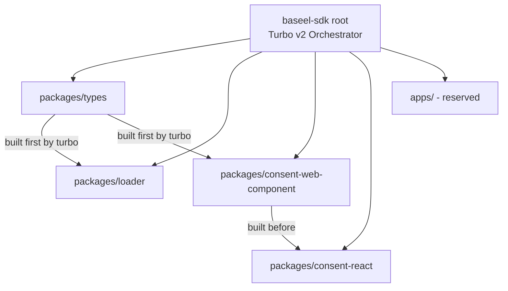
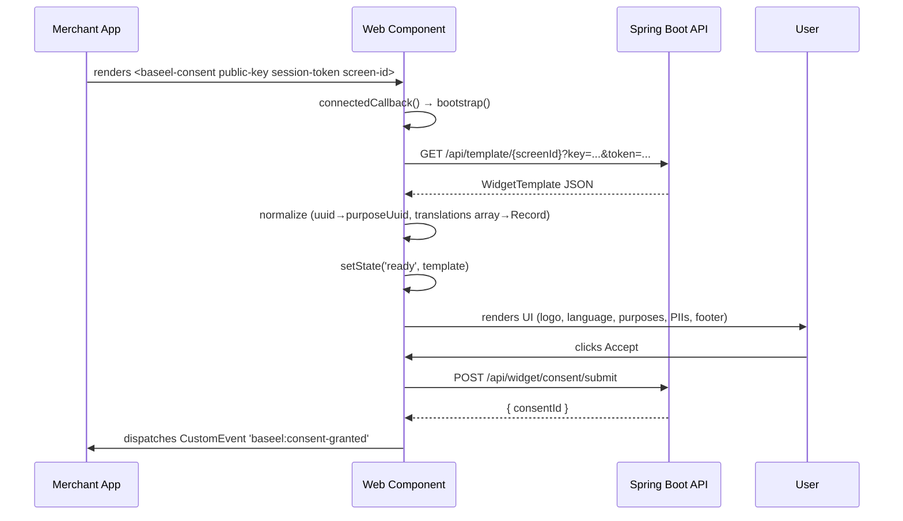
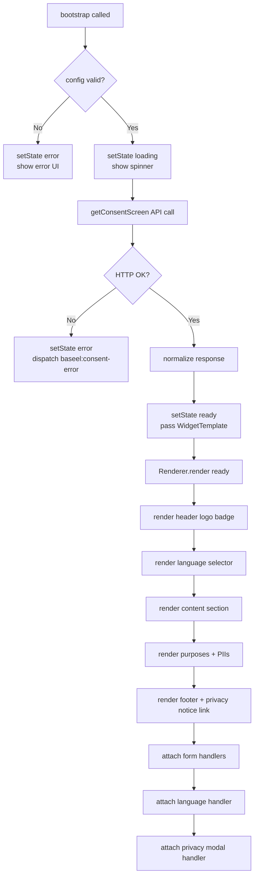
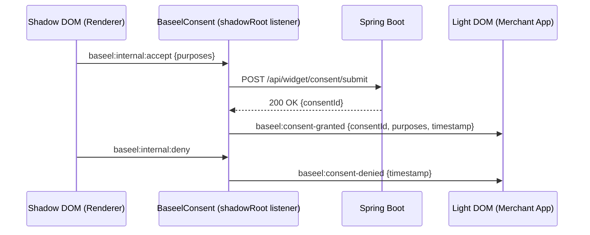
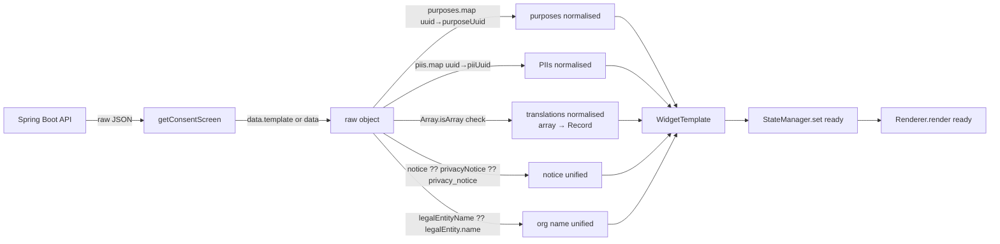
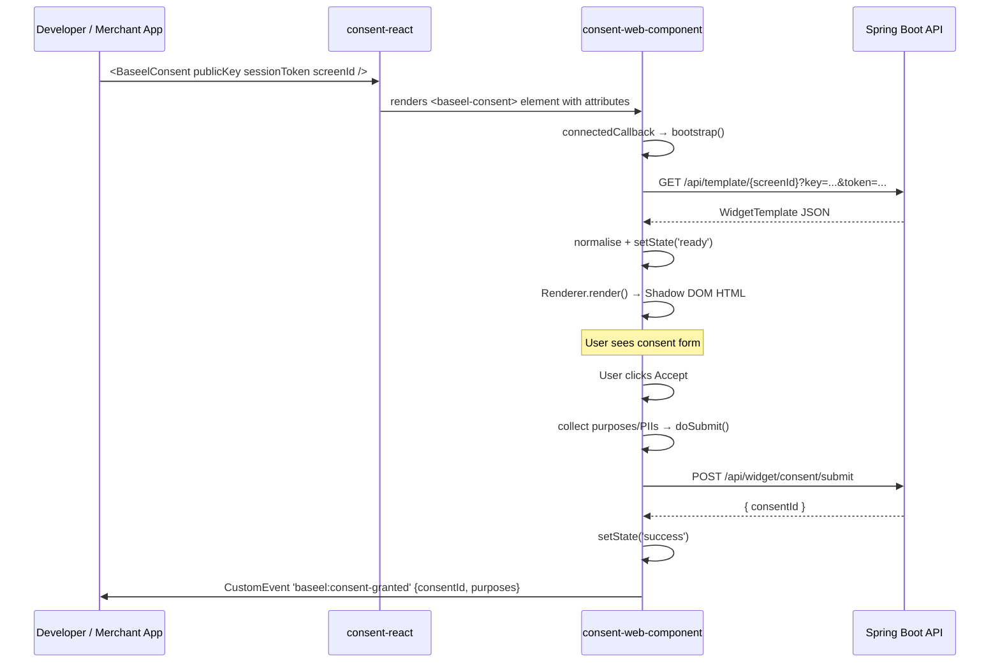
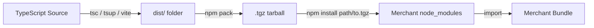

# Baseel SDK — Complete Implementation Details

> **Audience:** Developers, architects, technical managers, interviewers, new team members  
> **Purpose:** Understand every aspect of this project without reading source code  
> **Date generated:** 2026-07-03  
> **Branch analysed:** `1-pashe-1-configuration`

---

## Table of Contents

1. [Project Overview](#section-1-project-overview)
2. [Project Architecture](#section-2-project-architecture)
3. [Complete Folder Structure](#section-3-complete-folder-structure)
4. [Package Analysis](#section-4-package-analysis)
5. [File-by-File Analysis](#section-5-file-by-file-analysis)
6. [Function Analysis](#section-6-function-analysis)
7. [Configuration Files](#section-7-configuration-files)
8. [Build Process](#section-8-build-process)
9. [Project Execution Flow](#section-9-project-execution-flow)
10. [Event Flow](#section-10-event-flow)
11. [API Flow](#section-11-api-flow)
12. [Data Flow](#section-12-data-flow)
13. [System Diagrams](#section-13-system-diagrams)
14. [Dependency Analysis](#section-14-dependency-analysis)
15. [Testing](#section-15-testing)
16. [Security](#section-16-security)
17. [Performance](#section-17-performance)
18. [Current Implementation Status](#section-18-current-implementation-status)
19. [Enhancements](#section-19-enhancements)
20. [Manager Guide Compliance](#section-20-manager-guide-compliance)
21. [Interview / Presentation Guide](#section-21-interview--presentation-guide)
22. [Quick Revision Notes](#section-22-quick-revision-notes)

---

## Section 1: Project Overview

### Simple Language Explanation

Imagine a bank or a hospital that needs to ask their website visitors: *"Can we collect and use your personal data?"* This is a legal requirement in many countries (GDPR, DPDP Act, etc.). Traditionally, companies embedded a separate page (an iframe) inside their website to show this consent form. The problem with iframes is that they look different from the rest of the website, they are slow to load, and they are hard to customise.

The **Baseel SDK** solves this problem. It is a JavaScript toolkit that allows any website or application to show a fully-styled, interactive consent form — without iframes — that blends perfectly into their existing design. The form fetches consent template data from the Baseel backend, displays purposes and PII (personally identifiable information) items that the user needs to agree to, collects the user's choices, and submits them back to the server.

### Technical Explanation

The Baseel SDK is a **TypeScript monorepo** that delivers a consent management user interface as a set of composable npm packages:

| Package | Role |
|---|---|
| `@baseel/types` | Shared TypeScript interfaces and enums — single source of truth for all data shapes |
| `@baseel/loader` | Core SDK: bootstrapping, backend configuration fetching, event emitter, logger, error hierarchy |
| `@baseel/consent-web-component` | Framework-agnostic Web Component (`<baseel-consent>`) that renders the consent UI using Shadow DOM |
| `@baseel/consent-react` | Thin React wrapper around the Web Component for seamless use in React/Next.js applications |

### Problem Solved

| Problem | Solution |
|---|---|
| Iframe-based consent forms are slow and unstyled | Native Web Component rendered inside the merchant's own DOM |
| Consent UI must match CMP platform appearance | Renderer mirrors CMP platform layout: logo, status badge, language selector, purposes, PIIs, privacy notice modal |
| Field naming mismatch between API (uuid) and submit endpoint (purposeUuid / piiUuid) | Normalisation layer in `getConsentScreen()` |
| React / Next.js SSR breaks because `HTMLElement` is not defined in Node.js | React wrapper is loaded dynamically with `ssr: false` |
| Translations returned as array by API but consumed as `Record` by renderer | Normalisation converts array → `Record<languageCode, translation>` |

### Business Use Case

Baseel is a **Consent Management Platform (CMP)**. Businesses (merchants) integrate the SDK into their apps or websites. When a user visits, the SDK renders a consent form that the merchant has configured on the CMP dashboard. The user grants or denies consent; the result is recorded server-side and an event is fired so the merchant's application can react (e.g., enable analytics, load tracking pixels, etc.).

### Target Users

- **Merchants / Integrating developers** — install and use the SDK in their apps
- **CMP platform developers (Baseel team)** — maintain and extend the SDK
- **End users** — interact with the consent form rendered by the SDK

---

## Section 2: Project Architecture

### High-Level Architecture

```mermaid
graph TD
    A[Merchant Website / App] -->|installs| B[@baseel/consent-react or @baseel/consent-web-component]
    B -->|renders| C[<baseel-consent> Web Component]
    C -->|HTTP GET| D[Spring Boot Backend\n/api/template/{uuid}]
    D -->|WidgetTemplate JSON| C
    C -->|renders| E[Consent UI\nShadow DOM]
    E -->|user clicks Accept| F[Submit Handler]
    F -->|HTTP POST| G[Spring Boot Backend\n/api/widget/consent/submit]
    G -->|200 OK| F
    F -->|CustomEvent| H[Merchant App Listener]
    B -->|uses types from| I[@baseel/types]
    B -->|uses errors from| J[@baseel/loader]
```

### Package Dependency Diagram

```mermaid
graph LR
    A[@baseel/consent-react] -->|depends on| B[@baseel/consent-web-component]
    B -->|imports types from| C[@baseel/types]
    A -->|peer depends on| D[react >= 18]
    E[@baseel/loader] -->|imports types from| C
    F[Merchant App] -->|installs| A
    F -->|installs| E
```

### Monorepo Structure Overview



### Request Flow



### Consent UI Render Flow



---

## Section 3: Complete Folder Structure

```
baseel-sdk/
│
├── packages/                        ← All publishable npm packages
│   │
│   ├── types/                       ← @baseel/types — shared TypeScript definitions
│   │   ├── src/
│   │   │   ├── index.ts             ← Barrel: re-exports all type modules
│   │   │   ├── config.ts            ← SdkConfig, BackendSdkConfig, LogLevel
│   │   │   ├── consent.ts           ← ConsentStatus, ConsentChangePayload
│   │   │   ├── error.ts             ← ErrorCode enum, BaseelErrorPayload
│   │   │   ├── event.ts             ← SdkEventMap (typed event bus interface)
│   │   │   ├── sdk.ts               ← BaseelSdkInstance interface
│   │   │   └── widget.ts            ← WidgetTemplate, WidgetPurposeItem, WidgetPiiItem, etc.
│   │   ├── dist/                    ← compiled JS + .d.ts (gitignored, generated)
│   │   ├── package.json
│   │   └── tsconfig.json
│   │
│   ├── loader/                      ← @baseel/loader — core SDK bootstrapper
│   │   ├── src/
│   │   │   ├── index.ts             ← Public API: loadSdk(), error exports
│   │   │   ├── bootstrap.ts         ← Singleton initialisation, window globals
│   │   │   ├── sdkInstance.ts       ← BaseelSdk class implementing BaseelSdkInstance
│   │   │   ├── configValidator.ts   ← validateConfig() — client-side config validation
│   │   │   ├── backendConfigValidator.ts ← validateBackendConfig() — API response validation
│   │   │   ├── configService.ts     ← ConfigService — fetches config from backend
│   │   │   ├── apiClient.ts         ← ApiClient — typed GET with timeout + abort
│   │   │   ├── eventEmitter.ts      ← EventEmitter — typed pub/sub
│   │   │   ├── logger.ts            ← Logger — level-filtered console output
│   │   │   └── errors.ts            ← Error hierarchy: BaseelError → ConfigurationError, etc.
│   │   ├── dist/
│   │   ├── package.json
│   │   ├── tsconfig.json
│   │   └── vite.config.ts           ← Vite library build (ES + CJS, minified with terser)
│   │
│   ├── consent-web-component/       ← @baseel/consent-web-component — the consent UI
│   │   ├── src/
│   │   │   ├── index.ts             ← Public exports (re-exports register.ts side-effect)
│   │   │   ├── register.ts          ← Calls customElements.define('baseel-consent', ...)
│   │   │   ├── constants.ts         ← ELEMENT_TAG, ATTR map, DEFAULT_API_BASE_URL
│   │   │   ├── component/
│   │   │   │   ├── index.ts         ← Barrel for component exports
│   │   │   │   ├── BaseelConsent.ts ← HTMLElement subclass: lifecycle, bootstrap, submit
│   │   │   │   ├── StateManager.ts  ← Holds UI state, notifies Renderer
│   │   │   │   └── Renderer.ts      ← Converts state → Shadow DOM HTML + event handlers
│   │   │   ├── api/
│   │   │   │   └── consent.ts       ← getConsentScreen() + submitConsent() API functions
│   │   │   └── events/
│   │   │       ├── index.ts         ← Barrel for event exports
│   │   │       └── events.ts        ← BASEEL_EVENTS constants + dispatch helpers
│   │   ├── dist/
│   │   ├── package.json
│   │   ├── tsconfig.json
│   │   └── tsup.config.ts           ← tsup: ESM output, DTS, sourcemap
│   │
│   └── consent-react/               ← @baseel/consent-react — React wrapper
│       ├── src/
│       │   ├── index.ts             ← Barrel: re-exports components + hooks
│       │   ├── components/
│       │   │   ├── index.ts         ← Re-exports BaseelConsent component
│       │   │   └── BaseelConsent.tsx ← React component wrapping the web component
│       │   └── hooks/
│       │       └── index.ts         ← Placeholder (hooks for future milestones)
│       ├── dist/
│       ├── package.json
│       ├── tsconfig.json
│       └── tsup.config.ts           ← tsup: ESM, external react + web-component
│
├── apps/                            ← Reserved for example / demo applications
│
├── node_modules/                    ← Root-level hoisted dependencies (npm workspaces)
│
├── package.json                     ← Root workspace definition + Turbo scripts
├── tsconfig.json                    ← Root TS config (includes all packages/*/src)
├── tsconfig.base.json               ← Shared compiler options (ES2022, NodeNext, strict)
├── turbo.json                       ← Turbo task pipeline definitions
├── IMPLEMENTATION_DETAILS.md        ← This file
└── README.md                        ← Generic GitLab template (needs customisation)
```

### Folder Purpose Table

| Folder | Why it exists | Key contents | Depends on |
|---|---|---|---|
| `packages/types` | Single source of truth for all TypeScript types | `widget.ts`, `config.ts`, `error.ts` | Nothing |
| `packages/loader` | Core SDK bootstrap + config fetch | `bootstrap.ts`, `sdkInstance.ts` | `@baseel/types` |
| `packages/consent-web-component` | Renders consent UI as a Web Component | `BaseelConsent.ts`, `Renderer.ts` | `@baseel/types` |
| `packages/consent-react` | React-friendly wrapper around web component | `BaseelConsent.tsx` | `@baseel/consent-web-component`, React |
| `apps/` | Placeholder for demo/testing apps | (empty or gitignored) | All packages |

---

## Section 4: Package Analysis

### 4.1 `@baseel/types`

**Purpose:** Shared TypeScript type library. No runtime code — only `interface`, `type`, and `enum` definitions.

**Why it exists:** Without a shared types package, every other package would need to duplicate type definitions or import from each other, creating circular dependencies. This package breaks that cycle.

**Build process:** Uses raw `tsc` (not tsup or vite) — no bundling needed since it only emits `.d.ts` and `.js` re-export files.

**Exports:**

| Module | Contents |
|---|---|
| `config.ts` | `LogLevel`, `SdkConfig`, `BackendSdkConfig`, `BackendConsentConfig`, `BackendConsentCategory`, `ConsentConfig` |
| `consent.ts` | `ConsentStatus` (`'granted' \| 'denied'`), `ConsentChangePayload` |
| `error.ts` | `ErrorCode` enum (10 codes), `BaseelErrorPayload` |
| `event.ts` | `SdkEventMap` (typed event bus interface mapping event names → payload types) |
| `sdk.ts` | `BaseelSdkInstance` (complete SDK instance interface) |
| `widget.ts` | `WidgetTemplate`, `WidgetPurposeItem`, `WidgetPiiItem`, `WidgetTranslation`, `WidgetPrivacyNotice`, `ConsentSubmitPayload` |

**Internal workflow:** No runtime logic. All interfaces are `export interface` / `export type` / `export enum` — purely compile-time.

---

### 4.2 `@baseel/loader`

**Purpose:** The core SDK that a merchant initialises once per page. It validates configuration, fetches application settings from the Baseel backend, creates a singleton SDK instance, and exposes an event bus.

**Responsibilities:**
- Validate merchant-provided `SdkConfig` (client-side)
- Determine the backend API base URL from `environment` or `customEndpoint`
- Fetch `BackendSdkConfig` from `GET /v1/configs/{appId}`
- Validate the backend response (server-side shape validation)
- Create and freeze the `BaseelSdk` instance
- Prevent double-initialisation (singleton guard using `window.__BASEEL_SDK__`)
- Provide typed pub/sub events: `initialized`, `consent_changed`, `error`

**Build process:** Vite library build → both `es` and `cjs` formats, minified with terser.

**Key classes:**

| Class | Role |
|---|---|
| `BaseelSdk` | Implements `BaseelSdkInstance`; holds consent status, event emitter, logger |
| `ApiClient` | Generic `GET` with AbortController timeout (default 5000ms) |
| `ConfigService` | Knows backend environment URLs, calls `ApiClient.get()` |
| `EventEmitter` | Typed pub/sub (`on`, `off`, `emit`, `clear`) keyed by `SdkEventMap` |
| `Logger` | Priority-filtered console wrapper (`debug < info < warn < error < none`) |

**Error hierarchy:**

```
Error
└── BaseelError (code: ErrorCode, details?: any)
    ├── ConfigurationError  (config validation failures)
    ├── InitializationError (double-init)
    ├── ConsentError        (invalid consent state)
    └── ApiError            (HTTP / network failures)
```

---

### 4.3 `@baseel/consent-web-component`

**Purpose:** The consent UI widget. Renders as a native Web Component (`<baseel-consent>`) using Shadow DOM — works in any framework or plain HTML.

**Responsibilities:**
- Define `<baseel-consent>` custom element
- Accept four HTML attributes: `public-key`, `session-token`, `screen-id`, `api-base-url`
- Fetch the consent template from the backend on mount
- Normalise API response (uuid → purposeUuid, translations array → Record)
- Render all UI states: loading spinner, error message, consent form, submitting, success
- Dispatch public CustomEvents: `baseel:consent-granted`, `baseel:consent-denied`, `baseel:consent-error`
- Handle language switching and privacy notice modal via Shadow DOM event handlers

**Build process:** tsup → ESM only (because it targets browsers and modern bundlers), DTS declarations, source maps.

**Key classes / modules:**

| File | Role |
|---|---|
| `BaseelConsent.ts` | `HTMLElement` subclass — lifecycle, config, bootstrap, submit |
| `StateManager.ts` | Holds current `ComponentState`, notifies listeners on change |
| `Renderer.ts` | Translates `StateData` → Shadow DOM innerHTML + attaches event handlers |
| `api/consent.ts` | `getConsentScreen()` + `submitConsent()` — all HTTP calls |
| `events/events.ts` | `BASEEL_EVENTS` constants + `dispatchConsentGranted/Denied/Error()` helpers |
| `constants.ts` | `ELEMENT_TAG`, `ATTR`, `DEFAULT_API_BASE_URL` |
| `register.ts` | Side-effect: calls `customElements.define()` once |

**State machine:**

```
loading → ready (template loaded)
loading → error (fetch failed)
ready → submitting (user clicked Accept)
submitting → success (submit OK)
submitting → error (submit failed)
```

---

### 4.4 `@baseel/consent-react`

**Purpose:** Provides a React component `<BaseelConsent>` that wraps the web component. Solves the prop-to-attribute bridging problem and SSR incompatibility.

**Responsibilities:**
- Accept React props (`publicKey`, `sessionToken`, `screenId`, `apiBaseUrl`, event callback props)
- Set those props as HTML attributes on the `<baseel-consent>` element via a `useCallback` ref
- Attach custom event listeners for `baseel:consent-granted`, `baseel:consent-denied`, `baseel:consent-error`
- Re-attach listeners whenever callback props change (via `useRef` + `useCallback`)
- **No `useEffect`** — uses the `useCallback` ref pattern to avoid stale closure issues

**Build process:** tsup → ESM only, DTS. React and the web-component package are listed as `external` so they are not bundled.

**Why no `useEffect`:** The ref callback (`ref={callbackRef}`) fires when the DOM node mounts/unmounts. Using `useCallback` wrapping a `useRef` ensures the latest callback props are always used without the dependency array complexity of `useEffect`.

---

### 4.5 `@baseel/consent-node` (Not yet implemented)

**Purpose:** Server-side SDK for Node.js applications to verify consent tokens via HMAC signature verification. Planned for a future milestone.

**Expected responsibilities:** Verify webhook payloads, verify consent signatures, provide server-side consent querying.

---

## Section 5: File-by-File Analysis

### `packages/types/src/widget.ts`

**Purpose:** Defines the complete shape of data received from the backend consent template API and the payload sent on submission.

**Key interfaces:**

| Interface | Fields | Used by |
|---|---|---|
| `WidgetPiiItem` | `piiUuid`, `uuid?`, `piiCode?`, `name?`, `title?`, `description?`, `required`, `expiresAt?` | Renderer, submitConsent |
| `WidgetPurposeItem` | `purposeUuid`, `uuid?`, `purposeCode?`, `name?`, `title?`, `description?`, `required?`, `category?`, `piis[]` | Renderer, submitConsent |
| `WidgetTemplate` | All template fields + `translations?`, `notice?`, `privacyNotice?`, `purposes[]` | StateManager, Renderer |
| `WidgetTranslation` | `languageCode`, `header`, `body`, `footer` | Renderer language switcher |
| `WidgetPrivacyNotice` | `uuid`, `title`, `content`, `effectiveFrom?`, `effectiveTo?` | Renderer privacy modal |
| `ConsentSubmitPayload` | `templateUuid`, `templateVersion`, `languageCode`, `purposes[]` | submitConsent() |

**Design note:** Both `uuid` and `purposeUuid`/`piiUuid` are present on purpose items to accommodate API responses that use either field name. Normalisation in `getConsentScreen()` ensures `purposeUuid`/`piiUuid` are always set.

---

### `packages/loader/src/bootstrap.ts`

**Purpose:** The entry point for SDK initialisation. Enforces the singleton pattern, validates config, fetches backend config, and creates the SDK instance.

**Execution flow:**
1. Check `window.__BASEEL_SDK__` — if set and same `appId`, return existing instance
2. If different `appId`, throw `InitializationError`
3. Call `validateConfig(config)` → returns `Required<SdkConfig>` with defaults filled
4. Create `Logger`, `ApiClient`, `ConfigService`
5. Call `configService.fetchConfig(appId)` → hits `GET /v1/configs/{appId}`
6. Validate response via `validateBackendConfig()`
7. Create `new BaseelSdk(validatedConfig, backendConfig)`
8. Set `window.__BASEEL_SDK__` and `window.BaseelSdk` globals
9. Set `isInitialized = true`, emit `'initialized'` event
10. Return instance

**Global declarations:** Extends `Window` interface with `__BASEEL_SDK__?: BaseelSdkInstance` and `BaseelSdk?: BaseelSdkInstance`.

---

### `packages/loader/src/apiClient.ts`

**Purpose:** A minimal, typed HTTP client for `GET` requests. Uses `AbortController` for timeout control.

**Key behaviour:**
- Default timeout: `5000ms`
- On 401/403: throws `ApiError` with `ErrorCode.API_UNAUTHORIZED`
- On other non-OK: throws `ApiError` with `ErrorCode.API_CLIENT_ERROR`
- On abort: throws `ApiError` with `ErrorCode.API_TIMEOUT`
- On network failure: throws `ApiError` with `ErrorCode.API_NETWORK_ERROR`
- Validates `Content-Type: application/json` before parsing

---

### `packages/loader/src/configService.ts`

**Purpose:** Knows the three environment endpoint URLs and constructs the correct API URL.

**Environment → URL mapping:**

| Environment | Base URL |
|---|---|
| `development` | `https://api-dev.baseel.com` |
| `staging` | `https://api-staging.baseel.com` |
| `production` | `https://api.baseel.com` |
| `customEndpoint` set | Uses `customEndpoint` (stripped trailing slashes) |

---

### `packages/loader/src/sdkInstance.ts`

**Purpose:** The concrete `BaseelSdk` class that implements `BaseelSdkInstance`. Manages consent status and the event bus.

**Key behaviour:**
- `config` and `backendConfig` are frozen with `Object.freeze()` — immutable after creation
- `getConsentStatus()` — returns current `'granted' | 'denied'` status
- `setConsentStatus(status)` — validates input, updates status, emits `'consent_changed'` event
- Skips update if status is already the same value (idempotent)

---

### `packages/loader/src/eventEmitter.ts`

**Purpose:** A typed event bus. Keys are constrained to `keyof SdkEventMap` so TypeScript enforces that the right payload type is used for each event.

**API:** `on(event, handler)`, `off(event, handler)`, `emit(event, data)`, `clear()`

---

### `packages/loader/src/logger.ts`

**Purpose:** Console logging with priority filtering.

**Priority order:** `debug (0) < info (1) < warn (2) < error (3) < none (4)`

If `logLevel` is `'warn'`, only `warn` and `error` messages are printed.

---

### `packages/consent-web-component/src/component/BaseelConsent.ts`

**Purpose:** The Web Component class. Bridges HTML attributes → API calls → UI rendering.

**Lifecycle hooks:**

| Hook | What happens |
|---|---|
| `constructor()` | Attaches shadow root (`mode: 'open'`) |
| `connectedCallback()` | Creates `Renderer`, subscribes `StateManager.onChange`, adds shadow DOM event listeners, calls `bootstrap()` |
| `disconnectedCallback()` | Removes shadow DOM listeners, nulls renderer |
| `attributeChangedCallback()` | Re-runs `bootstrap()` if renderer is alive and value changed |

**Fetch race guard:** `fetchGen` counter increments on every `bootstrap()` call. The response is discarded if `gen !== this.fetchGen`, preventing stale renders when attributes change rapidly.

**Internal event flow:**
- Shadow DOM fires `baseel:internal:accept` (from Renderer button click) → `handleAccept` → `doSubmit()`
- Shadow DOM fires `baseel:internal:deny` → `handleDeny` → `dispatchConsentDenied()`

---

### `packages/consent-web-component/src/component/StateManager.ts`

**Purpose:** Observable state holder. Holds the current `StateData` and notifies all registered listeners when `set()` is called.

**States:** `'loading'`, `'ready'`, `'submitting'`, `'success'`, `'error'`

**`StateData` shape:**
```typescript
{
  state: ComponentState;
  template?: WidgetTemplate;  // only in 'ready' state
  error?: string;             // only in 'error' state
}
```

---

### `packages/consent-web-component/src/component/Renderer.ts`

**Purpose:** The UI rendering engine. Injects CSS into Shadow DOM on construction, then generates HTML for each state and attaches event handlers.

**CSS Variables exposed:**

| Variable | Default | Purpose |
|---|---|---|
| `--baseel-primary` | `#0066ff` | Button and link colour |
| `--baseel-text` | `#1a1a1a` | Body text |
| `--baseel-muted` | `#6b7280` | Secondary text |
| `--baseel-border` | `#e5e7eb` | Dividers and borders |
| `--baseel-radius` | `12px` | Card border radius |
| `--baseel-danger` | `#dc2626` | Error and required badge |
| `--baseel-success` | `#16a34a` | Success message and active badge |

**Rendered sections (in order):**
1. Widget header: logo (img or placeholder emoji), template title, ACTIVE status badge, org name, version badge
2. Language row (only if `translations` has >1 language): globe icon, "Language" label, `<select>` dropdown with native script names
3. Content section: `header` and `body` text (translatable)
4. Purposes section: "WHAT DATA WE COLLECT & WHY" heading, purpose cards with checkboxes and nested PII items
5. Footer section: footer text + Privacy Notice link (if `notice`/`privacyNotice` exists) + Decline/Accept buttons
6. Privacy notice modal overlay (hidden by default)

**Language names map** (includes native scripts):

| Code | Label |
|---|---|
| `hi` | Hindi (हिन्दी) |
| `ta` | Tamil (தமிழ்) |
| `te` | Telugu (తెలుగు) |
| `kn` | Kannada (ಕನ್ನಡ) |
| `ml` | Malayalam (മലയാളം) |
| `bn` | Bengali (বাংলা) |
| `mr` | Marathi (मराठी) |
| `gu` | Gujarati (ગુજરાતી) |
| `pa` | Punjabi (ਪੰਜਾਬੀ) |
| `or` | Odia (ଓଡ଼ିଆ) |

**Private methods:**

| Method | Purpose |
|---|---|
| `loading(message)` | Returns spinner + message HTML |
| `error(message)` | Returns warning icon + red message HTML |
| `success()` | Returns green checkmark + success text HTML |
| `ready(template)` | Assembles full consent UI HTML |
| `renderPurposes(purposes)` | Iterates purpose items → purpose cards with nested PII checkboxes |
| `attachFormHandlers(widget)` | Wires Accept/Decline button click → internal CustomEvents |
| `attachLanguageHandler(widget, template)` | Language `<select>` onChange → updates `data-field="header"` and `data-field="body"` text |
| `attachPrivacyHandler(widget)` | Privacy Notice link → removes `hidden`; close button / overlay click → adds `hidden` |

---

### `packages/consent-web-component/src/api/consent.ts`

**Purpose:** All HTTP communication for the web component. Two exported functions.

**`getConsentScreen(screenId, publicKey, sessionToken, apiBaseUrl)`**

- URL: `GET {apiBaseUrl}/api/template/{screenId}?key={publicKey}&token={sessionToken}`
- No `Authorization` header on GET (token is a query param)
- Unwraps `data.template ?? data` to handle both wrapped and direct responses
- **Normalises:**
  - `purposes[].uuid → purposeUuid`
  - `purposes[].piis[].uuid → piiUuid`
  - `translations` array → `Record<languageCode, translation>`
  - `notice ?? privacyNotice ?? privacy_notice → notice`
  - `legalEntityName ?? legalEntity.name → legalEntityName`

**`submitConsent(templateUuid, templateVersion, languageCode, publicKey, sessionToken, purposes, apiBaseUrl)`**

- URL: `POST {apiBaseUrl}/api/widget/consent/submit`
- Headers: `Authorization: Bearer {token}`, `X-Publishable-Key: {publicKey}`, `Content-Type: application/json`
- Strips `"Bearer "` prefix from token if already present to avoid double-prefixing
- Body: `{ templateUuid, templateVersion, languageCode, purposes: [{ purposeUuid, piis: [{ piiUuid, required }] }] }`
- Returns `{ consentId }` (from `data.consentId ?? data.uuid ?? data.id`)

---

### `packages/consent-web-component/src/events/events.ts`

**Purpose:** Defines and dispatches the three public CustomEvents.

| Constant | Event name | When fired | Payload |
|---|---|---|---|
| `BASEEL_EVENTS.CONSENT_GRANTED` | `baseel:consent-granted` | Submit API returns 2xx | `{ consentId?, purposes: string[], timestamp }` |
| `BASEEL_EVENTS.CONSENT_DENIED` | `baseel:consent-denied` | User clicks Decline | `{ timestamp }` |
| `BASEEL_EVENTS.CONSENT_ERROR` | `baseel:consent-error` | Any error state | `{ message: string }` |

All events bubble (`bubbles: true`) and cross Shadow DOM boundaries (`composed: true`).

---

### `packages/consent-react/src/components/BaseelConsent.tsx`

**Purpose:** React component that renders `<baseel-consent>` and bridges React props ↔ HTML attributes.

**Props interface (`BaseelConsentProps`):**

| Prop | Type | Maps to |
|---|---|---|
| `publicKey` | `string` | `public-key` attribute |
| `sessionToken` | `string` | `session-token` attribute |
| `screenId` | `string` | `screen-id` attribute |
| `apiBaseUrl?` | `string` | `api-base-url` attribute |
| `onConsentGranted?` | `(detail) => void` | `baseel:consent-granted` event |
| `onConsentDenied?` | `(detail) => void` | `baseel:consent-denied` event |
| `onConsentError?` | `(detail) => void` | `baseel:consent-error` event |

**Pattern used:** `useCallback` ref instead of `useEffect`. When the DOM node mounts, the callback fires; it sets attributes on the element and attaches event listeners using `useRef`-stored callbacks so the latest version is always called without stale closures.

---

## Section 6: Function Analysis

### `bootstrap(config: SdkConfig): Promise<BaseelSdkInstance>`

| Attribute | Detail |
|---|---|
| **Module** | `packages/loader/src/bootstrap.ts` |
| **Input** | Raw user-provided `SdkConfig` object |
| **Output** | Promise resolving to `BaseelSdkInstance` |
| **Side effects** | Sets `window.__BASEEL_SDK__`, `window.BaseelSdk` |
| **Error cases** | `InitializationError` on double init with different appId; `ConfigurationError` on invalid config; `ApiError` on backend fetch failure |
| **Callers** | `packages/loader/src/index.ts` → `loadSdk()` |

---

### `validateConfig(config: SdkConfig): Required<SdkConfig>`

| Attribute | Detail |
|---|---|
| **Module** | `packages/loader/src/configValidator.ts` |
| **Input** | Raw `SdkConfig` (may have missing optional fields) |
| **Output** | Fully-populated `Required<SdkConfig>` with defaults applied |
| **Validates** | `appId` non-empty string; `environment` one of 3 values; `logLevel` one of 5 values |
| **Defaults** | `environment: 'production'`, `logLevel: 'error'`, `consent.enabled: true`, `consent.defaultStatus: 'denied'`, `autoInitialize: true` |

---

### `getConsentScreen(screenId, publicKey, sessionToken, apiBaseUrl): Promise<WidgetTemplate>`

| Attribute | Detail |
|---|---|
| **Module** | `packages/consent-web-component/src/api/consent.ts` |
| **Input** | Four strings: template UUID, public API key, session JWT, backend base URL |
| **Output** | Normalised `WidgetTemplate` |
| **Normalisation** | `uuid → purposeUuid`, `uuid → piiUuid`, `translations[]` → `Record`, `notice` field unification, `legalEntityName` from either root or `legalEntity.name` |
| **Error cases** | Network error, 401/403, non-OK HTTP, missing `uuid` in response |

---

### `submitConsent(templateUuid, templateVersion, languageCode, publicKey, sessionToken, purposes, apiBaseUrl): Promise<{consentId?}>`

| Attribute | Detail |
|---|---|
| **Module** | `packages/consent-web-component/src/api/consent.ts` |
| **Input** | Template identifiers + auth credentials + selected purposes/PIIs |
| **Output** | `{ consentId?: string }` |
| **Headers sent** | `Authorization: Bearer {token}`, `X-Publishable-Key: {publicKey}` |
| **Body sent** | `{ templateUuid, templateVersion, languageCode, purposes: [{ purposeUuid, piis: [{ piiUuid, required }] }] }` |

---

### `Renderer.attachFormHandlers(widget)`

| Attribute | Detail |
|---|---|
| **Purpose** | Wire Accept and Decline buttons to internal Shadow DOM events |
| **Accept flow** | Collects checked purpose checkboxes → for each, collects PII checkboxes → builds `SubmitPurpose[]` → dispatches `baseel:internal:accept` with `{ purposes }` |
| **Deny flow** | Dispatches `baseel:internal:deny` |
| **Why internal events** | Shadow DOM isolation — the web component's outer element listens on the shadow root, not the light DOM |

---

### `Renderer.attachLanguageHandler(widget, template)`

| Attribute | Detail |
|---|---|
| **Purpose** | Live language switching without re-fetching the API |
| **Mechanism** | `<select>` onChange → looks up `template.translations[lang]` → updates elements with `data-field="header"` and `data-field="body"` textContent |
| **English fallback** | When `lang === 'en'`, uses original `template.header` / `template.body` |

---

### `Renderer.attachPrivacyHandler(widget)`

| Attribute | Detail |
|---|---|
| **Purpose** | Show/hide the privacy notice modal |
| **Open trigger** | `[data-privacy-toggle]` button click → `modal.removeAttribute('hidden')` |
| **Close triggers** | `[data-privacy-close]` button click OR clicking the modal overlay backdrop |

---

## Section 7: Configuration Files

### `package.json` (root)

```json
{
  "name": "baseel-sdk-monorepo",
  "private": true,
  "packageManager": "npm@11.11.0",
  "workspaces": ["packages/*", "apps/*"],
  "scripts": {
    "build": "turbo build",
    "dev": "turbo dev",
    "lint": "turbo lint",
    "test": "turbo test",
    "typecheck": "tsc --noEmit"
  }
}
```

| Field | Meaning |
|---|---|
| `private: true` | Prevents the monorepo root from being accidentally published to npm |
| `packageManager` | Pins npm version for consistent installs across developer machines |
| `workspaces` | Tells npm which directories contain packages; enables hoisting and cross-package `*` references |
| `turbo build` | Delegates to Turbo which runs `build` in each package in dependency order |
| `typecheck` | Runs `tsc --noEmit` across all packages (no emit, just type checking) |

---

### `tsconfig.base.json`

```json
{
  "compilerOptions": {
    "target": "ES2022",
    "module": "NodeNext",
    "moduleResolution": "NodeNext",
    "strict": true,
    "declaration": true,
    "sourceMap": true,
    "esModuleInterop": true,
    "skipLibCheck": true,
    "forceConsistentCasingInFileNames": true
  }
}
```

| Option | Why set |
|---|---|
| `target: ES2022` | Enables modern JS features (top-level await, private class fields); browsers support it natively |
| `module: NodeNext` | Required for proper ESM interop with `.js` extensions in import paths |
| `moduleResolution: NodeNext` | Resolves `imports` and `exports` fields in `package.json` correctly |
| `strict: true` | Enables all strict type checks — prevents `any` leakage, null pointer bugs, etc. |
| `declaration: true` | Emits `.d.ts` files so consumers get full IntelliSense |
| `sourceMap: true` | Maps compiled JS back to TypeScript source for debugging |
| `skipLibCheck: true` | Skips checking `.d.ts` files in `node_modules` — speeds up compilation |

---

### `turbo.json`

```json
{
  "tasks": {
    "build": {
      "dependsOn": ["^build"],
      "outputs": ["dist/**"]
    },
    "dev": { "cache": false, "persistent": true },
    "lint": {},
    "test": { "dependsOn": ["^build"] }
  }
}
```

| Setting | Meaning |
|---|---|
| `"dependsOn": ["^build"]` | `^` means "build my dependencies first" — ensures `@baseel/types` builds before packages that import it |
| `"outputs": ["dist/**"]` | Turbo caches these paths; if inputs unchanged, cache hit skips rebuild |
| `dev: cache: false` | Watch mode must always re-run |
| `dev: persistent: true` | Turbo keeps the process alive (watcher process) |
| `test: dependsOn ["^build"]` | Tests run only after all dependencies are built |

---

### `packages/consent-web-component/tsup.config.ts`

```typescript
export default defineConfig({
  entry: ['src/index.ts'],
  format: ['esm'],
  dts: true,
  clean: true,
  sourcemap: true,
  external: [],
});
```

| Option | Meaning |
|---|---|
| `format: ['esm']` | Output only ES modules — targets modern bundlers and browsers |
| `dts: true` | Emit TypeScript declaration files alongside JS |
| `clean: true` | Delete `dist/` before each build — prevents stale artefacts |
| `external: []` | Bundle everything — no external dependencies to exclude (types are inlined) |

---

### `packages/consent-react/tsup.config.ts`

```typescript
export default defineConfig({
  entry: ['src/index.ts'],
  format: ['esm'],
  dts: true,
  clean: true,
  sourcemap: true,
  external: ['react', 'react-dom', '@baseel/consent-web-component'],
});
```

| `external` entry | Why excluded |
|---|---|
| `react` | Provided by the consumer app — would cause two React instances if bundled |
| `react-dom` | Same reason as React |
| `@baseel/consent-web-component` | Consumer installs it separately; avoids double-bundling |

---

### `packages/loader/vite.config.ts`

```typescript
export default defineConfig({
  build: {
    lib: {
      entry: resolve(__dirname, 'src/index.ts'),
      name: 'BaseelLoader',
      fileName: 'index',
      formats: ['es', 'cjs']
    },
    minify: 'terser'
  }
});
```

The loader uses **Vite** (not tsup) to produce both `es` and `cjs` formats, ensuring compatibility with CommonJS environments (older Node.js, Next.js server-side).

---

## Section 8: Build Process

### Full Build Pipeline

```
npm install
    │
    └── hoists all dependencies to root node_modules
        installs workspace packages with cross-references

npm run build  →  turbo build
    │
    ├── (Step 1) @baseel/types: tsc
    │       src/*.ts → dist/*.js + dist/*.d.ts
    │       (must complete before other packages start)
    │
    ├── (Step 2 - parallel) @baseel/loader: vite build
    │       src/index.ts → dist/index.js (ES) + dist/index.cjs (CJS)
    │       minified with terser
    │
    ├── (Step 2 - parallel) @baseel/consent-web-component: tsup
    │       src/index.ts → dist/index.js (ESM) + dist/index.d.ts
    │       includes all source (no externals)
    │
    └── (Step 3) @baseel/consent-react: tsup
            src/index.ts → dist/index.js (ESM) + dist/index.d.ts
            externals: react, react-dom, @baseel/consent-web-component

npm run typecheck → tsc --noEmit
    Checks all packages/*/src/**/* against tsconfig.base.json
    Does NOT emit files — pure type validation

npm run test → turbo test
    Runs vitest --passWithNoTests in each package
    Currently no test files exist; passes silently

npm run lint → turbo lint
    No lint config found in repo — task defined but linter not configured yet

npm pack (in consent-web-component)
    Creates baseel-consent-web-component-0.0.1.tgz
    Used for local installation in merchant/testing apps
```

### Turbo Dependency Graph

```
@baseel/types
    └──> @baseel/loader           (can build in parallel after types)
    └──> @baseel/consent-web-component  (can build in parallel after types)
              └──> @baseel/consent-react   (must wait for web-component)
```

---

## Section 9: Project Execution Flow

### End-to-End User Flow

```mermaid
flowchart TD
    A[Merchant installs SDK packages] --> B[Merchant renders &lt;BaseelConsent&gt; in React app]
    B --> C[React wrapper mounts &lt;baseel-consent&gt; element]
    C --> D[BaseelConsent.connectedCallback fires]
    D --> E[Renderer created, initial loading state rendered]
    E --> F[bootstrap called]
    F --> G{All attributes present?}
    G -->|No| H[Error state rendered]
    G -->|Yes| I[GET /api/template/{screenId}?key=...&token=...]
    I --> J{HTTP 200?}
    J -->|No| K[Error state, dispatch baseel:consent-error]
    J -->|Yes| L[Normalize API response]
    L --> M[setState ready with WidgetTemplate]
    M --> N[Renderer renders full consent UI]
    N --> O[User views form: logo, language, purposes, PIIs]
    O --> P{User action}
    P -->|Click Accept| Q[Collect checked purposes + PIIs]
    Q --> R[Dispatch baseel:internal:accept with purposes]
    R --> S[handleAccept fires → doSubmit]
    S --> T[setState submitting]
    T --> U[POST /api/widget/consent/submit]
    U --> V{HTTP 200?}
    V -->|No| W[setState error, dispatch baseel:consent-error]
    V -->|Yes| X[setState success, dispatch baseel:consent-granted]
    X --> Y[Merchant app receives event, proceeds with analytics etc.]
    P -->|Click Decline| Z[Dispatch baseel:consent-denied]
    Z --> Y
```

---

## Section 10: Event Flow

### Internal Shadow DOM Events (private, never leave the shadow root)

| Event name | Fired by | Listened by | Payload |
|---|---|---|---|
| `baseel:internal:accept` | `Renderer.attachFormHandlers` (Accept button) | `BaseelConsent.handleAccept` on `shadowRoot` | `{ purposes: SubmitPurpose[] }` |
| `baseel:internal:deny` | `Renderer.attachFormHandlers` (Decline button) | `BaseelConsent.handleDeny` on `shadowRoot` | (none) |

### Public DOM Events (bubble through Shadow DOM, visible to merchant app)

| Event name | Fired by | Payload | When |
|---|---|---|---|
| `baseel:consent-granted` | `dispatchConsentGranted()` in `doSubmit()` | `{ consentId?, purposes: string[], timestamp }` | Submit API returns 2xx |
| `baseel:consent-denied` | `dispatchConsentDenied()` in `handleDeny()` | `{ timestamp }` | User clicks Decline |
| `baseel:consent-error` | `dispatchConsentError()` in error handlers | `{ message: string }` | Any failure (fetch or submit) |

### Event Listener Registration in React Wrapper

```typescript
// useCallback ref pattern — no useEffect
const callbackRef = useCallback((el: HTMLElement | null) => {
  if (!el) return;
  // Set attributes
  el.setAttribute('public-key', publicKey);
  // ...
  // Attach events using refs so latest callbacks are always used
  el.addEventListener('baseel:consent-granted', grantedHandler);
  el.addEventListener('baseel:consent-denied', deniedHandler);
  el.addEventListener('baseel:consent-error', errorHandler);
}, [publicKey, sessionToken, screenId, apiBaseUrl]);
```

### Event Flow Diagram



---

## Section 11: API Flow

### GET Template API

```
Request:
  GET {apiBaseUrl}/api/template/{screenId}?key={publicKey}&token={sessionToken}
  Headers:
    Accept: application/json

Response 200:
  Content-Type: application/json
  Body: WidgetTemplate JSON (may be wrapped in { template: {...} })

Response 401/403:
  → Throws "Invalid or expired session token."

Response other non-2xx:
  → Throws "Failed to load consent screen (HTTP {status})."
```

### POST Submit API

```
Request:
  POST {apiBaseUrl}/api/widget/consent/submit
  Headers:
    Content-Type: application/json
    Authorization: Bearer {sessionToken}
    X-Publishable-Key: {publicKey}
  Body:
    {
      "templateUuid": "...",
      "templateVersion": 1,
      "languageCode": "en",
      "purposes": [
        {
          "purposeUuid": "...",
          "piis": [
            { "piiUuid": "...", "required": true }
          ]
        }
      ]
    }

Response 200:
  { "consentId": "...", ... }

Response 401:
  → Throws "Invalid or expired session token."

Response 400:
  → Throws "Consent submission failed (HTTP 400)."
```

### Backend CORS Requirement

The Spring Boot backend must include `x-publishable-key` in its `Access-Control-Allow-Headers`. Without this, the browser blocks the submit request:

```
Access-Control-Allow-Headers: authorization, content-type, x-publishable-key
```

---

## Section 12: Data Flow

### Template Fetch + Normalisation Flow



### Submit Payload Assembly Flow

```mermaid
flowchart TD
    A[User clicks Accept] --> B[attachFormHandlers fires]
    B --> C[querySelectorAll name=purpose checked]
    C --> D[For each purpose checkbox]
    D --> E[querySelectorAll name=pii data-purpose=value]
    E --> F[Map each PII → piiUuid + required]
    F --> G[Build SubmitPurpose[]]
    G --> H[Dispatch baseel:internal:accept]
    H --> I[handleAccept → doSubmit]
    I --> J[Build ConsentSubmitPayload]
    J --> K[POST /api/widget/consent/submit]
```

---

## Section 13: System Diagrams

### Component Diagram

```mermaid
graph TB
    subgraph Merchant Application
        MA[App Code] --> RC[BaseelConsent React Component]
        MA --> LD[loadSdk - Loader]
    end

    subgraph consent-react package
        RC --> WC_ELEM[baseel-consent HTML element]
    end

    subgraph consent-web-component package
        WC_ELEM --> BC[BaseelConsent HTMLElement]
        BC --> SM[StateManager]
        BC --> REN[Renderer]
        BC --> API_M[consent.ts API module]
        BC --> EV[events.ts dispatch helpers]
        SM --> REN
    end

    subgraph types package
        WT[WidgetTemplate]
        WP[WidgetPurposeItem]
        WPI[WidgetPiiItem]
        WT --> WP --> WPI
    end

    subgraph loader package
        LD --> BS[bootstrap.ts]
        BS --> CS[ConfigService]
        BS --> AC[ApiClient]
        BS --> CV[configValidator]
        BS --> SDK[BaseelSdk instance]
    end

    subgraph Spring Boot Backend
        TAPI[GET /api/template]
        SAPI[POST /api/widget/consent/submit]
    end

    API_M -->|GET| TAPI
    API_M -->|POST| SAPI
    CS -->|GET| EXT[/v1/configs/appId]
```

### Sequence Diagram — Full Consent Flow



### Deployment Diagram

```mermaid
graph TD
    subgraph npm Registry
        PKG_T[@baseel/types tarball]
        PKG_L[@baseel/loader tarball]
        PKG_WC[@baseel/consent-web-component tarball]
        PKG_RC[@baseel/consent-react tarball]
    end

    subgraph Merchant Production Server
        APP[Next.js / React App] -->|npm install| PKG_RC
        PKG_RC -->|peer dep| PKG_WC
    end

    subgraph Baseel Backend
        API[Spring Boot REST API]
        DB[(PostgreSQL\nConsent Records)]
        API <--> DB
    end

    APP -->|API calls| API
    APP -->|served to| Browser

    subgraph Browser
        Browser[User Browser\nShadow DOM\n<baseel-consent>]
    end
```

### Build Flow Diagram



---

## Section 14: Dependency Analysis

### Root devDependencies

| Dependency | Version | Why used |
|---|---|---|
| `typescript` | ^5.4.5 | Type checking and compilation across all packages |
| `turbo` | ^2.0.0 | Monorepo task runner with caching and parallel execution |
| `tsup` | ^8.0.0 | Fast TypeScript bundler (used by web-component and react packages) |
| `vitest` | ^1.6.0 | Fast Vite-native unit test runner |
| `@types/node` | ^20.12.12 | Node.js type definitions (used in build scripts) |

### `packages/loader` devDependencies

| Dependency | Why |
|---|---|
| `vite` | Library build with CJS + ESM dual output |
| `terser` | Minification plugin for Vite |

### `packages/consent-react` devDependencies / peerDependencies

| Dependency | Why |
|---|---|
| `react` (peer ≥18) | Required by the consumer; declared as peer to avoid duplicate React instances |
| `react-dom` (peer ≥18) | Same reason |
| `@types/react` | TypeScript types for JSX |

### Internal Dependencies

| Package | Depends on |
|---|---|
| `@baseel/loader` | `@baseel/types: *` (workspace reference) |
| `@baseel/consent-web-component` | `@baseel/types` (imported directly) |
| `@baseel/consent-react` | `@baseel/consent-web-component: 0.0.1` (workspace reference) |

---

## Section 15: Testing

### Current State

All packages have `"test": "vitest run --passWithNoTests"` in their `package.json`. The `--passWithNoTests` flag means the test command exits with code 0 even when no test files exist.

**No test files are currently written.** The testing infrastructure is set up but tests have not been authored yet.

### Testing Strategy (Planned)

| Layer | Tool | What to test |
|---|---|---|
| Unit — types | vitest | Interface shape validation, type guards |
| Unit — loader | vitest + msw | `validateConfig()`, `validateBackendConfig()`, `ApiClient` with mocked fetch, `bootstrap()` singleton guard |
| Unit — web-component | vitest + happy-dom | `StateManager` transitions, `Renderer` HTML output per state, event dispatching |
| Unit — react | vitest + @testing-library/react | Props → attributes mapping, event callback firing |
| Integration | playwright | Full consent flow in a real browser |

### Vitest Configuration

Vitest is declared as a root devDependency but no `vitest.config.ts` file is present. When run, it uses default configuration (auto-discovers `*.test.ts` / `*.spec.ts` files).

---

## Section 16: Security

### Shadow DOM Isolation

The consent UI is rendered inside a Shadow DOM (`attachShadow({ mode: 'open' })`). This means:
- The merchant's global CSS cannot bleed in (no accidental style override)
- The merchant's JavaScript cannot accidentally query form elements inside the shadow root
- Internal events (`baseel:internal:accept`) stay within the shadow root and are not observable from outside

### Token Handling

- The session token is passed as a `Bearer` token in the `Authorization` header for submit
- The token is stripped of any existing `"Bearer "` prefix before re-adding it (prevents double-prefixing)
- The token is passed as a query parameter `?token=...` for the GET template fetch (no `Authorization` header on GET)
- Tokens are never stored in localStorage or cookies by the SDK

### Public Key (X-Publishable-Key)

- Sent as a custom header `X-Publishable-Key` to identify the merchant application
- This is a **publishable** (non-secret) key — it is intentionally exposed in browser code
- Backend CORS configuration must explicitly allow this header

### Input Validation

| Layer | What is validated |
|---|---|
| `validateConfig()` | appId non-empty, environment one of 3 values, logLevel one of 5 values |
| `validateBackendConfig()` | Entire backend response shape, each consent category, required boolean fields |
| `getConsentScreen()` | Checks `raw.uuid` present before returning — rejects malformed responses |
| `submitConsent()` | Checks HTTP status before returning — throws on 4xx/5xx |

### Error Exposure

Errors are caught and re-thrown as typed `BaseelError` subclasses. Internal error details (`details` field) are only visible to code that catches the error — they are not rendered in the UI. The UI only shows a generic user-friendly message.

### CORS

The backend must configure:
```
Access-Control-Allow-Origin: * (or specific merchant origin)
Access-Control-Allow-Methods: GET, POST, OPTIONS
Access-Control-Allow-Headers: authorization, content-type, x-publishable-key
```

---

## Section 17: Performance

### Bundle Size

| Package | Output size (approx) |
|---|---|
| `@baseel/consent-web-component` | ~24 KB JS + ~40 KB source map |
| `@baseel/consent-react` | Thin wrapper (~2–5 KB) |
| `@baseel/loader` | Minified with terser (~10–15 KB) |

### Tree Shaking

All packages use ESM format. Bundlers (webpack, Rollup, Vite) can tree-shake unused exports. The web component package bundles everything (no externals) to guarantee it works standalone.

### Shadow DOM Performance

Shadow DOM rendering is synchronous after the first async `bootstrap()` call. Re-renders happen only on state transitions — not on every attribute change. The `fetchGen` counter prevents unnecessary re-renders from stale responses.

### Lazy Loading (React)

In Next.js applications, the React wrapper must be loaded dynamically:
```typescript
const BaseelConsent = dynamic(
  () => import('@baseel/consent-react').then(m => m.BaseelConsent),
  { ssr: false }
);
```
This defers the web component code to the browser bundle only, avoiding the SSR `HTMLElement is not defined` error.

### API Timeout

`ApiClient` has a default 5000ms timeout via `AbortController`. The consent template fetch has no retry logic — failure immediately shows the error state.

### Memory

- `Renderer` injects `<style>` into the shadow root once on construction — not on every render
- Each re-render replaces the single `.widget` div — no accumulating DOM nodes
- Event listeners are cleaned up in `disconnectedCallback()` — no memory leaks when the element is unmounted

---

## Section 18: Current Implementation Status

| Feature | Status | Notes |
|---|---|---|
| Monorepo structure (Turbo + npm workspaces) | ✅ Complete | All 4 packages set up |
| `@baseel/types` — all interfaces | ✅ Complete | widget.ts, config.ts, error.ts, event.ts, sdk.ts |
| `@baseel/loader` — SDK bootstrap | ✅ Complete | Singleton, config validation, backend fetch |
| `@baseel/loader` — Event emitter | ✅ Complete | Typed pub/sub |
| `@baseel/loader` — Logger | ✅ Complete | 5 log levels |
| `@baseel/loader` — Error hierarchy | ✅ Complete | 4 error subclasses + ErrorCode enum |
| Web Component — custom element registration | ✅ Complete | `<baseel-consent>` via `customElements.define` |
| Web Component — Shadow DOM | ✅ Complete | `attachShadow({ mode: 'open' })` |
| Web Component — attribute observation | ✅ Complete | 4 observed attributes |
| Web Component — template fetch | ✅ Complete | `getConsentScreen()` with race guard |
| Web Component — API normalisation | ✅ Complete | uuid→purposeUuid, translations array→Record, notice unification |
| Web Component — state machine | ✅ Complete | loading→ready→submitting→success/error |
| Web Component — consent submit | ✅ Complete | `submitConsent()` with correct payload |
| Web Component — public CustomEvents | ✅ Complete | granted, denied, error |
| UI — loading spinner | ✅ Complete | CSS animation |
| UI — error state | ✅ Complete | Warning icon + red message |
| UI — success state | ✅ Complete | Green checkmark + message |
| UI — widget header (logo, title, badge, org, version) | ✅ Complete | Matches CMP platform |
| UI — language selector with native scripts | ✅ Complete | 11 Indian + 9 international languages |
| UI — live language switching | ✅ Complete | header/body swapped without API refetch |
| UI — purposes and PIIs rendering | ✅ Complete | Checkboxes, Required/Optional badges |
| UI — privacy notice modal | ✅ Complete | Open/close with backdrop click |
| UI — footer text | ✅ Complete | Translatable via `data-field` |
| React wrapper | ✅ Complete | `useCallback` ref pattern, no `useEffect` |
| React wrapper — prop→attribute bridging | ✅ Complete | All 4 required props |
| React wrapper — event callbacks | ✅ Complete | onConsentGranted, onConsentDenied, onConsentError |
| `@baseel/consent-node` | ❌ Not started | Server-side verification |
| Unit tests | ❌ Not started | Infrastructure ready, no test files |
| Integration tests | ❌ Not started | — |
| CI/CD pipeline | ❌ Not started | No `.github/workflows/` found |
| npm publish configuration | ⚠️ Partial | packages are `private: true`; needs publish config |
| ESLint configuration | ⚠️ Partial | Task defined in turbo.json, no `.eslintrc` found |
| Prettier configuration | ❌ Not found | — |
| README documentation | ⚠️ Partial | Generic GitLab template, not project-specific |
| HMAC signature verification | ❌ Not started | Planned for consent-node |

---

## Section 19: Enhancements

### High Priority

| Enhancement | Reason |
|---|---|
| Write unit tests for all packages | No tests exist; any refactor risks silent regressions |
| Configure ESLint + Prettier | No linter configured; code style is inconsistent |
| Add retry logic to `getConsentScreen()` | Network blips cause immediate error state; one retry would improve UX |
| Implement `@baseel/consent-node` | Backend verification of consent events is a core SDK feature |
| Add `loading` skeleton placeholder UI | Current spinner is bare; a skeleton matching the consent form dimensions reduces layout shift |

### Medium Priority

| Enhancement | Reason |
|---|---|
| Add `ExpiresAt` display for PII items | `WidgetPiiItem.expiresAt` is present in types but not rendered |
| Persist consent choice in `localStorage` | Avoid showing the form on every page load for returning users |
| Add `purpose.category` grouping in UI | `WidgetCategory` is typed but not rendered |
| Add keyboard accessibility (focus management in modal) | Privacy notice modal should trap focus; Escape key should close it |
| Add ARIA labels to all interactive elements | Shadow DOM accessibility requires explicit ARIA attributes |

### Medium Priority — Developer Experience

| Enhancement | Reason |
|---|---|
| Add `npm run changeset` + Changesets for versioning | All packages are at `0.0.1`; need a release workflow |
| Create `apps/example-vanilla` demo app | Developers need a working reference without a framework |
| Create `apps/example-react` demo app | Next.js demo with SSR fix pre-applied |
| Add Storybook for UI component development | Visual testing and design iteration for `Renderer.ts` |

### Low Priority

| Enhancement | Reason |
|---|---|
| Add `purpose-category` grouping | Nice-to-have visual organisation |
| Support RTL languages (Arabic, Hebrew) | `dir="rtl"` CSS adjustments needed |
| Add `consent-expiry` reminder system | Notify users when consents are about to expire |
| Add theming support via CSS custom property overrides | Merchants want brand colours |

### Future Architecture

| Enhancement | Reason |
|---|---|
| CDN loader script (`<script src="cdn.baseel.com/sdk.js">`) | Some merchants cannot use npm |
| Angular wrapper package | Parity with React wrapper |
| Vue wrapper package | Parity with React wrapper |
| Webhook verification in `consent-node` | HMAC-based payload signature verification |

---

## Section 20: Manager Guide Compliance

> Compliance table based on the milestones completed during the development session.

### Phase 0 — Foundation

| Task | Status | Evidence |
|---|---|---|
| Monorepo setup with npm workspaces | ✅ Done | Root `package.json` workspaces field |
| Turbo build orchestration | ✅ Done | `turbo.json` with `dependsOn: ["^build"]` |
| Shared `tsconfig.base.json` | ✅ Done | File present, all packages extend it |
| `@baseel/types` package created | ✅ Done | All type files present |

### Phase 1 — Core SDK (Loader)

| Task | Status | Evidence |
|---|---|---|
| `loadSdk(config)` entry point | ✅ Done | `packages/loader/src/index.ts` |
| Config validation | ✅ Done | `configValidator.ts` with all required checks |
| Backend config fetch | ✅ Done | `configService.ts` + `apiClient.ts` |
| Backend config validation | ✅ Done | `backendConfigValidator.ts` |
| Singleton guard | ✅ Done | `window.__BASEEL_SDK__` check in `bootstrap.ts` |
| Error hierarchy | ✅ Done | 4 error classes + ErrorCode enum |
| Typed event bus | ✅ Done | `eventEmitter.ts` keyed by `SdkEventMap` |
| Logger with levels | ✅ Done | `logger.ts` with 5 levels |

### Phase 2 — Web Component

| Task | Status | Evidence |
|---|---|---|
| `<baseel-consent>` custom element | ✅ Done | `BaseelConsent.ts` + `register.ts` |
| Shadow DOM | ✅ Done | `attachShadow({ mode: 'open' })` |
| 4 observed attributes | ✅ Done | `observedAttributes` static getter |
| Template API fetch | ✅ Done | `getConsentScreen()` |
| Consent submit API | ✅ Done | `submitConsent()` with correct payload |
| API normalisation layer | ✅ Done | uuid→purposeUuid, translations, notice |
| State machine (5 states) | ✅ Done | `StateManager.ts` |
| Public CustomEvents | ✅ Done | `events.ts` |
| Full consent UI | ✅ Done | `Renderer.ts` with all sections |

### Phase 3 — React Wrapper

| Task | Status | Evidence |
|---|---|---|
| React component wrapping web component | ✅ Done | `BaseelConsent.tsx` |
| Prop → attribute bridging | ✅ Done | `useCallback` ref pattern |
| Event callback props | ✅ Done | `onConsentGranted`, `onConsentDenied`, `onConsentError` |
| No `useEffect` (per requirement) | ✅ Done | Only `useCallback` + `useRef` used |

### Phase 4 — UI Enhancement

| Task | Status | Evidence |
|---|---|---|
| Match CMP platform UI (logo, badge, org name, version) | ✅ Done | `Renderer.ts` header section |
| Language selector with native scripts | ✅ Done | `LANG_NAMES` map + `<select>` |
| Live language switching | ✅ Done | `attachLanguageHandler()` |
| Privacy notice modal | ✅ Done | `attachPrivacyHandler()` |

### Pending Phases

| Phase | Status |
|---|---|
| Unit testing | ❌ Not started |
| CI/CD | ❌ Not started |
| `@baseel/consent-node` | ❌ Not started |
| npm publish prep | ⚠️ Partial |

---

## Section 21: Interview / Presentation Guide

### How to Explain the Architecture (2-minute version)

> "The Baseel SDK is a TypeScript monorepo with four packages. The `types` package is the shared contract between everything. The `loader` package is what merchants call to initialise the SDK — it fetches their application configuration from the Baseel backend and sets up a singleton SDK instance. The `consent-web-component` package is the core — it registers a native HTML custom element called `<baseel-consent>` that merchants drop into their page. This web component fetches the consent template from the backend, renders the UI inside a Shadow DOM, collects the user's choices, submits them, and fires DOM events the merchant's app can listen to. The `consent-react` package is a thin React wrapper around that web component so React developers get a familiar JSX component instead of dealing with custom element attributes."

### How to Explain the Web Component

> "A Web Component is a native browser standard — no framework required. You extend `HTMLElement`, define lifecycle hooks like `connectedCallback`, register it with `customElements.define`, and then any HTML page can use it like a regular HTML tag. We use Shadow DOM to isolate our styles and internal elements from the merchant's page. The four HTML attributes — `public-key`, `session-token`, `screen-id`, and `api-base-url` — are how the merchant passes configuration in. When the element mounts, we call the backend API, get the consent template, render it, and listen for button clicks."

### How to Explain the React Wrapper

> "React doesn't know about custom element attributes natively — React passes things as props but web components need HTML attributes. Our React component uses a `useCallback` ref pattern. When the DOM node mounts, the callback fires and we manually set each attribute using `setAttribute`. We also attach event listeners in the same callback. We use `useRef` to hold the latest callback functions so we never have stale closure issues. We deliberately don't use `useEffect` because that's how the team has structured it."

### How to Explain the Build System

> "We use Turbo v2 as our monorepo task runner. The key feature is the `dependsOn: ['^build']` in `turbo.json` — the `^` means 'build my dependencies first'. So `@baseel/types` always builds before anything else. Then `@baseel/loader` and `@baseel/consent-web-component` build in parallel. Then `@baseel/consent-react` builds last because it depends on the web component. Turbo also caches build outputs — if no source changed, it skips the build entirely."

### How to Explain the API Flow

> "There are two API calls. First, a GET to fetch the consent template — this includes the template's title, header, body, purposes, PII items, translations, and privacy notice. The URL includes the screen ID, public key, and session token as query parameters. Second, a POST to submit the user's consent choices. This includes the template UUID, version, language code, and an array of purposes with their nested PII items. The submit call uses both an Authorization Bearer token and an X-Publishable-Key header."

### How to Explain the Normalisation Layer

> "The backend API returns purposes with a field called `uuid`, but the submit endpoint expects `purposeUuid`. So we have a normalisation step in `getConsentScreen()` that adds `purposeUuid = p.purposeUuid ?? p.uuid` for every purpose, and similarly for PIIs. We also handle translations — the API returns them as an array, but our renderer wants a Record keyed by language code, so we convert it. This normalisation is centralised in one function so we never have to handle it elsewhere."

### How to Explain Security

> "We have three security layers. First, Shadow DOM isolation — the consent form's internal elements can't be tampered with by the merchant's JavaScript or styled by accident. Second, token handling — the session token is sent as a Bearer token; we strip any existing `Bearer ` prefix before adding it to prevent double-prefixing. Third, all errors are typed and structured — we never expose raw backend error details to the UI."

### How to Explain Consent UX

> "The user sees a card with the company logo, the template title, an ACTIVE status badge, and the company name and version. Below that is a language selector if translations are available. Then the consent content — header and body text — followed by a 'What Data We Collect and Why' section listing purposes and their PII items with Required or Optional badges. At the bottom is the footer text, an optional Privacy Notice link that opens a modal, and Decline and Accept buttons."

---

## Section 22: Quick Revision Notes

### Project Summary

- Consent Management SDK for embedding consent forms in merchant websites
- Replaces iframe-based approach with a native Web Component
- Built as a TypeScript monorepo with Turbo v2 + npm workspaces
- 4 packages: `types`, `loader`, `consent-web-component`, `consent-react`
- Connects to Spring Boot backend for template fetch and consent submission

### Architecture Summary

- `types` → no deps → imported by everything
- `loader` → depends on `types` → singleton SDK init
- `consent-web-component` → depends on `types` → the UI widget
- `consent-react` → depends on `consent-web-component` → React wrapper
- All packages output ESM; loader also outputs CJS

### Folder Summary

| Folder | Key file |
|---|---|
| `packages/types/src` | `widget.ts` (most important — WidgetTemplate) |
| `packages/loader/src` | `bootstrap.ts` (entry), `sdkInstance.ts` (SDK class) |
| `packages/consent-web-component/src/component` | `BaseelConsent.ts` (web component), `Renderer.ts` (UI) |
| `packages/consent-web-component/src/api` | `consent.ts` (all HTTP calls) |
| `packages/consent-react/src/components` | `BaseelConsent.tsx` (React wrapper) |

### Execution Flow Summary

1. Merchant renders `<BaseelConsent publicKey sessionToken screenId />`
2. React wrapper sets HTML attributes on `<baseel-consent>` element
3. `connectedCallback` → `bootstrap()` → `GET /api/template/{screenId}`
4. Response normalised → `setState('ready')` → `Renderer.render()`
5. UI displays consent form with logo, language, purposes, PIIs
6. User clicks Accept → collect form data → `POST /api/widget/consent/submit`
7. `setState('success')` → dispatch `baseel:consent-granted`

### Key APIs

| Endpoint | Method | Purpose |
|---|---|---|
| `/api/template/{uuid}?key=...&token=...` | GET | Fetch consent template |
| `/api/widget/consent/submit` | POST | Submit user consent choices |
| `/v1/configs/{appId}` | GET | Fetch SDK configuration (loader) |

### Important Functions

| Function | File | Role |
|---|---|---|
| `bootstrap()` | `loader/bootstrap.ts` | SDK singleton init |
| `validateConfig()` | `loader/configValidator.ts` | Client config validation |
| `getConsentScreen()` | `web-component/api/consent.ts` | Template fetch + normalise |
| `submitConsent()` | `web-component/api/consent.ts` | Consent submission |
| `Renderer.ready()` | `web-component/component/Renderer.ts` | Full UI HTML generation |
| `attachFormHandlers()` | `web-component/component/Renderer.ts` | Wire Accept/Decline buttons |
| `attachLanguageHandler()` | `web-component/component/Renderer.ts` | Live language switch |
| `attachPrivacyHandler()` | `web-component/component/Renderer.ts` | Privacy modal open/close |

### Important Files

| File | Why important |
|---|---|
| `packages/types/src/widget.ts` | Defines the entire API data shape |
| `packages/consent-web-component/src/component/BaseelConsent.ts` | The web component — all lifecycle and flow |
| `packages/consent-web-component/src/component/Renderer.ts` | All UI rendering logic |
| `packages/consent-web-component/src/api/consent.ts` | All HTTP calls + normalisation |
| `packages/loader/src/bootstrap.ts` | SDK entry point |
| `turbo.json` | Build dependency graph |
| `tsconfig.base.json` | TypeScript settings for all packages |

### Frequently Asked Questions

**Q: Why Web Component instead of a plain React component?**  
A: Web Components work in any framework (React, Vue, Angular, plain HTML). A React-only component would exclude non-React merchants. The Web Component is framework-agnostic; the React package is just a convenience wrapper.

**Q: Why use Shadow DOM?**  
A: Shadow DOM isolates the widget's CSS and internal DOM from the merchant's page. The merchant can't accidentally break the consent form's styles, and the SDK's styles can't leak out and break the merchant's page.

**Q: Why no `useEffect` in the React wrapper?**  
A: The team's explicit requirement. The `useCallback` ref pattern achieves the same result (attach event listeners when the DOM node mounts) without the `useEffect` dependency array complexity and potential stale closure bugs.

**Q: What is the `fetchGen` counter?**  
A: A race condition guard. If attributes change rapidly (triggering multiple `bootstrap()` calls), each call gets an incrementing generation number. When a fetch completes, it checks if its generation matches the latest — if not, it discards the result and prevents a stale template from overwriting a newer one.

**Q: Why does `getConsentScreen()` normalise the response?**  
A: The backend API returns `purposes[].uuid` but the submit endpoint expects `purposes[].purposeUuid`. The normalisation layer bridges this mismatch so the rest of the codebase always works with `purposeUuid`. Similarly, `translations` may be an array or a Record depending on the API version.

**Q: Why does the backend need `x-publishable-key` in CORS allowed headers?**  
A: Browsers block custom headers that aren't in the CORS `Access-Control-Allow-Headers` list. The submit request sends `X-Publishable-Key` as a custom header, so the Spring Boot CORS config must explicitly allow it.

### Possible Manager Questions

| Question | Answer |
|---|---|
| "What's the current state of testing?" | No tests exist yet. Infrastructure is configured (vitest) but no test files have been written. |
| "How does the SDK get deployed to merchants?" | Currently via `npm pack` + local install. Production publishing to npm registry is not yet configured (packages are `private: true`). |
| "What happens if the backend is down?" | The web component shows an error state with a user-friendly message and dispatches a `baseel:consent-error` event. No retry logic currently. |
| "Is there a server-side package?" | The `consent-node` package for server-side verification is planned but not yet implemented. |
| "How do merchants customise the look?" | CSS custom properties are exposed (e.g., `--baseel-primary`). Full theming support is on the roadmap. |
| "How does language translation work?" | The API returns translations in the template. The renderer swaps header/body text when the user selects a language. No additional API call is needed. |

### Interview Questions with Answers

**Q: Explain the event architecture in this SDK.**  
A: Two-layer event system. Internal Shadow DOM events (`baseel:internal:accept`, `baseel:internal:deny`) communicate between the Renderer and the BaseelConsent element — they stay within the shadow root. Public CustomEvents (`baseel:consent-granted`, `baseel:consent-denied`, `baseel:consent-error`) are dispatched on the web component element itself with `bubbles: true, composed: true` so they cross the Shadow DOM boundary and reach the merchant's light DOM code.

**Q: How does the monorepo build order work?**  
A: Turbo reads the `dependsOn: ["^build"]` in `turbo.json`. The `^` prefix means "my dependencies must build first". Since `@baseel/consent-react` lists `@baseel/consent-web-component` as a dependency, Turbo ensures the web component builds before React. Since both depend on `@baseel/types`, types builds first. Loader and web-component build in parallel.

**Q: What is the risk if the API response field names change?**  
A: The normalisation layer in `getConsentScreen()` would need to be updated. The benefit of centralising normalisation is that only one function needs to change — the rest of the codebase always uses `purposeUuid` / `piiUuid` regardless of what the API sends.

**Q: How would you add a new consent UI language?**  
A: Add the language code and native name to the `LANG_NAMES` Record in `Renderer.ts`. The rest of the system is data-driven — if the API returns a translation for that language code, it will appear in the dropdown automatically.

**Q: How would you implement server-side consent verification in `consent-node`?**  
A: The package would use Node's `crypto.createHmac()` (or `SubtleCrypto` for edge runtimes) to verify HMAC signatures on webhook payloads. The merchant would receive consent events at their server via webhook, and the `consent-node` SDK would verify the signature using their shared secret key.

---

*Generated by Claude Code — based on complete codebase analysis of branch `1-pashe-1-configuration` as of 2026-07-03.*
