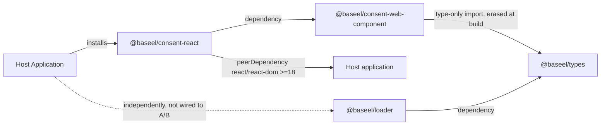
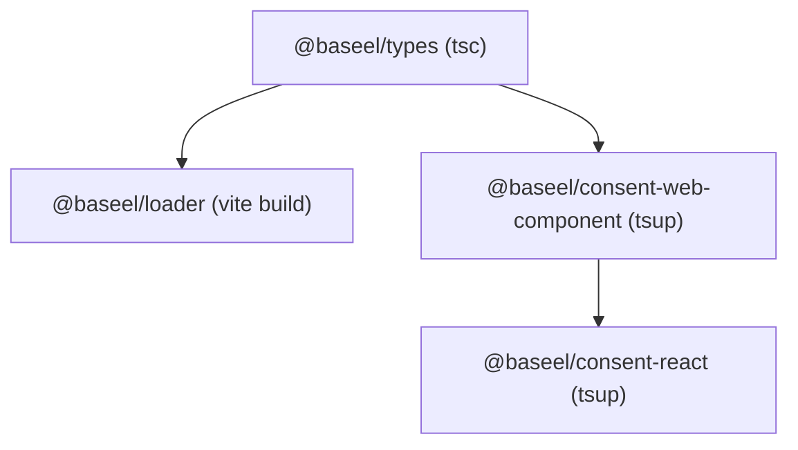
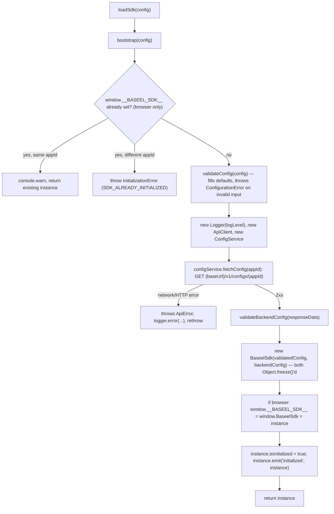
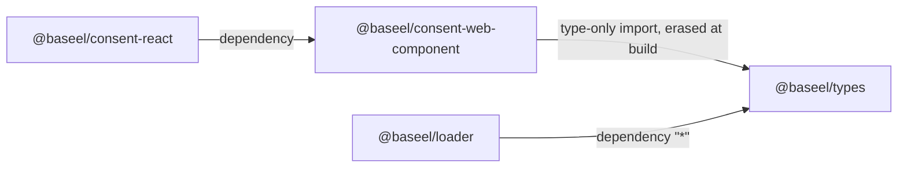
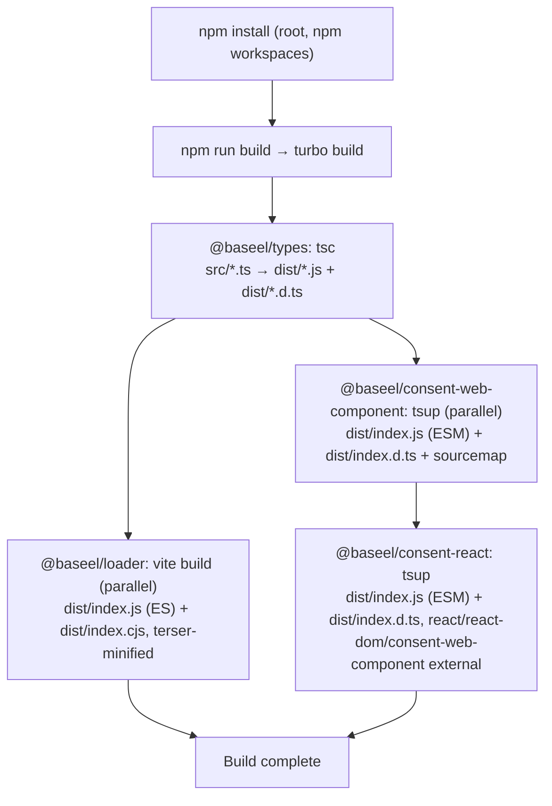

# SDK Installation Guide

> **Document scope:** This guide is generated strictly from the current state of the `baseel-sdk` repository (source code, `package.json` files, build configs, and the existing `DOCUMENTATION.md` / `IMPLEMENTATION_DETAILS.md`, which were read in full to produce it). It documents only installation methods, frameworks, and configuration options that actually exist in this codebase. Where a commonly-expected installation feature (an `.env` file, a CLI installer, etc.) is **not present**, this guide says so explicitly instead of omitting or inventing it.

> **📦 This SDK is published on the public npm registry** under the `@baseel` scope. Install it directly — no build step, no cloning the repo, no tarball required:
> ```bash
> npm install @baseel/consent-react            # React / Next.js apps
> npm install @baseel/consent-web-component     # Vue, Angular, Svelte, vanilla HTML, or any other framework
> ```
> See [§5](#5-installation) for the full installation guide, and [§11](#11-framework-specific-installation) for per-framework instructions.

| | |
|---|---|
| **Version** | `@baseel/types` 0.1.0 · `@baseel/loader` 0.0.1 · `@baseel/consent-web-component` 0.1.0 · `@baseel/consent-react` 0.1.0 — all published live on the public npm registry under the `@baseel` scope |
| **Supported SDK Packages** | `@baseel/types`, `@baseel/loader`, `@baseel/consent-web-component`, `@baseel/consent-react` |
| **Supported Frameworks** | React, Next.js, Vue 3, Nuxt 3/4, Angular, Svelte, SvelteKit, SolidJS, Astro, Vanilla JavaScript/HTML, standalone TypeScript |
| **Supported Runtimes** | Any evergreen browser with native Custom Elements v1 + Shadow DOM v1 (Chrome/Edge, Firefox, Safari); Node.js (for `@baseel/loader` and for building/type-checking only — the widget itself is browser-only) |

---

## Table of Contents

1. [Introduction](#1-introduction)
2. [Prerequisites](#2-prerequisites)
3. [Supported Frameworks](#3-supported-frameworks)
4. [SDK Packages](#4-sdk-packages)
5. [Installation](#5-installation)
6. [Folder Structure](#6-folder-structure)
7. [Project Structure](#7-project-structure)
8. [Build Requirements](#8-build-requirements)
9. [Environment Variables](#9-environment-variables)
10. [Configuration](#10-configuration)
11. [Framework-Specific Installation](#11-framework-specific-installation)
12. [Initialization Flow](#12-initialization-flow)
13. [Dependency Graph](#13-dependency-graph)
14. [Build Process](#14-build-process)
    - [14.1 Publishing a New Version (Maintainers Only)](#141-publishing-a-new-version-maintainers-only)
15. [Verification](#15-verification)
16. [Troubleshooting](#16-troubleshooting)
17. [Frequently Asked Questions](#17-frequently-asked-questions)
18. [Best Practices](#18-best-practices)
19. [Uninstallation](#19-uninstallation)
20. [Appendix](#20-appendix)

---

## 1. Introduction

### What the SDK is

`baseel-sdk` is a **TypeScript monorepo** (npm workspaces + Turbo v2) that ships four npm packages implementing a Digital Personal Data Protection (DPDP)-style **Consent Management Platform (CMP) client**:

| Package | Role |
|---|---|
| `@baseel/types` | Shared TypeScript types/interfaces/enums. Zero runtime code. |
| `@baseel/loader` | A standalone, headless application-config bootstrapper: singleton init, config validation, backend config fetch, a typed event bus, a logger, and an error hierarchy. |
| `@baseel/consent-web-component` | A native Web Component (`<baseel-consent>`) that renders an interactive, translatable consent form in Shadow DOM, fetches its template from a backend, and submits the user's choices. **This is the actual consent banner/UI product.** |
| `@baseel/consent-react` | A thin React wrapper (`<BaseelConsent>`) around `@baseel/consent-web-component`, for JSX-based consumption in React/Next.js apps. |

> **Important, verified architectural fact:** `@baseel/loader` and `@baseel/consent-web-component` are **two independent subsystems** that share only `@baseel/types`. Installing/initializing one does not initialize or configure the other. Choose the package(s) that match what you actually need — you do not need `@baseel/loader` to use the consent widget.

### Purpose

Businesses operating under consent-law regimes (India's DPDP Act, GDPR-style regimes) must ask visitors for permission to collect and use personal data. This SDK replaces the conventional `<iframe>`-based consent form with a **native custom element** rendered directly in the host page's DOM (inside an isolated Shadow DOM), fetching its content from a Baseel-hosted backend and submitting the visitor's choices back to it.

### Supported environments

- Any modern, evergreen browser (Custom Elements v1 + Shadow DOM v1 + `fetch`/`AbortController`/`CustomEvent`).
- Any JavaScript framework that can render an arbitrary custom element and attach a DOM event listener — verified directly against React, Next.js, Vue 3, Nuxt, Angular, Svelte, SvelteKit, SolidJS, Astro, and plain HTML (see [§3](#3-supported-frameworks)).
- Node.js, for the build toolchain (`tsc`, `vite`, `tsup`) and for `@baseel/loader`'s runtime (it has no browser-only APIs itself, aside from the optional `window` singleton guard).

### High-level overview



---

## 2. Prerequisites

| Requirement | Value | Source |
|---|---|---|
| Node.js | No `engines` field is declared anywhere in the repo's own `package.json` files. In practice, a version compatible with `@types/node@^20.12.12` and the toolchain (Vite 5, tsup 8, TypeScript 5.4+) is required — practically **Node 18+**. | Inferred from devDependency versions; verified gap, not an oversight in this document. |
| npm | Pinned to `11.11.0` | Root `package.json` → `"packageManager": "npm@11.11.0"` |
| TypeScript | `^5.4.5` (root devDependency), resolves to 5.9.x in practice | Root `package.json` |
| React (only if using `@baseel/consent-react`) | `>=18.0.0` (peerDependency); tested with React 18 and confirmed working with React 19 | `packages/consent-react/package.json` |
| Browser | Any browser supporting native Custom Elements v1 + Shadow DOM v1 (all evergreen browsers: Chrome, Edge, Firefox, Safari). **Internet Explorer is not supported** — no polyfill is bundled. | `customElements.define`, `attachShadow` usage in `BaseelConsent.ts` |
| Operating system | None enforced by the SDK itself; all tooling (npm, tsc, tsup, vite) is cross-platform | — |
| Build tools | npm workspaces + Turbo v2 (root); tsup (esbuild) for `consent-web-component`/`consent-react`; Vite + Terser for `loader`; plain `tsc` for `types` | `turbo.json`, each package's build config |
| Peer dependencies | `react` and `react-dom` (only for `@baseel/consent-react`) | `packages/consent-react/package.json` |
| Environment variables | **None required or read by the SDK.** See [§9](#9-environment-variables). | Verified: zero `process.env.*` / `import.meta.env.*` references in any package's source |
| Authentication requirements | A `public-key` (publishable identifier) and a `session-token` (bearer credential), plus a `screen-id` template identifier — all supplied by the consuming application, not by the SDK's installation process. See [§10](#10-configuration). | `packages/consent-web-component/src/component/BaseelConsent.ts` |
| Backend service | A Baseel-hosted (or compatible) backend exposing `GET /api/template/{screenId}` and `POST /api/widget/consent/submit` (for the widget), and/or `GET /v1/configs/{appId}` (for `@baseel/loader`). The SDK does not include or mock this backend. | `packages/consent-web-component/src/api/consent.ts`, `packages/loader/src/configService.ts` |

> **Note:** There is no `.nvmrc`, no CI matrix, and no documented minimum Node version anywhere in the repository. This is a genuine, verified gap — plan your own Node version pin accordingly.

---

## 3. Supported Frameworks

The table below reflects **actual verification performed** in this repository's own `compat-tests/*` QA demos (each with its own working project, mock backend, and Playwright-driven smoke test) — not assumption. `@baseel/consent-web-component` is a native Custom Element, so "framework support" mostly means "can this framework render an arbitrary tag and listen for a `CustomEvent`."

| Framework | Supported Version (verified in `compat-tests/`) | Status | Notes |
|---|---|---|---|
| React (Vite) | React `^19.2.7` demo; peerDependency allows `>=18.0.0` | ✅ Supported | Via `@baseel/consent-react`. No special config needed. |
| Next.js (App Router) | Not pinned to a specific version in a compat demo; documented pattern only | ✅ Supported | Requires a `"use client"` boundary around the consuming component (standard Next.js pattern for any browser-only library). |
| Vue 3 (Vite) | Vue `^3.5.39` | ✅ Supported | Raw custom element (no dedicated Vue wrapper package exists). Requires `isCustomElement: (tag) => tag === 'baseel-consent'` in the Vue compiler options. |
| Nuxt 3/4 | Nuxt `^4.5.0` | ✅ Supported | `<ClientOnly>` is **not required** — the component's own guards make it SSR-safe either wrapped or unwrapped. |
| Angular | `^19.2.0` | ✅ Supported | Raw custom element (no dedicated Angular wrapper package exists). Requires `schemas: [CUSTOM_ELEMENTS_SCHEMA]`; colon-containing event bindings like `(baseel:consent-granted)` do **not** compile — use `@ViewChild` + `addEventListener` instead. |
| Svelte (Vite) | Svelte `^5.56.4` | ✅ Supported | Raw custom element. No special element-recognition config needed. |
| SvelteKit | `^2.63.0` | ✅ Supported | SSR-safe; `bind:this` + `addEventListener` is the recommended event-binding pattern. |
| SolidJS (Vite) | `solid-js ^1.9.13` | ✅ Supported | Raw custom element. Needs a `JSX.IntrinsicElements` augmentation (the same pattern `@baseel/consent-react` uses internally). |
| Astro | `^7.1.1` | ✅ Supported | Zero workarounds — a plain `<script>import '@baseel/consent-web-component';</script>` works; no `client:*` directive needed. |
| Vanilla JavaScript / Plain HTML | N/A (no framework) | ✅ Supported | This is the SDK's native target — `<script type="module">` import + plain `addEventListener`. |
| TypeScript (standalone, no UI framework) | `^5.4.5`+ | ✅ Supported | Package types resolve cleanly; verified with `tsc --noEmit --strict`. See [§16](#16-troubleshooting) for one known packaging caveat. |
| Remix, Electron, Node.js (as a UI host) | — | ❌ **Not verified / not tested** | No compat demo, source reference, or documentation exists for these in this repository. Do not assume support. |

---

## 4. SDK Packages

### 4.1 `@baseel/types`

| Aspect | Detail |
|---|---|
| Purpose | Shared TypeScript types/interfaces/enums consumed by the other three packages. Zero runtime code — nothing to execute, only types. |
| Installation | Not installed directly by consuming applications in the documented workflow — it is a transitive/dev-time dependency resolved automatically via the workspace or bundled type-erasure in the other packages. |
| Import syntax | `import type { SdkConfig, WidgetTemplate, ... } from '@baseel/types';` (only meaningful inside this monorepo or a project with direct filesystem/workspace access to it) |
| When to use it | You generally do not install this package standalone; it exists to be imported by `@baseel/loader` and (type-only, erased at build) by `@baseel/consent-web-component`. |
| Dependencies | None |
| Peer dependencies | None |

### 4.2 `@baseel/loader`

| Aspect | Detail |
|---|---|
| Purpose | A standalone, headless application-config bootstrapper: `loadSdk()` singleton init, config validation, backend config fetch (`GET /v1/configs/{appId}`), a typed event bus, a logger, and an error hierarchy. **Not wired to the consent widget** — see [§1](#1-introduction). |
| Installation command | `npm install @baseel/loader` (published on the public npm registry, current version `0.0.1` — see [§5](#5-installation)) |
| Import syntax | `import { loadSdk, ConfigurationError, InitializationError, ConsentError, ApiError } from '@baseel/loader';` |
| When to use it | Use only if your application needs a generic app-config bootstrap/event-bus layer with its own backend contract (`/v1/configs/{appId}`) — **not** required to render the consent widget. |
| Dependencies | `@baseel/types: "*"` |
| Peer dependencies | None |
| Build output | `dist/index.js` (ES) + `dist/index.cjs` (CJS), minified with Terser |

### 4.3 `@baseel/consent-web-component`

| Aspect | Detail |
|---|---|
| Purpose | The actual consent banner/UI product — a native `<baseel-consent>` Custom Element rendered in Shadow DOM. Framework-agnostic. |
| Installation command | `npm install @baseel/consent-web-component` (published on the public npm registry, current version `0.1.0` — see [§5](#5-installation)) |
| Import syntax | `import '@baseel/consent-web-component';` (side-effect import registers the custom element) |
| When to use it | Use this directly in any non-React framework (Vue, Angular, Svelte, Astro, vanilla HTML) or when you want to avoid the React wrapper. |
| Dependencies | None declared in `package.json` (only a type-only import of `@baseel/types`, erased at build — see the packaging caveat in [§16](#16-troubleshooting)) |
| Peer dependencies | None |
| Build output | `dist/index.js` (ESM only) + `dist/index.d.ts` + sourcemap, ~32 KB unminified |

### 4.4 `@baseel/consent-react`

| Aspect | Detail |
|---|---|
| Purpose | A thin React wrapper (`<BaseelConsent>`) around `@baseel/consent-web-component`, for JSX-based consumption in React/Next.js apps. |
| Installation command | `npm install @baseel/consent-react` (published on the public npm registry, current version `0.1.0`; transitively installs `@baseel/consent-web-component` as a dependency — see [§5](#5-installation)) |
| Import syntax | `import { BaseelConsent } from '@baseel/consent-react';` |
| When to use it | Use in React or Next.js applications for idiomatic JSX usage instead of manually managing a raw custom element. |
| Dependencies | `@baseel/consent-web-component: "0.0.1"` |
| Peer dependencies | `react >=18.0.0`, `react-dom >=18.0.0` |
| Build output | `dist/index.js` (ESM only) + `dist/index.d.ts` + sourcemap, ~1.4 KB (React/`react-dom`/`@baseel/consent-web-component` are `external`, not bundled) |

---

## 5. Installation

> **Published, verified fact:** All four packages are **live on the public npm registry** under the `@baseel` scope (owned by the npm organization `baseel`), each with `publishConfig.access: "public"`:
>
> | Package | Version |
> |---|---|
> | `@baseel/types` | `0.1.0` |
> | `@baseel/loader` | `0.0.1` |
> | `@baseel/consent-web-component` | `0.1.0` |
> | `@baseel/consent-react` | `0.1.0` |
>
> `npm install @baseel/consent-react` (bare, against the public registry) **works** — no build step, no cloning this repo, and no tarball is required for a normal consumer. Source: [`https://github.com/Baseel-IT-Services/consent-sdk`](https://github.com/Baseel-IT-Services/consent-sdk).

### 5.1 Installing from the registry (npm / pnpm / yarn / bun)

```bash
# npm — React or Next.js apps (transitively installs @baseel/consent-web-component and @baseel/types)
npm install @baseel/consent-react

# npm — any other framework (Vue, Angular, Svelte, SolidJS, Astro, vanilla HTML)
npm install @baseel/consent-web-component

# npm — only if you need the standalone app-config bootstrapper (independent of the widget — see §1/§2)
npm install @baseel/loader
```

```bash
# pnpm
pnpm add @baseel/consent-react

# yarn
yarn add @baseel/consent-react

# bun
bun add @baseel/consent-react
```

These are now standard registry installs — pnpm/yarn/bun all resolve `@baseel/*` the same way they would resolve any other published scoped package. (The repo itself still uses npm workspaces exclusively for its own internal development — no `pnpm-workspace.yaml`, `.yarnrc`, or `bun.lockb` exists in this repository — but that has no bearing on how an external consumer installs the published packages.)

### 5.2 Verifying the install

```bash
npm view @baseel/consent-react version   # confirms what's currently published on the registry
npm ls @baseel/consent-react              # confirms what your project actually resolved/installed
```

### 5.3 Local development / testing an unpublished change (contributors only)

This subsection is **not** for normal consumers — it's only relevant if you're developing this SDK itself and need to test a not-yet-released change in a separate app before publishing a new version.

```bash
# from the monorepo root
npm install
npm run build

# then, from the specific package you want to test
cd packages/consent-web-component
npm pack
# → produces baseel-consent-web-component-0.1.0.tgz

cd ../consent-react
npm pack
# → produces baseel-consent-react-0.1.0.tgz
```

Install that tarball in a scratch consuming project:

```bash
npm install @baseel/consent-web-component@file:../baseel-sdk/packages/consent-web-component/baseel-consent-web-component-0.1.0.tgz
npm install @baseel/consent-react@file:../baseel-sdk/packages/consent-react/baseel-consent-react-0.1.0.tgz
```

Or reference it directly in `package.json`:

```json
{
  "dependencies": {
    "@baseel/consent-web-component": "file:../baseel-sdk/packages/consent-web-component/baseel-consent-web-component-0.1.0.tgz",
    "@baseel/consent-react": "file:../baseel-sdk/packages/consent-react/baseel-consent-react-0.1.0.tgz"
  }
}
```

> ⚠️ **Warning — verified behavior:** Re-running `npm install` with the *same* file path does not always pick up a rebuilt tarball, because npm may not detect that the file content changed. Re-specify the exact dependency (`npm install @baseel/consent-web-component@file:...`) to force npm to re-read the tarball.

pnpm/yarn support the same `file:` tarball semantics for local testing:

```bash
pnpm add @baseel/consent-web-component@file:../baseel-sdk/packages/consent-web-component/baseel-consent-web-component-0.1.0.tgz
yarn add @baseel/consent-web-component@file:../baseel-sdk/packages/consent-web-component/baseel-consent-web-component-0.1.0.tgz
```

> **bun is not documented or tested anywhere in this repository.** Do not assume its `file:` tarball behavior is verified — no local-tarball verification exists for bun either way; its normal registry install (§5.1) is unaffected.

### 5.4 Workspace dependency (within this monorepo)

Inside this repo, `@baseel/consent-react`'s `package.json` declares its dependency on `@baseel/consent-web-component` as a plain version string, resolved via npm workspaces' hoisting/symlinking — this is how the packages reference each other during development, and is unrelated to how an external consumer installs them (§5.1).

### 5.5 `npm link` / Git dependency

Neither is used or documented anywhere in this repo's own workflow. Standard `npm link` semantics would apply if a developer chose to use it, but no script or doc references it. No package references a git URL as a dependency.

---

## 6. Folder Structure

```
baseel-sdk/
├── apps/
│   ├── browser-demo/.gitkeep             Reserved, empty — no demo app implemented yet
│   └── dev-sandbox/.gitkeep               Reserved, empty — no sandbox app implemented yet
├── packages/
│   ├── types/                            @baseel/types — shared TypeScript definitions, no runtime code
│   │   └── src/                          index.ts (barrel), config.ts, consent.ts, error.ts, event.ts, sdk.ts, widget.ts
│   ├── loader/                           @baseel/loader — standalone app-config bootstrapper
│   │   └── src/                          index.ts, bootstrap.ts, sdkInstance.ts, configValidator.ts,
│   │                                      backendConfigValidator.ts, configService.ts, apiClient.ts,
│   │                                      eventEmitter.ts, logger.ts, errors.ts, index.test.ts
│   ├── consent-web-component/            @baseel/consent-web-component — the consent banner Custom Element
│   │   └── src/                          index.ts, register.ts, constants.ts,
│   │                                      component/ (BaseelConsent.ts, StateManager.ts, Renderer.ts),
│   │                                      api/consent.ts, events/(events.ts), utils/translate.ts
│   └── consent-react/                    @baseel/consent-react — React wrapper
│       └── src/                          index.ts, components/BaseelConsent.tsx, hooks/index.ts (placeholder)
├── compat-tests/                         Standalone, non-workspace demo apps used for cross-framework QA
│                                          (angular, astro, nuxt3, react-vite, solidjs-vite, svelte,
│                                          sveltekit, typescript-project, vanilla-html, vue3-vite) —
│                                          not part of the publishable SDK
├── package.json                          Root workspace manifest: workspaces ["packages/*","apps/*"]
├── package-lock.json
├── tsconfig.json                         Root aggregate config: includes packages/*/src/**/*
├── tsconfig.base.json                    Shared compilerOptions extended by every package
└── turbo.json                            Turbo v2 task pipeline: build (dependsOn ^build), dev, lint, test
```

**Folders explicitly requested by common convention but not present in this codebase** (so as not to imply features that don't exist): a top-level `lib/`, `providers/`, `services/` (the closest equivalent is `packages/loader/src/*Service.ts`), `styles/`, `assets/`, `public/`, `build/` (build output is `dist/`), or a standalone `scripts/` folder.

---

## 7. Project Structure

`baseel-sdk` is a single Git repository organized as an **npm-workspaces monorepo**, orchestrated by **Turbo v2**:

- **`packages/*`** — the four publishable/consumable packages described in [§4](#4-sdk-packages). Each has its own `package.json`, `tsconfig.json` (extending `tsconfig.base.json`), and build config.
- **`apps/*`** — reserved workspace slots (`browser-demo`, `dev-sandbox`) that currently contain only a `.gitkeep` file each; no demo application is implemented in them.
- **`compat-tests/*`** — ten standalone (non-workspace) demo projects created for cross-framework compatibility QA. Each is a real, independently `npm install`-able project with its own mock backend and Playwright smoke test. These are QA artifacts, not officially maintained example apps.
- **Root config** — `package.json` (workspace manifest + scripts), `turbo.json` (task pipeline), `tsconfig.json` / `tsconfig.base.json` (shared TypeScript config).

Build order across packages is enforced by `turbo.json`'s `"dependsOn": ["^build"]`:



---

## 8. Build Requirements

| Category | Tool / Requirement |
|---|---|
| Language | TypeScript `^5.4.5` (root), `strict: true` in every package |
| Module system | ESM (`NodeNext`); `@baseel/loader` additionally emits CJS |
| Compiler (`@baseel/types`) | Plain `tsc` — no bundler, since it only emits `.d.ts` + re-export `.js` files |
| Bundler (`@baseel/loader`) | Vite (library mode), dual `es`/`cjs` output, minified with **Terser** |
| Bundler (`consent-web-component`, `consent-react`) | **tsup** (esbuild-based), ESM-only output, `dts: true`, `sourcemap: true`, `clean: true` |
| Package manager | npm (pinned `npm@11.11.0` via the root `packageManager` field), npm workspaces |
| Monorepo orchestrator | Turbo v2 (`^2.0.0`) |
| Type checker | `tsc --noEmit` (root `npm run typecheck`, not delegated to Turbo) |
| Test runner | Vitest `^1.6.0`, declared in every package; **only `@baseel/loader` has real test files** (`index.test.ts`, 27 tests) |
| Build commands | `npm install` then `npm run build` (`turbo build`) from the monorepo root |
| Output | Each package's `dist/` folder — `.js`/`.cjs` bundles, `.d.ts` declarations, and (where applicable) `.map` sourcemaps |
| Generated files | `packages/*/dist/**` (Turbo-cached, keyed by inputs); `<package>-<version>.tgz` after running `npm pack` |

**Explicitly NOT part of the build toolchain** (verified absent): ESLint, Prettier, Webpack, Parcel, Rollup (used only transitively via tsup for `.d.ts` generation), plain esbuild CLI, Jest, Playwright/Cypress as an installed monorepo test runner, pnpm, yarn.

---

## 9. Environment Variables

**There are no environment variables anywhere in this codebase.** No `.env`, `.env.example`, `process.env.*` reference, or `import.meta.env.*` reference exists in any of the four packages' source.

| Variable | Purpose | Default | Required | Example |
|---|---|---|---|---|
| *(none exist)* | — | — | — | — |

All runtime configuration is passed **explicitly** by the consuming application:

- To `@baseel/consent-web-component` / `@baseel/consent-react`: via HTML attributes / React props (`public-key`, `session-token`, `screen-id`, `api-base-url`). See [§10.1](#101-baseelconsent-web-component--baseelconsent-react-configuration-html-attributes--react-props).
- To `@baseel/loader`: via the `SdkConfig` object argument passed to `loadSdk()`. See [§10.3](#103-baseelloaders-sdkconfig-independent-of-the-widget).

> 💡 **Tip:** If your own build tooling defines environment variables (e.g. a consuming Next.js app's `NEXT_PUBLIC_*` vars) to *supply* these configuration values at build/runtime, that is your application's own concern — the SDK itself never reads `process.env` or `import.meta.env`.

---

## 10. Configuration

### 10.1 `@baseel/consent-web-component` / `@baseel/consent-react` configuration (HTML attributes / React props)

| Option | Type | Required | Default | Purpose |
|---|---|---|---|---|
| `public-key` / `publicKey` | `string` | **Yes** | — | Sent as the `X-Publishable-Key` header on submit and as a `?key=` query param on the template fetch. Identifies the merchant application. |
| `session-token` / `sessionToken` | `string` | **Yes** | — | Sent as `Authorization: Bearer {token}` on submit and as `?token=` on the template fetch. A leading `"Bearer "` prefix, if already present, is stripped before re-adding it. |
| `screen-id` / `screenId` | `string` | **Yes** | — | The consent template UUID/code to fetch: `GET {apiBaseUrl}/api/template/{screenId}`. |
| `api-base-url` / `apiBaseUrl` | `string` | No | `http://localhost:8080` (`DEFAULT_API_BASE_URL` constant) | Base URL prefixed to both API calls. |

> ⚠️ **Warning:** If any of the three required attributes is missing, the component enters an `error` state with the message *"Missing required attributes: public-key, session-token, screen-id."* and logs `console.error('[baseel-consent] Missing required attributes: ...')` — no network call is made.

### 10.2 `@baseel/consent-react` additional props

| Prop | Type | Required | Purpose |
|---|---|---|---|
| `onConsentGranted?` | `(detail: ConsentGrantedDetail) => void` | No | Fired on `baseel:consent-granted` |
| `onConsentDenied?` | `(detail: ConsentDeniedDetail) => void` | No | Fired on `baseel:consent-denied` |
| `onConsentError?` | `(message: string) => void` | No | Fired on `baseel:consent-error` (receives the extracted `.message` string, not the raw event detail object) |
| `className?` | `string` | No | Forwarded to the underlying element's `class` attribute |
| `style?` | `CSSProperties` | No | Forwarded to the underlying element's `style` |

### 10.3 `@baseel/loader`'s `SdkConfig` (independent of the widget)

| Option | Type | Required | Default (applied by `validateConfig()`) | Purpose |
|---|---|---|---|---|
| `appId` | `string` | **Yes** | — | Must be non-empty; throws `ConfigurationError` (`CONFIG_MISSING_APP_ID`) otherwise |
| `environment` | `'development' \| 'staging' \| 'production'` | No | `'production'` | Selects the backend base URL |
| `logLevel` | `'none' \| 'error' \| 'warn' \| 'info' \| 'debug'` | No | `'error'` | Passed to `Logger` |
| `consent.enabled` | `boolean` | No | `true` | Stored on the frozen config; not otherwise enforced in loader logic |
| `consent.defaultStatus` | `'granted' \| 'denied'` | No | `'denied'` | Initial in-memory `consentStatus` on the `BaseelSdk` instance |
| `customEndpoint` | `string` | No | `''` (falls back to environment URL) | Overrides the environment-derived base URL; trailing slashes stripped |
| `autoInitialize` | `boolean` | No | `true` | Stored on config; not otherwise consumed by any logic in this codebase |

**Sample configuration:**

```ts
import { loadSdk } from '@baseel/loader';

const sdk = await loadSdk({
  appId: 'my-app-id',
  environment: 'production',
  logLevel: 'warn',
  consent: { enabled: true, defaultStatus: 'denied' },
});
```

Invalid `environment` or `logLevel` values throw `ConfigurationError` with `CONFIG_INVALID_ENV` / `CONFIG_INVALID_LOG_LEVEL` respectively.

---

## 11. Framework-Specific Installation

### React Installation

**Installation:**
```bash
npm install @baseel/consent-react
```

**Imports & usage:**
```tsx
import { BaseelConsent } from '@baseel/consent-react';

function App() {
  return (
    <BaseelConsent
      publicKey="pk_live_xxx"
      sessionToken="eyJhbGciOi..."
      screenId="scr_abc123"
      onConsentGranted={(detail) => console.log('granted', detail)}
      onConsentDenied={(detail) => console.log('denied', detail)}
      onConsentError={(message) => console.error(message)}
    />
  );
}
```

**Initialization:** Implicit — the component mounts a real `<baseel-consent>` DOM node via a `useCallback` ref (not `useEffect`); attribute-driven bootstrap happens automatically when the element connects.

**Common issues:** None framework-specific beyond the general [Troubleshooting](#16-troubleshooting) table — React 18 and 19 have both been verified to work even though the peerDependency only requires `>=18.0.0`.

---

### Next.js Installation

Next.js is supported through the same `@baseel/consent-react` package. There is no dedicated `@baseel/consent-next` package.

**CSR / Client Component:**
```tsx
// components/ConsentBanner.tsx
"use client";
import { BaseelConsent } from '@baseel/consent-react';

export function ConsentBanner() {
  return <BaseelConsent publicKey="pk_..." sessionToken="..." screenId="scr_..." />;
}
```

**SSR / Server Component:** The underlying `BaseelConsent.ts` class falls back to a plain base class when the global `HTMLElement` is undefined, so merely *importing* the package no longer crashes under SSR. However, the component still renders nothing meaningful until it reaches the browser — a `"use client"` boundary (App Router) remains the correct, verified pattern.

**Hydration:** No special hydration handling exists in the SDK; treat it as any other client-only third-party widget and keep it inside a client component.

**Configuration / Environment variables:** None read by the SDK itself (see [§9](#9-environment-variables)). If you use `NEXT_PUBLIC_*` variables to supply `publicKey`/`sessionToken`/`screenId` values at build time, that plumbing is entirely your application's responsibility.

**Common issues:** Rendering nothing / a blank space — verify the component is inside a client boundary and that all three required props are non-empty strings.

---

### Vue Installation

There is **no dedicated `@baseel/consent-vue` wrapper package** — Vue 3 consumes the raw `@baseel/consent-web-component` custom element directly.

**Installation:**
```bash
npm install @baseel/consent-web-component
```

**Configuration (`vite.config.ts`):**
```ts
export default defineConfig({
  plugins: [vue({
    template: { compilerOptions: { isCustomElement: (tag) => tag === 'baseel-consent' } }
  })]
});
```

**Initialization & usage:**
```vue
<script setup lang="ts">
import '@baseel/consent-web-component';
</script>
<template>
  <baseel-consent public-key="pk_..." session-token="..." screen-id="scr_..."
    @baseel:consent-granted="onGranted" />
</template>
```

**Common issues:** Without `isCustomElement`, the dev console logs `Failed to resolve component: baseel-consent` — a warning only, and it does not appear in production builds.

---

### Angular Installation

There is **no dedicated `@baseel/consent-angular` wrapper package** — Angular consumes the raw custom element directly.

**Installation:**
```bash
npm install @baseel/consent-web-component
```

**Module setup:**
```ts
// app.component.ts
import { Component, CUSTOM_ELEMENTS_SCHEMA, ViewChild, ElementRef, AfterViewInit } from '@angular/core';
import '@baseel/consent-web-component';

@Component({
  selector: 'app-root',
  templateUrl: './app.component.html',
  schemas: [CUSTOM_ELEMENTS_SCHEMA]
})
export class AppComponent implements AfterViewInit {
  @ViewChild('consentEl') consentEl!: ElementRef<HTMLElement>;
  ngAfterViewInit() {
    this.consentEl.nativeElement.addEventListener('baseel:consent-granted', (e: any) => console.log(e.detail));
  }
}
```

**Usage:**
```html
<baseel-consent #consentEl public-key="pk_..." session-token="..." screen-id="scr_..."></baseel-consent>
```

**Common issues:**
- Build fails with `NG8001: 'baseel-consent' is not a known element` → missing `CUSTOM_ELEMENTS_SCHEMA`.
- `Unexpected global target 'baseel'...` at compile time → caused by attempting a template binding like `(baseel:consent-granted)="..."`; Angular cannot parse a colon-containing custom event name this way — use `@ViewChild` + `addEventListener` instead, as shown above.

---

### Vanilla JavaScript / Plain HTML

**Installation:**
```bash
npm install @baseel/consent-web-component
```
(or reference the built `dist/index.js` file directly via a `<script type="module">` tag without any package manager, since the bundle is self-contained with `external: []`)

**Script loading & initialization:**
```html
<script type="module">
  import '@baseel/consent-web-component';
</script>

<baseel-consent
  public-key="pk_live_xxx"
  session-token="eyJhbGciOi..."
  screen-id="scr_abc123"
  api-base-url="https://api.baseel.com">
</baseel-consent>

<script type="module">
  document.querySelector('baseel-consent').addEventListener('baseel:consent-granted', (e) => {
    console.log(e.detail); // { consentId, purposes, timestamp }
  });
</script>
```

**Usage:** This is the SDK's native target platform — no adapter or wrapper is needed.

---

### Other verified frameworks (Svelte, SvelteKit, SolidJS, Astro)

These also consume the raw `@baseel/consent-web-component` custom element and require no dedicated wrapper package:

- **Svelte / SvelteKit:** No special element-recognition config needed; `bind:this` + `addEventListener` is the recommended, warning-free event-binding pattern.
- **SolidJS:** Needs a `JSX.IntrinsicElements` augmentation (the same pattern `@baseel/consent-react` uses internally); the `on:` directive cannot parse a colon-containing event name — use a ref callback + `addEventListener`.
- **Astro:** A plain `<script>import '@baseel/consent-web-component';</script>` in a `.astro` file works with zero workarounds — no `client:*` directive needed, since it's not a framework island.

> Only frameworks with verified support are documented here or in [§3](#3-supported-frameworks). If a framework is not listed, it has **not** been tested against this SDK — do not assume compatibility.

---

## 12. Initialization Flow

There are **two separate initialization flows** in this codebase — they are unrelated and must not be conflated.

### 12.1 Web Component initialization (the consent widget)

Initialization is implicit and attribute-driven — there is no explicit "init" function call.

```mermaid
sequenceDiagram
    participant Host as Host App
    participant El as &lt;baseel-consent&gt; element
    participant API as Backend

    Host->>El: Element inserted into DOM (any means: HTML, innerHTML, React, etc.)
    El->>El: constructor(): attachShadow({mode:'open'})
    El->>El: connectedCallback(): new Renderer(shadowRoot), subscribe StateManager, render 'loading' state
    El->>El: bootstrap(): getConfig() — validate 3 required attributes
    alt attribute missing
        El->>El: setState('error', {...}); return
    else all present
        El->>API: GET /api/template/{screenId}?key=...&token=...
        API-->>El: WidgetTemplate JSON (or error)
        El->>El: normalize response, setState('ready'|'error')
    end
```

Re-initialization: `attributeChangedCallback` re-runs `bootstrap()` whenever any of the 4 observed attributes changes value. Cleanup: `disconnectedCallback` unsubscribes listeners and nulls the renderer reference.

### 12.2 Loader initialization (`loadSdk()`)



The singleton guard only applies **in a browser environment** (`typeof window !== 'undefined'`). In Node/SSR, `loadSdk()` always creates a fresh instance. **Cleanup / lifecycle:** there is no explicit `destroy()`/`dispose()` API in either flow — the widget cleans up its own DOM listeners in `disconnectedCallback`; the loader's singleton persists for the page's lifetime.

---

## 13. Dependency Graph

### Internal (workspace) dependencies



### Peer dependencies

| Package | Peer dependency | Required by consumer |
|---|---|---|
| `@baseel/consent-react` | `react >=18.0.0`, `react-dom >=18.0.0` | Yes — must be installed by the host application |

### Runtime dependencies (declared in each package's own `package.json`)

| Package | Runtime dependency |
|---|---|
| `@baseel/types` | None |
| `@baseel/loader` | `@baseel/types: "*"` |
| `@baseel/consent-web-component` | None declared (type-only `@baseel/types` import, erased at compile time) |
| `@baseel/consent-react` | `@baseel/consent-web-component: "0.0.1"` |

### Development dependencies (root, shared across the monorepo)

`@types/node ^20.12.12`, `tsup ^8.0.0`, `turbo ^2.0.0`, `typescript ^5.4.5`, `vitest ^1.6.0` — plus per-package devDependencies (`vite`, `terser` for `loader`; `react`/`react-dom`/`@types/react` for `consent-react`).

---

## 14. Build Process



| Command | What it does |
|---|---|
| `npm install` | Installs and hoists dependencies for all 4 workspace packages |
| `npm run build` | `turbo build` — builds `@baseel/types` first (tsc), then `@baseel/loader` (vite) and `@baseel/consent-web-component` (tsup) in parallel, then `@baseel/consent-react` (tsup) last. Order is enforced by `turbo.json`'s `"dependsOn": ["^build"]`. |
| `npm run dev` | `turbo dev` — runs each package's watch-mode build (`cache: false, persistent: true`). Only `consent-web-component` and `consent-react` define a `dev` script (`tsup --watch`); `types` and `loader` do not. |
| `npm run test` | `turbo test` — runs `vitest run --passWithNoTests` in each package. Only `@baseel/loader` has actual tests (27, all passing). |
| `npm run lint` | `turbo lint` — **a `lint` task is defined in `turbo.json`, but no ESLint/Prettier config exists anywhere in the repo.** |
| `npm run typecheck` | `tsc --noEmit` (root-level) — type-checks `packages/*/src/**/*` against `tsconfig.base.json`. |
| `npm publish` | Manual, per-package (`npm publish --access public` run from each package's own directory, in dependency order). All four packages are already published — see §14.1. No CI/CD automation exists yet. |
| Packaging | `npm pack` (run manually inside a package directory) → `<package-name>-<version>.tgz` — now only needed for contributor/local-dev testing of an unpublished change (§5.3); normal consumers install straight from the registry (§5.1). |

Turbo caches each package's `dist/**` output keyed by its inputs — an unchanged package is skipped on subsequent builds (cache hit).

### 14.1 Publishing a New Version (Maintainers Only)

This is a maintainer-only runbook — normal SDK consumers never need any of this. It's the verified, repeatable process behind the current published state (`@baseel/types@0.1.0`, `@baseel/loader@0.0.1`, `@baseel/consent-web-component@0.1.0`, `@baseel/consent-react@0.1.0`), and the process to follow for any future release. There is no CI/CD automation for this yet — every step is run by hand.

**One-time prerequisites:**

1. **npm org membership.** The `@baseel` scope is owned by the npm organization `baseel`. Publishing requires at least the `developer` role. Verify with `npm org ls baseel`.
2. **npm CLI login.** `npm login` in a real interactive terminal (opens a browser tab). Being logged into npmjs.com in a browser does **not** authenticate the CLI — they're separate sessions.
3. **Two-factor authentication.** npm requires 2FA (or a granular access token with publish + 2FA-bypass permission) before `npm publish` succeeds; otherwise: `403 E403: Two-factor authentication or granular access token with bypass 2fa enabled is required to publish packages.` Enable it at npmjs.com → Account Settings → Configure 2FA → an authenticator app → **"Authorization and Publishing"** mode (not "Authorization only").

**Per-release steps:**

4. Build everything: `npm install && npm run build` from the monorepo root (Turbo enforces the correct order — see the diagram above).
5. Optional dry run per package: `cd packages/<name> && npm publish --access public --dry-run`.
6. Real publish, one package at a time, strictly in dependency order (breaking this order publishes a package whose pinned dependency doesn't exist on the registry yet):
   ```bash
   cd packages/types              && npm publish --access public
   cd ../loader                   && npm publish --access public
   cd ../consent-web-component    && npm publish --access public
   cd ../consent-react            && npm publish --access public
   ```
   Each call may prompt for a 2FA OTP or a browser approval URL — **interactive, must be run by a human**, not scriptable against a personal account's browser-based 2FA. (For future CI automation, use an npm Granular Access Token scoped to `@baseel` with write + 2FA-bypass-for-publish, stored as a CI secret — not what was used for the initial publish.)
7. Verify: `npm view @baseel/<name> version`, or `GET https://registry.npmjs.org/@baseel/<name>/<version>` (200 = live). Note: the *unversioned* packument endpoint can show a stale 404 for a few minutes post-publish (CDN edge-caching) — harmless and self-resolving; the version-pinned endpoint and npm's search index reflect the publish immediately.
8. **For a future version bump:** bump `version` in the package's `package.json` (and any dependent package's pinned reference to it), rebuild, repeat steps 5–7.

---

## 15. Verification

After installing and initializing the SDK, verify the installation succeeded using the checks below.

### Web Component / React (`<baseel-consent>`)

**Expected output / browser checks:**
- The custom element is registered: `customElements.get('baseel-consent')` returns the `BaseelConsent` class (not `undefined`).
- With valid `public-key`/`session-token`/`screen-id`, the widget renders a centered modal overlay with a header (logo/title/status badge), purposes/PIIs, and an "Agree & Save" button — this is the `ready` state.
- With any required attribute missing, the widget renders its error state with the message *"Missing required attributes: public-key, session-token, screen-id."*

**Console checks:**
- `console.error('[baseel-consent] Missing required attributes: ...')` appears only when a required attribute is actually missing — its absence on a correctly-configured element is expected and healthy.

**Network checks (browser DevTools → Network tab):**
- A `GET {apiBaseUrl}/api/template/{screenId}?key=...&token=...` request fires once the element connects to the DOM.
- After clicking "Agree & Save," a `POST {apiBaseUrl}/api/widget/consent/submit` request fires with `Authorization: Bearer {token}` and `X-Publishable-Key: {publicKey}` headers.

**Event checks:**
```js
document.querySelector('baseel-consent').addEventListener('baseel:consent-granted', (e) => {
  console.log('Consent verified:', e.detail); // { consentId, purposes, timestamp }
});
```

### `@baseel/loader`

```ts
import { loadSdk } from '@baseel/loader';

const sdk = await loadSdk({ appId: 'my-app-id' });
console.log(sdk.isInitialized); // true
console.log(sdk.version);       // '0.0.1'
```

### Build-level verification (monorepo development)

```bash
npm run typecheck   # should exit 0 with no TS errors
npm run build        # should produce dist/ in all 4 packages
npm run test         # 27 passing tests in @baseel/loader; 0 tests (pass trivially) elsewhere
```

---

## 16. Troubleshooting

| Symptom | Verified cause | Fix |
|---|---|---|
| Widget shows the error state immediately with "Missing required attributes..." | One of `public-key`/`session-token`/`screen-id` is missing or empty | Ensure all three attributes/props are non-empty strings |
| Nothing renders in Next.js / Nuxt / SvelteKit | The consuming component isn't in a client-only boundary | Wrap in `"use client"` (Next.js), a client-only plugin (Nuxt), or `onMount` (SvelteKit) |
| Vue dev console logs `Failed to resolve component: baseel-consent` | Missing `isCustomElement` compiler option | Add it to the Vue plugin config (see [§11](#vue-installation)) — warning only, doesn't appear in production builds |
| Angular build fails with `NG8001: 'baseel-consent' is not a known element` | Missing `CUSTOM_ELEMENTS_SCHEMA` | Add `schemas: [CUSTOM_ELEMENTS_SCHEMA]` to the component decorator |
| Angular throws `Unexpected global target 'baseel'...` at compile time | Attempted `(baseel:consent-granted)="..."` template binding | Angular can't parse a colon-containing custom event name this way — use `ViewChild` + `addEventListener` |
| Submit request blocked by the browser (CORS error in console) | Backend's `Access-Control-Allow-Headers` doesn't include `x-publishable-key` | Update backend CORS config to include `authorization, content-type, x-publishable-key` |
| `npm install @baseel/consent-react` fails / package not found | Usually a stale local npm cache/registry mirror, a typo in the package name, or a private/scoped-registry `.npmrc` override redirecting the `@baseel` scope elsewhere | The package is published and public — confirm with `npm view @baseel/consent-react version`; check for a `.npmrc` line like `@baseel:registry=...` pointing away from `https://registry.npmjs.org/` |
| Rebuilt package changes don't show up in a consuming app (contributor/local-dev workflow only, §5.3) | `npm install` with an unchanged `file:` tarball path doesn't always detect a rebuilt tarball | Re-specify the exact dependency (`npm install <pkg>@file:...`) to force re-read |
| `TS2307: Cannot find module '@baseel/types'` when a consumer's own `tsc` inspects `StateData.template` | Historical packaging gap from before `@baseel/types` was published — now resolved | Update to the current published versions; `@baseel/types@0.1.0` is a real, installable transitive dependency, not `private: true` |
| SDK re-initializes and shows a `console.warn` "Already initialized" (loader only) | `loadSdk()` called twice with the same `appId` in the same browser session | Expected, idempotent behavior — the existing instance is returned |
| `InitializationError` thrown (loader only) | `loadSdk()` called twice with a **different** `appId` in the same browser session | By design — one `appId` per page load; reload the page to re-initialize with a new `appId` |
| Build fails / dependency conflicts | Node version incompatible with the toolchain (Vite 5, tsup 8, TypeScript 5.4+) | No `engines` field is enforced — ensure Node 18+ is used, since this is not automatically validated |
| Nothing happens when running `npm run lint` beyond an empty pass | No ESLint/Prettier config exists in the repo despite the `lint` task being declared in `turbo.json` | Not a bug — this is a genuine, verified gap; there is currently nothing to actually lint |

---

## 17. Frequently Asked Questions

**Q: Can I install this SDK from the public npm registry?**
A: Yes. All four packages are published under the `@baseel` scope — `npm install @baseel/consent-react` (or `@baseel/consent-web-component` for non-React apps) works directly against the public registry, no build step required (see [§5](#5-installation)). Building from source and installing a local `.tgz` via `file:` is now only needed if you're contributing to the SDK itself and testing an unreleased change (§5.3).

**Q: Do I need `@baseel/loader` to use the consent widget?**
A: No. They are two independent packages sharing only `@baseel/types`. The widget (`consent-web-component`/`consent-react`) works with zero involvement from `@baseel/loader`.

**Q: Does the SDK remember a user's consent choice across page reloads?**
A: No. There is no client-side storage of any kind (verified: zero references to `localStorage`, `sessionStorage`, or `document.cookie`). Every page load re-fetches the template and shows the form again; persistence must be handled entirely by your backend.

**Q: Which package manager should I use to install it?**
A: Any of them — npm, pnpm, yarn, or bun all install `@baseel/consent-react`/`@baseel/consent-web-component` directly from the public registry the same way they'd install any other published scoped package (see [§5.1](#51-installing-from-the-registry-npm--pnpm--yarn--bun)). The monorepo itself uses npm workspaces exclusively for its own internal development, which has no bearing on how you install the published packages.

**Q: Is there a `.env` file or environment variable I need to set?**
A: No. The SDK reads zero environment variables. All configuration is passed explicitly via HTML attributes/React props or the `SdkConfig` object (see [§9](#9-environment-variables) and [§10](#10-configuration)).

**Q: Can this SDK run in Internet Explorer?**
A: No — it depends on native Custom Elements v1 and Shadow DOM v1, which IE never implemented, and no polyfill is bundled.

**Q: Why does the React wrapper not use `useEffect`?**
A: A deliberate design choice: the `useCallback` ref pattern attaches listeners exactly once when the DOM node mounts, using `useRef` to always call the latest prop callbacks — avoiding `useEffect`'s dependency-array and stale-closure pitfalls.

**Q: What happens if the backend is unreachable?**
A: The widget shows its `error` state with a user-facing message and dispatches `baseel:consent-error`. There is no automatic retry on either the widget's or the loader's network calls.

---

## 18. Best Practices

- **Just install from the registry** — `npm install @baseel/consent-react` (or `@baseel/consent-web-component`) is all a normal consumer needs; the build-and-tarball workflow (§5.3) is only for contributors testing an unreleased SDK change.
- **Always supply the three required attributes/props first.** `public-key`, `session-token`, and `screen-id` are mandatory — the component fails predictably (error state, no network call) rather than silently if any is missing.
- **Wrap in a client-only boundary in SSR frameworks.** Even though the package no longer *crashes* on import under SSR, the widget only does anything meaningful in a real browser — use `"use client"` / `onMount` / a client-only plugin per your framework's convention.
- **Don't rely on client-side persistence.** Since none exists, any "don't show the form again" requirement must be implemented in your own application logic (e.g. by checking your own backend's consent record before mounting the widget at all).
- **Listen for `baseel:consent-error`, not just `-granted`/`-denied`.** It is the only signal the widget gives you when something goes wrong (missing config, network failure, bad response).
- **(Contributors only) re-specify the exact tarball dependency after rebuilding**, rather than a bare `npm install`, to guarantee a consuming project picks up a locally rebuilt package — not relevant when installing the published registry version.
- **Match the framework-specific integration requirement** — Vue's `isCustomElement`, Angular's `CUSTOM_ELEMENTS_SCHEMA`, Solid's JSX augmentation. Omitting it produces either a hard build error (Angular) or a silent dev-only warning (Vue).
- **Pin exact versions where it matters.** Internal cross-package references are inconsistent in the current codebase (`consent-react` pins `consent-web-component` at exact `0.1.0`, while `loader` uses a wildcard `"*"` for `@baseel/types`) — do not assume semantic-versioning ranges are safe until this is resolved upstream.

---

## 19. Uninstallation

There is no dedicated uninstall script, CLI, or teardown API shipped by this SDK. To remove it from a consuming project, use standard package-manager and code-removal steps:

```bash
# npm
npm uninstall @baseel/consent-react @baseel/consent-web-component

# pnpm
pnpm remove @baseel/consent-react @baseel/consent-web-component

# yarn
yarn remove @baseel/consent-react @baseel/consent-web-component
```

Additional manual cleanup steps (since there is no automated uninstall hook):

1. Remove the `<baseel-consent>` element (or `<BaseelConsent>` React component) and any associated event listeners from your application code.
2. If you're a contributor who was testing an unreleased change via a local tarball (§5.3), also remove any leftover `file:` dependency entries from your `package.json` and delete the `.tgz` tarball file(s) — not applicable if you installed normally from the registry.
3. If you used `@baseel/loader`, remove the `loadSdk()` call; note that it sets `window.__BASEEL_SDK__` / `window.BaseelSdk` globals in the browser — these are cleared automatically on a full page reload since nothing persists them across reloads (see [§17](#17-frequently-asked-questions)).

No consent data, cookies, or storage is written by the SDK itself, so there is nothing client-side to purge beyond the package and its usage in your code.

---

## 20. Appendix

### Useful commands

```bash
# For consumers — install directly from the registry, no build needed:
npm install @baseel/consent-react           # or @baseel/consent-web-component for non-React apps
npm view @baseel/consent-react version      # confirm the currently published version

# For contributors working inside this monorepo:
npm install                 # install all workspace dependencies (monorepo root)
npm run build                # build all 4 packages in dependency order (turbo build)
npm run dev                  # watch-mode build for consent-web-component / consent-react
npm run test                 # run vitest across all packages
npm run typecheck            # tsc --noEmit across all packages
npm run lint                 # declared, but no linter is configured (no-op)
npm publish --access public  # (run inside a package dir, in dependency order — see §14.1) publish a new version
npm pack                     # (run inside a package dir) produce a local .tgz tarball for local-dev testing (§5.3)
npm install <pkg>@file:<tgz> # (re-)install a locally built tarball, forcing a re-read
```

### References (internal documentation in this repository)

- [`DOCUMENTATION.md`](./DOCUMENTATION.md) — the comprehensive, 43-section architecture and API reference this installation guide was derived from; consult it for deep internals (rendering engine, state machine, error hierarchy, security posture, limitations) beyond installation and setup.
- [`IMPLEMENTATION_DETAILS.md`](./IMPLEMENTATION_DETAILS.md) — an earlier, independently-generated architecture analysis (dated 2026-07-03); superseded by `DOCUMENTATION.md` for anything the two disagree on.
- `compat-tests/*/README.md` and `compat-tests/*/REPORT.md` (where present) — per-framework installation and compatibility verification notes produced during this SDK's cross-framework QA pass.

### Glossary

| Term | Meaning in this codebase |
|---|---|
| CMP | Consent Management Platform — the broader Baseel product this SDK is a client library for |
| DPDP | Digital Personal Data Protection (Act) — the regulatory context motivating consent collection |
| Custom Element | A native browser API (`customElements.define`) for defining new HTML tags with custom behavior — the mechanism `<baseel-consent>` is built on |
| Shadow DOM | A native browser API for DOM/CSS encapsulation, used to isolate the widget's internal markup and styles from the host page |
| Purpose | A `WidgetPurposeItem` — one data-processing purpose the user is asked to consent to (e.g. "Marketing") |
| PII | Personally Identifiable Information — a `WidgetPiiItem` nested under a purpose (e.g. "Email", "Phone Number") |
| Publishable key | The non-secret `public-key` identifying a merchant application, sent as `X-Publishable-Key` |
| Session token | The bearer credential (`session-token`) authorizing the current consent session |
| tsup | An esbuild-based TypeScript bundler used to build `consent-web-component` and `consent-react` |
| Turbo | The monorepo task orchestrator (`turbo.json`) coordinating build order and caching across the four packages |

### Abbreviations

`SDK` (Software Development Kit) · `API` (Application Programming Interface) · `UI` (User Interface) · `UUID` (Universally Unique Identifier) · `ESM` (ECMAScript Modules) · `CJS` (CommonJS) · `SSR` (Server-Side Rendering) · `CSR` (Client-Side Rendering) · `DTS` (Declaration files, `.d.ts`) · `CORS` (Cross-Origin Resource Sharing)

---

*This document was generated strictly from the verified state of the `baseel-sdk` repository. No installation method, framework, API, or configuration option described here was invented — where a commonly expected capability does not exist in this codebase (a public registry, environment variables, CI/CD, an uninstall script, etc.), that absence is stated explicitly.*
